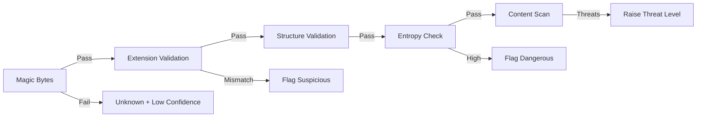
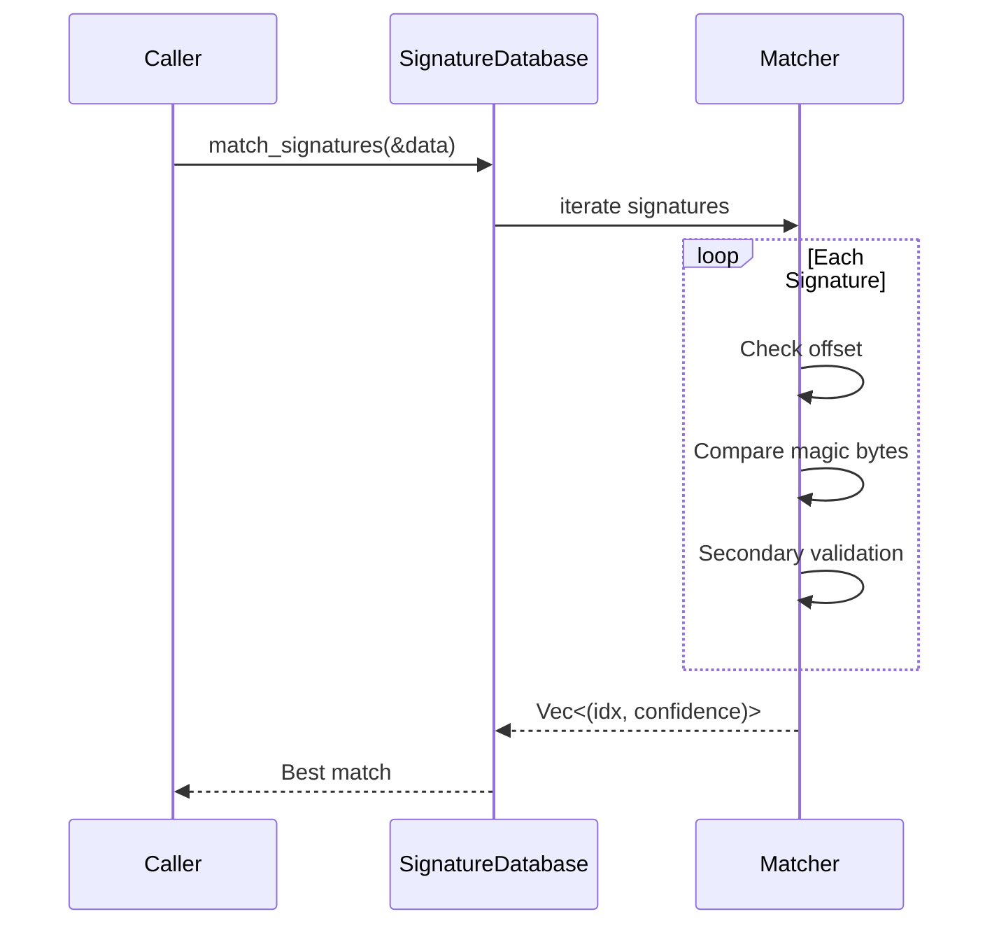
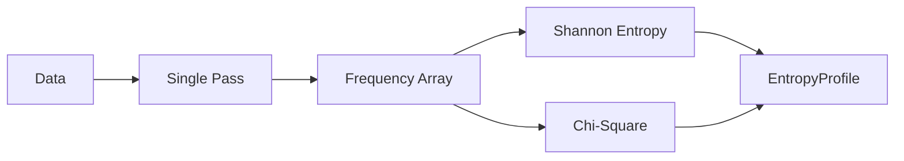
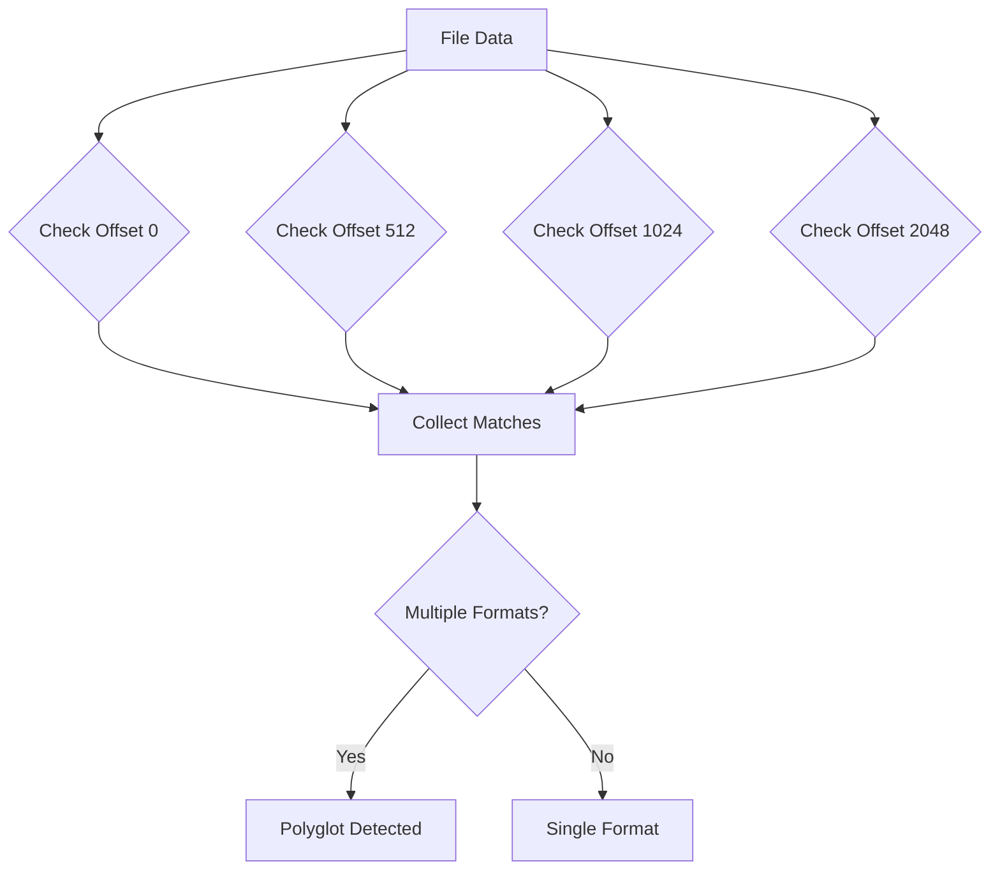
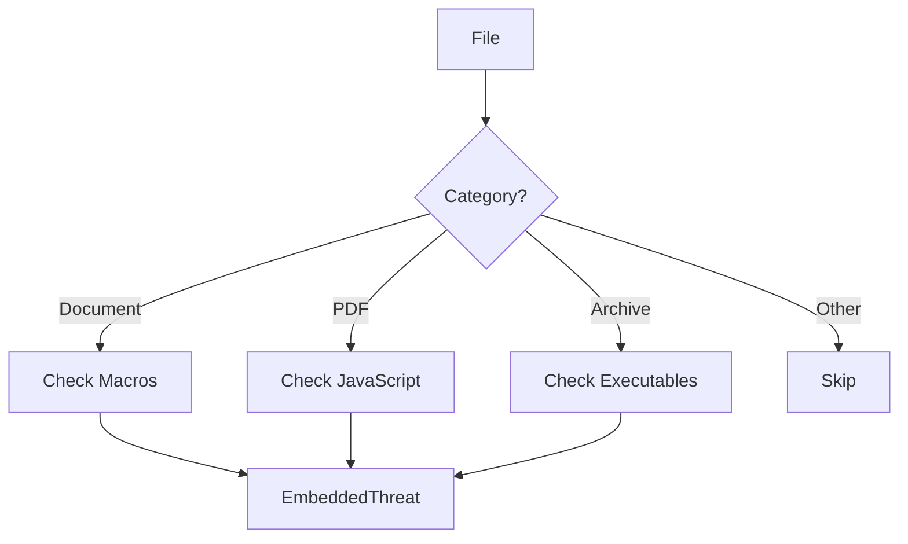

# Architecture Overview

A deep dive into Batin's internal architecture, design decisions, and why each component exists.

## High-Level Architecture

```mermaid
flowchart TB
    subgraph Input["Input Layer"]
        A[File Path] --> B[Async I/O]
        C[Byte Slice] --> D[Direct Processing]
    end
    
    subgraph Detection["Detection Engine"]
        B --> E[Signature Matching]
        D --> E
        E --> F[Entropy Analysis]
        F --> G[Polyglot Detection]
        G --> H[Embedded Threat Scan]
    end
    
    subgraph Assessment["Threat Assessment"]
        H --> I[Risk Scoring]
        I --> J[Threat Level]
    end
    
    subgraph Output["Output Layer"]
        J --> K[FileType Result]
        K --> L[JSON/CSV/Table]
    end
    
    style Input fill:#1a1a2e
    style Detection fill:#16213e
    style Assessment fill:#0f3460
    style Output fill:#25c2a0
```



## Core Design Principles

### 1. Zero Unsafe Code

```rust
#![forbid(unsafe_code)]
```

**Why?** Security tools must be secure themselves. Memory corruption bugs in a file analyzer could be exploited by crafted malicious files.

**How achieved:**

- All operations use safe Rust abstractions
- `LazyLock` for thread-safe static initialization
- `RwLock` for concurrent database access
- No raw pointer manipulation

### 2. Defense in Depth

Batin never trusts a single detection method:



### 3. Bounded Resource Usage

Every operation is resource-limited:

| Resource | Limit | Configuration |
|----------|-------|---------------|
| Memory | `max_read_bytes` | Default 3KB |
| Time | `timeout_ms` | Default 5s |
| Archive entries | `MAX_ARCHIVE_ENTRIES` | 10,000 |
| Archive size | `MAX_TOTAL_EXTRACTED_SIZE` | 100MB |
| Compression ratio | `SUSPICIOUS_COMPRESSION_RATIO` | 100:1 |

### 4. Zero Panics Guarantee

Fuzz-tested to never panic on any input:

```rust
// All public APIs return Result<T, DetectionError>
pub fn from_bytes(data: &[u8], config: &DetectionConfig) -> Result<Self>
```

---

## Module Organization

```
src/
├── lib.rs              # Core types, main API
├── main.rs             # CLI entry point
├── utils.rs            # Byte utilities
│
├── detection/          # File detection
│   ├── mod.rs
│   ├── signatures.rs   # Magic byte database
│   ├── entropy.rs      # Shannon entropy
│   ├── polyglot.rs     # Multi-format detection
│   └── embedded.rs     # Embedded threats
│
├── analysis/           # Deep analysis
│   ├── mod.rs
│   ├── validation.rs   # Structure validation
│   ├── forensics.rs    # Fragment classification
│   └── binary.rs       # PE/ELF parsing
│
├── io/                 # I/O operations
│   ├── mod.rs
│   ├── batch.rs        # Parallel processing
│   ├── archive.rs      # Archive scanning
│   └── hasher.rs       # File hashing
│
└── cli/                # CLI interface
    ├── mod.rs
    ├── scanner.rs      # Scan command
    ├── watcher.rs      # Watch command
    └── console.rs      # UI theming
```

### Why This Structure?

1. **Separation of Concerns**: Detection, analysis, I/O, and CLI are independent
2. **Feature Flags**: Each dir maps to a cargo feature
3. **Testability**: Each module can be tested in isolation
4. **Maintainability**: Related code is co-located

---

## Detection Pipeline

### Stage 1: Magic Byte Matching



**Why arrays instead of HashMap for frequencies?**

```rust
// Fast: Fixed size, no hashing, cache-friendly
let mut frequency: [usize; 256] = [0; 256];

// Slow: Heap allocation, hashing overhead
let mut frequency: HashMap<u8, usize> = HashMap::new();
```

### Stage 2: Entropy Analysis



**Why single-pass calculation?**

Previous implementation made two passes:

```rust
// OLD: Two iterations
let entropy = calculate_shannon_entropy(&data);
let chi = chi_square_test(&data);
```

Now optimized to single pass:

```rust
// NEW: One iteration builds frequency, calculates both
let stats = calculate_entropy_stats(&data);
```

### Stage 3: Polyglot Detection



**Why check multiple offsets?**

Polyglot files hide secondary formats at various locations:

- Offset 0: Primary format header
- Offset 512+: Secondary headers (common for PDF+EXE)

### Stage 4: Embedded Threat Scan



---

## Thread Safety

### Signature Database

```rust
pub static SIGNATURE_DB: LazyLock<RwLock<SignatureDatabase>> = 
    LazyLock::new(|| RwLock::new(SignatureDatabase::default()));
```

**Why `LazyLock<RwLock<...>>`?**

1. **`LazyLock`**: Initialize once, on first access
2. **`RwLock`**: Multiple readers, single writer
3. **Safe**: No manual synchronization needed

### Batch Processing

```rust
// Rayon for CPU-bound work
files.par_iter().map(|f| process(f)).collect()

// Tokio for I/O-bound work
futures::future::join_all(tasks).await
```

**Why both Rayon and Tokio?**

| Workload | Best Tool | Reason |
|----------|-----------|--------|
| File I/O | Tokio | Non-blocking, high concurrency |
| Entropy calculation | Rayon | CPU-bound, work-stealing |

---

## Error Handling Strategy

```rust
#[derive(Error, Debug)]
pub enum DetectionError {
    #[error("I/O error: {0}")]
    Io(#[from] std::io::Error),
    
    #[error("File too large: {0} bytes (max: {1})")]
    FileTooLarge(u64, u64),
    
    #[error("Corrupted file structure: {0}")]
    CorruptedStructure(String),
    
    #[error("Detection timeout after {0}ms")]
    Timeout(u64),
    
    #[error("Unsupported file type")]
    Unsupported,
}
```

**Why custom error types?**

1. **Granular handling**: Caller can match specific errors
2. **Context preservation**: Error messages include relevant data
3. **No panics**: All failures are explicit `Result::Err`

---

## Performance Characteristics

### Time Complexity

| Operation | Complexity | Notes |
|-----------|------------|-------|
| Magic byte match | O(n×m) | n=signatures, m=magic length |
| Entropy calculation | O(n) | Single pass over data |
| Polyglot detection | O(n×k) | k=check offsets (4) |
| Embedded scan | O(n) | Pattern search |

### Space Complexity

| Component | Space | Notes |
|-----------|-------|-------|
| Signature DB | O(1) | Static, ~10KB |
| Entropy arrays | O(1) | Fixed 256 bytes |
| Detection result | O(k) | k=detected threats |

---

## Extension Points

### Adding New File Formats

1. Add signature to `signatures.rs`:

```rust
FileSignature {
    magic: &[0x00, 0x00, 0x01, 0x00],  // ICO magic
    offset: 0,
    additional_magic: None,
    extensions: vec!["ico"],
    mime_type: "image/x-icon",
    category: FileCategory::Image,
}
```

2. Add validation (optional) in `validation.rs`:

```rust
pub fn validate_ico(data: &[u8]) -> ValidationResult { ... }
```

### Adding New Threat Detectors

1. Add detector function in `embedded.rs`:

```rust
fn detect_flash_exploits(data: &[u8]) -> Vec<EmbeddedThreat> { ... }
```

2. Call from `scan_embedded_content` based on file category

---

:::tip For Contributors
Understanding the architecture helps you:

- Know where to add new features
- Maintain consistent design patterns
- Write efficient, safe code
- Understand why decisions were made

See [Contributing Guide](./contributing) to start contributing!
:::
