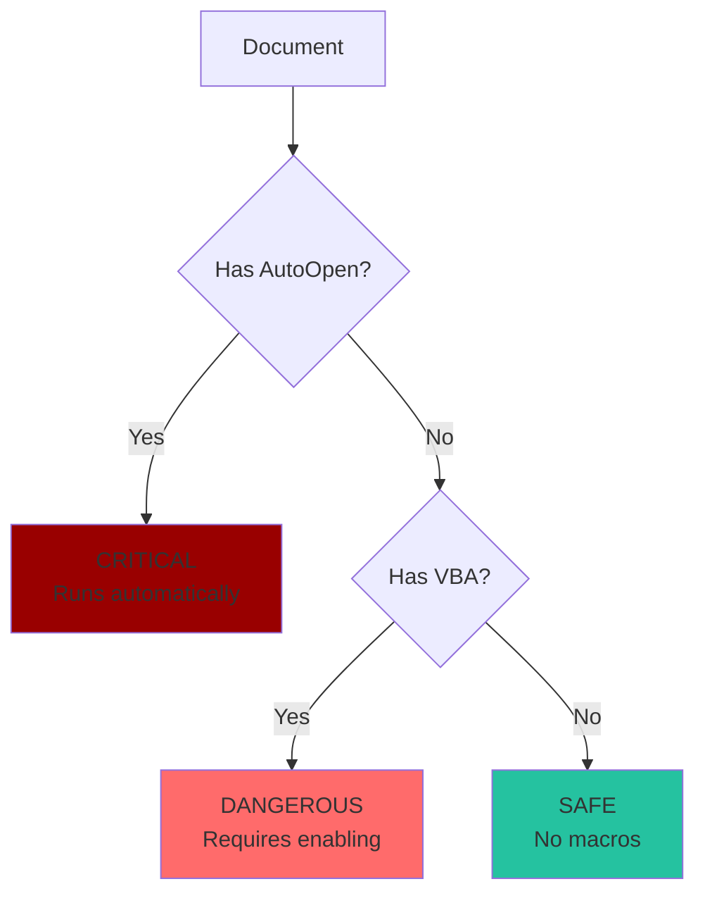

# Embedded Threat Detection

How Batin scans for malicious content hidden inside files.

## Overview

Many file formats can **contain** other content:

- Office documents → VBA macros
- PDFs → JavaScript
- Archives → Executables
- Images → Hidden data

Batin's Stage 4 scans for these embedded threats.

---

## Threat Types

```rust
pub enum ThreatType {
    Macro,      // Office VBA macros
    JavaScript, // PDF/HTML JavaScript
    Executable, // Hidden EXE/DLL
    Script,     // Shell/PowerShell scripts
    Unknown,    // Unclassified threat
}
```

---

## Office Macro Detection

### The Threat

VBA macros in Office documents can:

- Download and execute malware
- Steal credentials/data
- Encrypt files (ransomware)
- Spread to other documents

### Auto-Execute Macros (Critical)

Most dangerous, they run automatically when document opens:

| Macro Name | Trigger |
|------------|---------|
| `AutoOpen` | Document opens |
| `AutoExec` | Application starts |
| `Document_Open` | Word document opens |
| `Workbook_Open` | Excel workbook opens |
| `Auto_Open` | Legacy Excel macro |

### Detection Implementation

```rust
fn detect_macros(data: &[u8]) -> Vec<EmbeddedThreat> {
    let mut threats = Vec::new();
    
    // Auto-execute markers (CRITICAL severity)
    let auto_exec_markers: [&[u8]; 4] = [
        b"AutoOpen",
        b"AutoExec", 
        b"Document_Open",
        b"Workbook_Open"
    ];
    
    for marker in &auto_exec_markers {
        if let Some(offset) = find_bytes(data, marker) {
            threats.push(EmbeddedThreat {
                threat_type: ThreatType::Macro,
                offset,
                severity: ThreatLevel::Critical,
                description: format!(
                    "Auto-execute macro detected: {}",
                    String::from_utf8_lossy(marker)
                ),
            });
        }
    }
    
    // Regular VBA markers (only if no auto-exec found)
    if threats.is_empty() {
        let macro_markers: [&[u8]; 3] = [
            b"VBA",
            b"_VBA_PROJECT",
            b"macros/"
        ];
        
        for marker in &macro_markers {
            if let Some(offset) = find_bytes(data, marker) {
                threats.push(EmbeddedThreat {
                    threat_type: ThreatType::Macro,
                    offset,
                    severity: ThreatLevel::Dangerous,
                    description: "Office macro detected".to_string(),
                });
                break;  // Only report once
            }
        }
    }
    
    threats
}
```

### Why Priority?



---

## PDF JavaScript Detection

### The Threat

PDF JavaScript can:

- Exploit PDF reader vulnerabilities
- Download malware
- Redirect to phishing sites
- Run when opening the document

### Detection Implementation

```rust
fn detect_pdf_javascript(data: &[u8]) -> Vec<EmbeddedThreat> {
    let mut threats = Vec::new();
    
    // JavaScript object markers in PDF
    let js_markers: [&[u8]; 2] = [
        b"/JavaScript",
        b"/JS"
    ];
    
    for marker in &js_markers {
        if let Some(offset) = find_bytes(data, marker) {
            threats.push(EmbeddedThreat {
                threat_type: ThreatType::JavaScript,
                offset,
                severity: ThreatLevel::Suspicious,
                description: "PDF with JavaScript detected".to_string(),
            });
            break;  // Only report once
        }
    }
    
    threats
}
```

### Why Suspicious (Not Dangerous)?

- Many legitimate PDFs use JavaScript for forms
- Interactive PDFs need JavaScript
- But it's still worth flagging for review

---

## Executable in Archive Detection

### The Threat

Attackers hide executables in archives to:

- Bypass email filters
- Trick users with fake extensions
- Package multiple malware components

### Detection Implementation

```rust
fn detect_executable_in_archive(data: &[u8]) -> Vec<EmbeddedThreat> {
    let mut threats = Vec::new();
    
    // Look for PE header (MZ) in archive data
    if let Some(offset) = find_bytes(data, &[0x4D, 0x5A]) {
        threats.push(EmbeddedThreat {
            threat_type: ThreatType::Executable,
            offset,
            severity: ThreatLevel::Dangerous,
            description: "Executable file in archive".to_string(),
        });
    }
    
    threats
}
```

### Why MZ Header?

- All Windows executables start with `MZ`
- Works even if extension is changed
- Finds nested/compressed executables

---

## Main Scan Function

```rust
pub fn scan_embedded_content(
    data: &[u8],
    signature: &FileSignature,
) -> Result<Vec<EmbeddedThreat>> {
    let mut threats = Vec::new();
    
    match signature.category {
        FileCategory::Document => {
            // Check for Office macros
            if signature.mime_type.contains("msword") 
                || signature.mime_type.contains("ms-excel") 
            {
                threats.extend(detect_macros(data));
            }
            
            // Check for PDF JavaScript
            if signature.mime_type == "application/pdf" {
                threats.extend(detect_pdf_javascript(data));
            }
        }
        FileCategory::Archive => {
            // Check for executables in archives
            threats.extend(detect_executable_in_archive(data));
        }
        _ => {
            // Other categories don't have embedded threats (yet)
        }
    }
    
    Ok(threats)
}
```

---

## EmbeddedThreat Structure

```rust
#[derive(Debug, Clone, Serialize)]
pub struct EmbeddedThreat {
    /// Type of embedded threat
    pub threat_type: ThreatType,
    
    /// Byte offset where threat was found
    pub offset: usize,
    
    /// Severity assessment
    pub severity: ThreatLevel,
    
    /// Human-readable description
    pub description: String,
}
```

### Why Include Offset?

- Forensic investigators can examine the exact location
- Helps distinguish multiple threats
- Enables targeted mitigation

---

## Severity Matrix

| Category | Threat | Severity |
|----------|--------|----------|
| Document | AutoOpen/AutoExec macro | **Critical** |
| Document | Regular VBA macro | Dangerous |
| PDF | JavaScript | Suspicious |
| Archive | Embedded executable | Dangerous |

---

## Integration with Threat Assessment

```rust
fn assess_threat(...) -> ThreatLevel {
    // Embedded threats raise the level
    if !embedded_threats.is_empty() {
        let max_severity = embedded_threats
            .iter()
            .map(|t| &t.severity)
            .max()
            .unwrap();
        
        return max(*max_severity, current_level);
    }
    
    // ... other checks ...
}
```

---

## Adding New Threat Detectors

### Step 1: Create Detection Function

```rust
fn detect_powershell_in_document(data: &[u8]) -> Vec<EmbeddedThreat> {
    let mut threats = Vec::new();
    
    let ps_markers = [
        b"powershell",
        b"powershell.exe",
        b"-EncodedCommand",
        b"Invoke-Expression",
    ];
    
    for marker in &ps_markers {
        if let Some(offset) = find_bytes(data, marker) {
            threats.push(EmbeddedThreat {
                threat_type: ThreatType::Script,
                offset,
                severity: ThreatLevel::Dangerous,
                description: format!(
                    "PowerShell reference: {}",
                    String::from_utf8_lossy(marker)
                ),
            });
        }
    }
    
    threats
}
```

### Step 2: Integrate into Main Scanner

```rust
FileCategory::Document => {
    // ... existing checks ...
    
    // New: Check for PowerShell
    threats.extend(detect_powershell_in_document(data));
}
```

### Step 3: Add Tests

```rust
#[test]
fn test_detect_powershell() {
    let doc_with_ps = b"normal content powershell.exe more content";
    let threats = detect_powershell_in_document(doc_with_ps);
    assert!(!threats.is_empty());
    assert!(matches!(threats[0].threat_type, ThreatType::Script));
}
```

---

## Performance Considerations

### Time Complexity

**O(n × p)** per detector, where:

- n = file size
- p = number of patterns to search

### Optimization: Category-Based Skipping

Only scan categories that can have embedded threats:

```rust
match signature.category {
    FileCategory::Document => { /* scan */ }
    FileCategory::Archive => { /* scan */ }
    // Skip Image, Executable, etc.
    _ => { /* no embedded threat scanning */ }
}
```

---

:::tip Security Best Practice
When processing uploaded files:

1. **Always scan** for embedded threats
2. **Block** Critical severity (auto-execute macros)
3. **Quarantine** Dangerous severity for review
4. **Log** Suspicious severity for monitoring
:::
