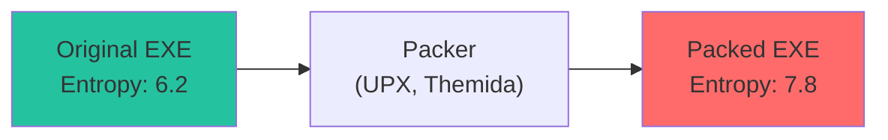

# Entropy Analysis

How Batin uses information theory to detect packed, encrypted, and suspicious files.

## What is Entropy?

**Entropy** measures the randomness or "information content" of data. In cybersecurity, it reveals file characteristics invisible to signature detection.

### Shannon Entropy Formula

```
H(X) = -Σ p(xᵢ) × log₂(p(xᵢ))
```

Where:

- **H(X)** = entropy in bits per byte (0.0 to 8.0)
- **p(xᵢ)** = probability of byte value i occurring
- **log₂** = logarithm base 2

### Intuitive Understanding

| Entropy | Meaning | Example |
|---------|---------|---------|
| 0.0 | All bytes identical | `AAAAAAAAAA` |
| ~4.5 | English text | Source code, documents |
| ~6.0 | Compiled code | Normal executables |
| ~7.5 | Compressed data | ZIP, JPEG, MP3 |
| ~8.0 | Perfectly random | Encrypted, packed |

---

## Why Entropy Matters for Security

### Packed Executables

Malware is often "packed" to:

- Evade signature detection
- Reduce file size
- Obfuscate code

Packing compresses the executable, resulting in **high entropy**.



### Encrypted Content

Ransomware, encrypted payloads, and encrypted documents have:

- Very high entropy (>7.8)
- Nearly uniform byte distribution

### Compression vs Encryption

Both have high entropy, but:

| Characteristic | Compressed | Encrypted |
|---------------|------------|-----------|
| Entropy | 7.0-7.8 | 7.8-8.0 |
| Chi-square | Higher | Very low |
| Has headers | Yes (ZIP, GZIP) | Often no |

Chi-square test distinguishes them: encrypted data has nearly perfect uniform distribution.

---

## Implementation

### Single-Pass Algorithm

```rust
pub fn calculate_entropy_stats(data: &[u8]) -> EntropyStats {
    if data.is_empty() {
        return EntropyStats::default();
    }
    
    // Step 1: Build frequency table in single pass
    let mut frequency: [usize; 256] = [0; 256];
    for &byte in data {
        frequency[byte as usize] += 1;
    }
    
    let len = data.len() as f64;
    let mut entropy = 0.0;
    let mut chi_square = 0.0;
    let expected = len / 256.0;  // Expected count for uniform
    
    // Step 2: Calculate both metrics from frequency table
    for &count in &frequency {
        if count > 0 {
            // Shannon entropy
            let p = count as f64 / len;
            entropy -= p * p.log2();
            
            // Chi-square statistic
            let diff = count as f64 - expected;
            chi_square += (diff * diff) / expected;
        }
    }
    
    EntropyStats { frequency, entropy, chi_square }
}
```

### Why Single Pass?

**Memory Access Pattern:**

```
Data:      [A, B, C, D, E, F, G, H, ...]
Pass 1:     ^  ^  ^  ^  ^  ^  ^  ^       (OLD: build frequency)
Pass 2:     ^  ^  ^  ^  ^  ^  ^  ^       (OLD: calculate chi)

Single:     ^  ^  ^  ^  ^  ^  ^  ^       (NEW: do both)
```

- **50% fewer memory reads**
- **Better cache utilization**
- **Same result**

---

## Chi-Square Test

### Purpose

Chi-square measures how much the observed distribution deviates from expected (uniform).

### Formula

```
χ² = Σ (Oᵢ - Eᵢ)² / Eᵢ
```

Where:

- **Oᵢ** = observed count of byte i
- **Eᵢ** = expected count (data.len() / 256)

### Interpretation

| Chi-Square | Interpretation |
|------------|---------------|
| < 50 | Very uniform (encrypted) |
| 50-150 | Somewhat uniform (packed/compressed) |
| 150-500 | Normal variation (binary) |
| > 500 | Non-uniform (text, structured data) |

### Packed vs Encrypted

```mermaid
quadrantChart
    title Entropy vs Chi-Square
    x-axis Low Chi-Square --> High Chi-Square
    y-axis Low Entropy --> High Entropy
    quadrant-1 Packed (high entropy, moderate χ²)
    quadrant-2 Encrypted (high entropy, low χ²)
    quadrant-3 Text (low entropy, high χ²)
    quadrant-4 Binary (medium entropy, medium χ²)
```

---

## Detection Thresholds

```rust
pub struct DetectionConfig {
    // Packed detection
    pub entropy_threshold: f64,          // Default: 7.2
    pub packed_chi_square_threshold: f64, // Default: 100.0
    
    // Encrypted detection
    pub encrypted_entropy_threshold: f64,     // Default: 7.8
    pub encrypted_chi_square_threshold: f64,  // Default: 50.0
}
```

### Detection Rules

```rust
EntropyProfile {
    is_packed: entropy > 7.2 && chi_square < 100.0,
    is_encrypted: entropy > 7.8 && chi_square < 50.0,
    ...
}
```

---

## Sliding Window Entropy

### Purpose

Global entropy misses localized anomalies:

```
[Normal data .................. Hidden encrypted blob .... Normal data]
                                ^^^^^^^^^^^^^^^^^^^
             Global entropy: 5.5 (looks normal)
             Local entropy:  7.9 (suspicious!)
```

### Implementation

```rust
pub fn sliding_window_entropy(data: &[u8], window_size: usize) -> Vec<f64> {
    if data.len() < window_size {
        return vec![calculate_shannon_entropy(data)];
    }
    
    let mut entropies = Vec::with_capacity(data.len() - window_size + 1);
    
    for i in 0..=(data.len() - window_size) {
        let window = &data[i..i + window_size];
        entropies.push(calculate_shannon_entropy(window));
    }
    
    entropies
}
```

### Visualization

```
Offset:     0    100   200   300   400   500
Entropy:   |-----|-----|-----|-----|-----|
           4.5   4.8   7.9   7.8   4.6   4.5
                       ^^^^^^^^^^^
                    Hidden encrypted section!
```

### Use Cases

1. **Steganography detection** - Hidden data in images
2. **Ransomware analysis** - Encrypted file sections
3. **Malware unpacking** - Find encrypted payloads

---

## EntropyProfile

```rust
pub struct EntropyProfile {
    /// Overall file entropy (0.0-8.0)
    pub global_entropy: f64,
    
    /// Entropy at each block (for visualization)
    pub block_entropies: Vec<f64>,
    
    /// Chi-square statistic
    pub chi_square: f64,
    
    /// True if likely packed executable
    pub is_packed: bool,
    
    /// True if likely encrypted content
    pub is_encrypted: bool,
}
```

### Construction

```rust
pub fn analyze_entropy(data: &[u8], threshold: f64) -> Result<EntropyProfile> {
    let stats = calculate_entropy_stats(data);
    
    // Block entropies for visualization (optional)
    let block_entropies = sliding_window_entropy(data, 256);
    
    Ok(EntropyProfile {
        global_entropy: stats.entropy,
        block_entropies,
        chi_square: stats.chi_square,
        is_packed: stats.entropy > threshold && stats.chi_square < 100.0,
        is_encrypted: stats.entropy > 7.8 && stats.chi_square < 50.0,
    })
}
```

---

## Real-World Examples

### Normal Executable

```
File: notepad.exe
Entropy: 6.12 bits/byte
Chi-square: 342.5
Is Packed: false
Is Encrypted: false
→ Threat Level: Suspicious (normal exe)
```

### UPX-Packed Malware

```
File: malware_packed.exe
Entropy: 7.89 bits/byte
Chi-square: 78.2
Is Packed: true
Is Encrypted: false
→ Threat Level: Dangerous
```

### Encrypted Payload

```
File: encrypted_data.bin
Entropy: 7.99 bits/byte
Chi-square: 23.1
Is Packed: false
Is Encrypted: true
→ Threat Level: Dangerous
```

### Text File

```
File: readme.txt
Entropy: 4.23 bits/byte
Chi-square: 8547.3  (very non-uniform)
Is Packed: false
Is Encrypted: false
→ Threat Level: Safe
```

---

## Performance

### Time Complexity

| Operation | Complexity |
|-----------|------------|
| `calculate_entropy_stats` | O(n) |
| `sliding_window_entropy` | O(n × w) |

Where n = file size, w = window size.

### Space Complexity

| Component | Space |
|-----------|-------|
| Frequency array | 256 bytes (fixed) |
| Block entropies | 8 × (n/w) bytes |

### Optimization: Skip for Small Files

```rust
if data.len() < 256 {
    // Too small for meaningful entropy
    return EntropyProfile::default();
}
```

---

:::tip Key Insight
Entropy is the "second opinion" after magic bytes. A file claiming to be a PDF with 7.9 entropy is almost certainly **not** a normal PDF. It is likely encrypted, packed, or malicious.

Combined with chi-square, Batin can distinguish:

- Normal compression (ZIP, JPEG)
- Suspicious packing (UPX, Themida)  
- Likely encryption (ransomware, encrypted payloads)
:::
