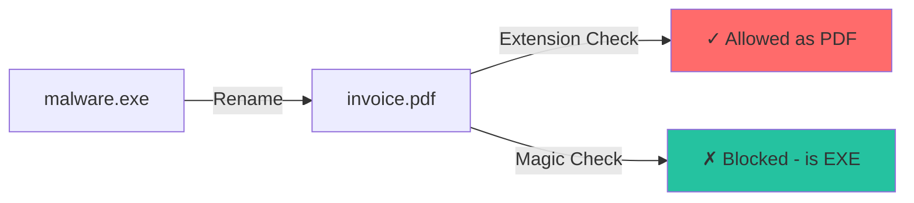

# Magic Bytes Detection

Deep dive into how Batin identifies file types using magic byte signatures.

## What Are Magic Bytes?

Magic bytes (also called "file signatures" or "magic numbers") are fixed sequences of bytes at specific offsets that uniquely identify file formats.

### History

The term "magic number" comes from early Unix systems where the first bytes of executable files indicated their format. The `/etc/magic` file contains these patterns.

### Why Magic Bytes?

1. **Extensions lie**: `malware.exe` → `invoice.pdf` - trivial to rename
2. **Content doesn't**: The actual bytes reveal the true format
3. **Fast**: Only read first few bytes, not entire file
4. **Reliable**: Formats rarely change their signatures

---

## Signature Structure

```rust
pub struct FileSignature {
    /// Primary magic bytes to match
    pub magic: &'static [u8],
    
    /// Offset from file start where magic appears
    pub offset: usize,
    
    /// Optional secondary check for disambiguation
    pub additional_magic: Option<(usize, &'static [u8])>,
    
    /// Possible file extensions
    pub extensions: Vec<String>,
    
    /// MIME type
    pub mime_type: &'static str,
    
    /// Category for threat assessment
    pub category: FileCategory,
}
```

### Why This Design?

| Field | Purpose |
|-------|---------|
| `magic` | Primary identification pattern |
| `offset` | Some formats don't start at byte 0 (e.g., MP4 at offset 4) |
| `additional_magic` | Distinguish similar formats (e.g., DOCX vs XLSX) |
| `extensions` | Multiple extensions per format (e.g., jpg/jpeg) |
| `category` | Enables threat-aware processing |

---

## Example Signatures

### PNG Image

```rust
FileSignature {
    magic: &[0x89, 0x50, 0x4E, 0x47, 0x0D, 0x0A, 0x1A, 0x0A],
    offset: 0,
    additional_magic: None,
    extensions: vec!["png".to_string()],
    mime_type: "image/png",
    category: FileCategory::Image,
}
```

**Bytes explained:**

- `0x89` - High bit set (not ASCII)
- `0x50 0x4E 0x47` - "PNG" in ASCII
- `0x0D 0x0A` - DOS line ending (\\r\\n)
- `0x1A` - DOS EOF (stops `type` command)
- `0x0A` - Unix line ending (\\n)

**Why this pattern?** It detects corruption when copied between systems with different line endings.

### PE Executable (EXE/DLL)

```rust
FileSignature {
    magic: &[0x4D, 0x5A],  // "MZ"
    offset: 0,
    additional_magic: None,
    extensions: vec!["exe".to_string(), "dll".to_string()],
    mime_type: "application/x-dosexec",
    category: FileCategory::Executable,
}
```

**Bytes explained:**

- `0x4D 0x5A` - "MZ" - initials of Mark Zbikowski (DOS developer)

### MP4 Video

```rust
FileSignature {
    magic: &[0x66, 0x74, 0x79, 0x70],  // "ftyp"
    offset: 4,  // NOTE: Not at offset 0!
    additional_magic: None,
    extensions: vec!["mp4".to_string()],
    mime_type: "video/mp4",
    category: FileCategory::Multimedia,
}
```

**Why offset 4?** MP4 files start with a size field (4 bytes), then "ftyp" atom type.

---

## Matching Algorithm

```rust
pub fn match_signatures(&self, data: &[u8]) -> Vec<(usize, f64)> {
    let mut matches = Vec::new();
    
    for (idx, sig) in self.signatures.iter().enumerate() {
        // 1. Check data length
        let required_len = sig.offset + sig.magic.len();
        if data.len() < required_len {
            continue;
        }
        
        // 2. Extract slice at offset
        let slice = &data[sig.offset..sig.offset + sig.magic.len()];
        
        // 3. Compare magic bytes
        if slice != sig.magic {
            continue;
        }
        
        // 4. Check additional_magic if present
        if let Some((add_offset, add_bytes)) = sig.additional_magic {
            if data.len() < add_offset + add_bytes.len() {
                continue;
            }
            if &data[add_offset..add_offset + add_bytes.len()] != add_bytes {
                continue;
            }
        }
        
        // 5. Match found!
        matches.push((idx, 0.9));  // 90% base confidence
    }
    
    matches
}
```

### Time Complexity

**O(n × m)** where:

- n = number of signatures (~60)
- m = average magic byte length (~6 bytes)

For a 3KB file scan: ~360 byte comparisons = **microseconds**.

---

## Disambiguation Techniques

### Problem: Shared Prefixes

Many formats share the same magic bytes:

| Magic | Possible Formats |
|-------|-----------------|
| `PK..` | ZIP, DOCX, XLSX, JAR, EPUB, APK |
| `ftyp` | MP4, MOV, M4A, M4V, HEIC, AVIF |
| `RIFF` | WAV, AVI, WebP |

### Solution 1: Additional Magic

```rust
// WEBP: RIFF at 0, WEBP at 8
FileSignature {
    magic: &[0x52, 0x49, 0x46, 0x46],  // "RIFF"
    offset: 0,
    additional_magic: Some((8, b"WEBP")),
    extensions: vec!["webp".to_string()],
    ...
}
```

### Solution 2: Content Inspection

For ZIP-based formats, check internal paths:

```rust
fn detect_zip_format(&self, data: &[u8]) -> Option<&'static str> {
    // Look for internal file patterns
    if find_bytes(data, b"[Content_Types].xml").is_some() {
        // Office Open XML
        if find_bytes(data, b"word/").is_some() { return Some("docx"); }
        if find_bytes(data, b"xl/").is_some() { return Some("xlsx"); }
        if find_bytes(data, b"ppt/").is_some() { return Some("pptx"); }
    }
    if find_bytes(data, b"META-INF/MANIFEST.MF").is_some() {
        return Some("jar");
    }
    if find_bytes(data, b"mimetype").is_some() {
        return Some("epub");
    }
    None
}
```

### Solution 3: ISO Base Media Format

For MP4-like files, parse the `ftyp` atom:

```rust
fn detect_iso_base_media_format(&self, data: &[u8]) -> Option<...> {
    // Parse ftyp box
    if data.len() < 12 { return None; }
    let brand = &data[8..12];
    
    match brand {
        b"isom" | b"mp41" | b"mp42" => Some("mp4"),
        b"qt  " => Some("mov"),
        b"M4A " | b"M4B " => Some("m4a"),
        b"heic" | b"mif1" => Some("heic"),
        b"avif" => Some("avif"),
        _ => None,
    }
}
```

---

## Adding New Signatures

### Step 1: Research the Format

1. Find official specification
2. Identify magic bytes and offset
3. Note any similar formats to disambiguate

### Step 2: Add to Database

```rust
// In signatures.rs, build_signatures()
FileSignature {
    magic: &[0x00, 0x00, 0x01, 0x00],
    offset: 0,
    additional_magic: None,
    extensions: vec!["ico".to_string()],
    mime_type: "image/x-icon",
    category: FileCategory::Image,
},
```

### Step 3: Add Disambiguation (if needed)

If it shares magic with another format, add:

- `additional_magic` check, or
- Special detection function

### Step 4: Add Tests

```rust
#[test]
fn test_detect_ico() {
    let ico_data = [0x00, 0x00, 0x01, 0x00, /* ... */];
    let db = SignatureDatabase::default();
    let matches = db.match_signatures(&ico_data);
    assert!(!matches.is_empty());
    assert_eq!(db.signatures[matches[0].0].extensions[0], "ico");
}
```

---

## Why Not Use File Extension?



**Extension checking failures:**

1. User renames file (accidental or malicious)
2. Server/gateway doesn't set extension
3. File is extracted from archive
4. Memory forensics - no filename

**Magic byte checking:**

- Works without filename
- Works on file fragments
- Reveals true content type

---

## Performance Optimizations

### 1. Static Initialization

```rust
pub static SIGNATURE_DB: LazyLock<RwLock<SignatureDatabase>> = 
    LazyLock::new(|| RwLock::new(SignatureDatabase::default()));
```

- Database built once, on first access
- Subsequent calls are just pointer lookup

### 2. Extension Map

```rust
pub extension_map: HashMap<String, Vec<usize>>
```

When validating extension, lookup is O(1) instead of O(n).

### 3. Early Exit

Algorithm exits on first non-match byte, not after comparing entire magic.

---

:::tip Key Takeaway
Magic bytes are the foundation of file type detection, but they're not infallible. Batin uses them as Stage 1, then validates with entropy, polyglot detection, and threat scanning for comprehensive security.
:::
