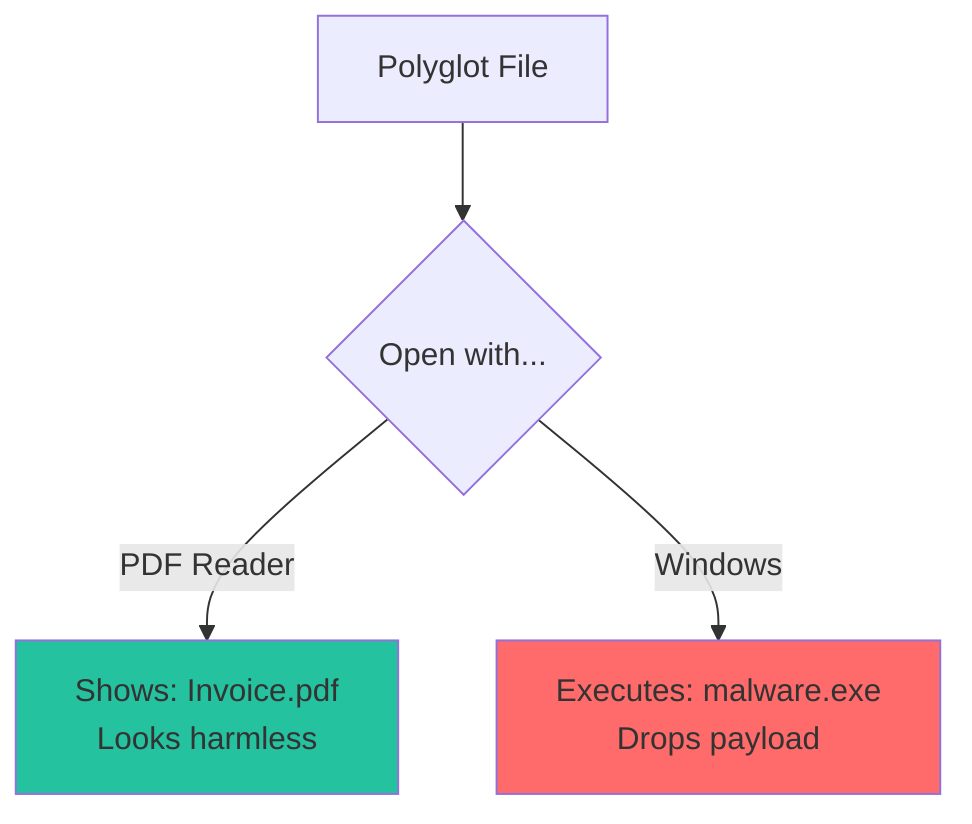
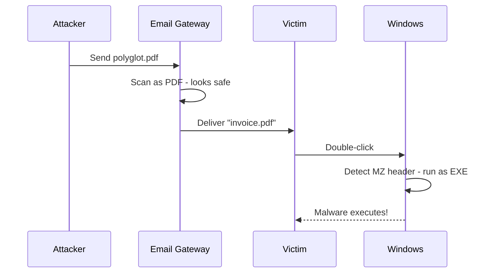

# Polyglot Detection

How Batin identifies files that are simultaneously valid in multiple formats.

## What is a Polyglot File?

A **polyglot** (from Greek "many tongues") is a file that:

1. Is **valid** when interpreted as Format A
2. Is **also valid** when interpreted as Format B
3. May behave **differently** in each context



---

## Why Polyglots Are Dangerous

### Attack Scenario: Email Bypass



### Why This Works

1. **Email scanners** check the beginning - see `%PDF`
2. **Windows** checks the **actual content** - finds `MZ` header inside
3. Different tools, different interpretations

---

## Common Polyglot Combinations

| Primary | Secondary | Attack Vector |
|---------|-----------|---------------|
| PDF | EXE | Email, web downloads |
| PNG | HTML | Web XSS, image hosting |
| GIF | JavaScript | Image-based XSS |
| ZIP | JAR | Java exploitation |
| JPEG | ZIP | Steganography |

### PDF + EXE (Most Common)

```
+----------------------------------+
| %PDF-1.4                         | <- PDF header
| ...PDF objects...                |
| MZ                               | <- PE header (embedded)
| ...executable code...            |
| %%EOF                            | <- PDF trailer
+----------------------------------+
```

PDF readers stop at `%%EOF`.  
Windows finds `MZ` and executes.

---

## Detection Algorithm

```rust
pub fn detect_polyglot(data: &[u8], db: &SignatureDatabase) -> Result<Vec<String>> {
    let mut detected_formats = Vec::new();
    
    // Check multiple offsets for signatures
    let check_offsets = [0, 512, 1024, 2048];
    
    for offset in check_offsets {
        if offset >= data.len() {
            break;
        }
        
        let slice = &data[offset..];
        let matches = db.match_signatures(slice);
        
        for (sig_idx, _confidence) in matches {
            let sig = &db.signatures[sig_idx];
            let format = sig.extensions[0].clone();
            
            if !detected_formats.contains(&format) {
                detected_formats.push(format);
            }
        }
    }
    
    // Special case: PDF with embedded PE
    if data.starts_with(b"%PDF") {
        if let Some(pe_pos) = find_bytes(data, &[0x4D, 0x5A]) {
            if pe_pos > 100 {  // Not at start (embedded)
                detected_formats.push("exe".to_string());
            }
        }
    }
    
    Ok(detected_formats)
}
```

### Why These Offsets?

| Offset | Rationale |
|--------|-----------|
| 0 | Primary format header location |
| 512 | Floppy sector size, common padding |
| 1024 | Secondary header location |
| 2048 | CD-ROM sector size, ISO 9660 |

---

## Special Case: PDF + PE

This attack is so common it gets special handling:

```rust
// Special case: PDF with embedded PE
if data.starts_with(b"%PDF") {
    if let Some(pe_pos) = find_bytes(data, &[0x4D, 0x5A]) {
        if pe_pos > 100 {  // Not at very start
            detected_formats.push("exe".to_string());
        }
    }
}
```

### Why `pe_pos > 100`?

- **Legitimate**: Some PDFs have "MZ" as text (e.g., in font names)
- **Attack**: PE header needs space for DOS stub (>100 bytes)
- **Trade-off**: Minor false positive risk vs. detection accuracy

---

## Threat Level Impact

```rust
fn assess_threat(...) -> ThreatLevel {
    // Polyglot = ALWAYS Dangerous
    if detected_formats.len() > 1 {
        return ThreatLevel::Dangerous;
    }
    
    // ... other checks ...
}
```

**Rationale:**

- Legitimate files are **never** polyglots
- Any multi-format file should be investigated
- Better to over-warn than miss an attack

---

## Creating Polyglots (For Testing)

### PDF + EXE Polyglot

```python
# polyglot_creator.py (educational purposes only)
pdf_header = b"%PDF-1.4\n"
pdf_body = b"1 0 obj\n<<>>\nendobj\n"
pdf_xref = b"xref\n0 1\n0000000000 65535 f \ntrailer\n<<>>\nstartxref\n0\n"
pdf_eof = b"%%EOF\n"

exe_content = open("malware.exe", "rb").read()

# Embed EXE in PDF "stream"
polyglot = pdf_header + pdf_body + exe_content + pdf_xref + pdf_eof

with open("polyglot.pdf", "wb") as f:
    f.write(polyglot)
```

### Testing Detection

```bash
batin scan polyglot.pdf --json | jq '.[] | {
  formats: .file_type.detected_formats,
  is_polyglot: (.file_type.detected_formats | length > 1),
  threat: .file_type.threat_level
}'
```

Expected output:

```json
{
  "formats": ["pdf", "exe"],
  "is_polyglot": true,
  "threat": "Dangerous"
}
```

---

## Defense Strategies

### 1. Reject Polyglots

```rust
async fn validate_upload(data: &[u8]) -> Result<(), &'static str> {
    let config = DetectionConfig::default();
    let result = FileType::from_bytes(data, &config)?;
    
    if result.detected_formats.len() > 1 {
        log::error!("Polyglot rejected: {:?}", result.detected_formats);
        return Err("Polyglot files not allowed");
    }
    
    Ok(())
}
```

### 2. Content-Type Enforcement

```rust
fn validate_claimed_type(data: &[u8], claimed: &str) -> bool {
    let config = DetectionConfig::default();
    let result = FileType::from_bytes(data, &config).ok()?;
    
    // Reject if polyglot
    if result.detected_formats.len() > 1 {
        return false;
    }
    
    // Reject if detected type doesn't match claimed
    result.extension == claimed
}
```

### 3. Quarantine for Review

```bash
# Quarantine script
batin scan /uploads -r --json | \
  jq -r '.[] | select(.file_type.detected_formats | length > 1) | .path' | \
  xargs -I {} mv {} /quarantine/
```

---

## False Positives

### Legitimate Multi-Format Files

Some files are intentionally multi-format:

| File Type | Reason |
|-----------|--------|
| Self-extracting archives | EXE + ZIP |
| Hybrid installers | Binary + archive |
| Art projects | Intentional polyglots |

### Mitigation

```rust
// Allow specific known combinations
fn is_legitimate_polyglot(formats: &[String]) -> bool {
    // Self-extracting archive: EXE + ZIP is okay
    if formats.len() == 2 
        && formats.contains(&"exe".to_string())
        && formats.contains(&"zip".to_string()) 
    {
        return true;
    }
    false
}
```

---

## Performance Considerations

### Time Complexity

**O(n × k × m)** where:

- n = number of signatures
- k = number of offsets checked (4)
- m = average magic byte length

### Optimization: Early Exit

If already found 2+ formats, the file is a polyglot—no need to check more offsets.

```rust
for offset in check_offsets {
    // ... check signatures ...
    
    // Early exit: already polyglot
    if detected_formats.len() >= 2 {
        break;
    }
}
```

---

:::warning Security Note
Polyglot files are **inherently suspicious**. While some legitimate cases exist, any file detected as multiple formats should be:

1. Logged
2. Quarantined or blocked
3. Manually reviewed before allowing

When in doubt, reject.
:::
