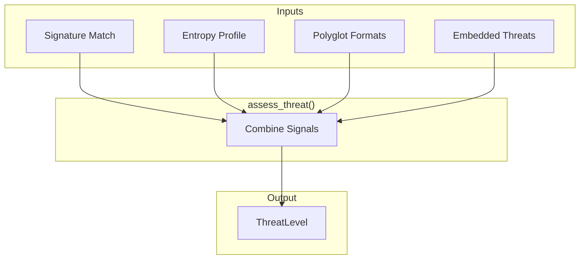
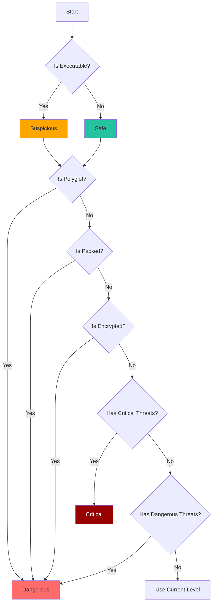

# Threat Assessment

How Batin combines all detection signals to assess file risk.

## Overview

After the four detection stages complete, Batin synthesizes results into a single `ThreatLevel`:



---

## Threat Level Enum

```rust
#[derive(Debug, Clone, Copy, PartialEq, Eq, PartialOrd, Ord, Serialize)]
pub enum ThreatLevel {
    Safe,       // 0 - No risk indicators
    Suspicious, // 1 - Minor concerns
    Dangerous,  // 2 - High risk indicators
    Critical,   // 3 - Immediate threat
}
```

### Ordering

Threat levels are ordered, enabling comparisons:

```rust
assert!(ThreatLevel::Safe < ThreatLevel::Suspicious);
assert!(ThreatLevel::Dangerous < ThreatLevel::Critical);

// Get maximum threat level
let levels = [ThreatLevel::Safe, ThreatLevel::Dangerous];
let max = levels.iter().max().unwrap(); // Dangerous
```

---

## Assessment Algorithm

```rust
fn assess_threat(
    signature: &FileSignature,
    entropy_profile: &Option<EntropyProfile>,
    detected_formats: &[String],
) -> ThreatLevel {
    // Start with category-based default
    let mut level = match signature.category {
        FileCategory::Executable => ThreatLevel::Suspicious,
        _ => ThreatLevel::Safe,
    };
    
    // Polyglot detection → Dangerous
    if detected_formats.len() > 1 {
        level = level.max(ThreatLevel::Dangerous);
    }
    
    // Entropy analysis
    if let Some(entropy) = entropy_profile {
        // Packed → Dangerous
        if entropy.is_packed {
            level = level.max(ThreatLevel::Dangerous);
        }
        // Encrypted → Dangerous
        if entropy.is_encrypted {
            level = level.max(ThreatLevel::Dangerous);
        }
    }
    
    level
}
```

---

## Assessment Rules

### Rule 1: Category-Based Default

| File Category | Default Level | Rationale |
|--------------|---------------|-----------|
| Executable | Suspicious | Can run code |
| Document | Safe | Generally harmless |
| Image | Safe | Display only |
| Archive | Safe | Container, scan contents |
| Multimedia | Safe | Non-executable |

### Rule 2: Polyglot Escalation

```rust
if detected_formats.len() > 1 {
    level = level.max(ThreatLevel::Dangerous);
}
```

**Why?** Polyglots are never legitimate in uploaded content.

### Rule 3: Entropy Escalation

```rust
if entropy.is_packed || entropy.is_encrypted {
    level = level.max(ThreatLevel::Dangerous);
}
```

**Why?** Packing/encryption indicate evasion attempts.

### Rule 4: Embedded Threat Escalation

Handled separately after `assess_threat`:

```rust
// In FileType construction
let threat_level = if !embedded_threats.is_empty() {
    embedded_threats.iter()
        .map(|t| t.severity)
        .max()
        .unwrap_or(base_level)
        .max(base_level)
} else {
    base_level
};
```

---

## Decision Tree



---

## Threat Level Application

### Filtering by Level

```rust
fn threat_level_value(level: &ThreatLevel) -> u8 {
    match level {
        ThreatLevel::Safe => 0,
        ThreatLevel::Suspicious => 1,
        ThreatLevel::Dangerous => 2,
        ThreatLevel::Critical => 3,
    }
}

// Filter files by minimum threat level
let filtered: Vec<_> = results
    .iter()
    .filter(|r| threat_level_value(&r.threat_level) >= min_level)
    .collect();
```

### CLI Integration

```bash
# Show only dangerous and critical
batin scan /uploads -r --min-threat dangerous
```

---

## Customizing Assessment

### Stricter Assessment

```rust
fn strict_assess_threat(result: &FileType) -> ThreatLevel {
    let base = result.threat_level;
    
    // All executables are Dangerous
    if result.extension == "exe" || result.extension == "dll" {
        return ThreatLevel::Dangerous;
    }
    
    // Any macro presence is Critical
    if result.embedded_threats.iter().any(|t| 
        matches!(t.threat_type, ThreatType::Macro)
    ) {
        return ThreatLevel::Critical;
    }
    
    // High entropy in non-archive = Dangerous
    if let Some(profile) = &result.entropy_profile {
        if profile.global_entropy > 7.0 && result.extension != "zip" {
            return ThreatLevel::Dangerous;
        }
    }
    
    base
}
```

### Lenient Assessment (Whitelisting)

```rust
fn lenient_assess_threat(result: &FileType, allowed_types: &[&str]) -> ThreatLevel {
    // Known types are always Safe
    if allowed_types.contains(&result.extension.as_str()) {
        // But still check for embedded threats
        if result.embedded_threats.is_empty() {
            return ThreatLevel::Safe;
        }
    }
    
    result.threat_level
}
```

---

## Risk Scoring (Extended)

For more granular assessment, convert to numeric score:

```rust
fn calculate_risk_score(result: &FileType) -> f64 {
    let mut score = 0.0;
    
    // Base score by category
    match result.threat_level {
        ThreatLevel::Safe => score += 0.0,
        ThreatLevel::Suspicious => score += 25.0,
        ThreatLevel::Dangerous => score += 50.0,
        ThreatLevel::Critical => score += 100.0,
    }
    
    // Add points for concerning indicators
    if let Some(profile) = &result.entropy_profile {
        // High entropy adds risk
        if profile.global_entropy > 7.0 {
            score += (profile.global_entropy - 7.0) * 20.0;
        }
        if profile.is_packed { score += 15.0; }
        if profile.is_encrypted { score += 20.0; }
    }
    
    // Polyglot adds significant risk
    if result.detected_formats.len() > 1 {
        score += 30.0;
    }
    
    // Embedded threats
    for threat in &result.embedded_threats {
        score += match threat.severity {
            ThreatLevel::Suspicious => 10.0,
            ThreatLevel::Dangerous => 25.0,
            ThreatLevel::Critical => 50.0,
            _ => 0.0,
        };
    }
    
    // Cap at 100
    score.min(100.0)
}
```

### Score Interpretation

| Score Range | Meaning |
|------------|---------|
| 0-10 | Safe, no concerns |
| 11-30 | Low risk, log only |
| 31-50 | Medium risk, review |
| 51-75 | High risk, quarantine |
| 76-100 | Critical, block immediately |

---

## Integration Example

```rust
use batin::{FileType, DetectionConfig, ThreatLevel};

async fn security_gate(data: &[u8]) -> Result<(), String> {
    let config = DetectionConfig::default();
    let result = FileType::from_bytes(data, &config)
        .map_err(|e| format!("Detection failed: {}", e))?;
    
    match result.threat_level {
        ThreatLevel::Safe => {
            log::info!("File passed: {}", result.extension);
            Ok(())
        }
        ThreatLevel::Suspicious => {
            log::warn!("Suspicious file: {} - logging", result.extension);
            // Log but allow
            Ok(())
        }
        ThreatLevel::Dangerous => {
            log::error!("Dangerous file blocked: {:?}", result);
            Err("File blocked: dangerous content detected".into())
        }
        ThreatLevel::Critical => {
            log::error!("CRITICAL THREAT: {:?}", result);
            // Alert security team
            notify_security_team(&result);
            Err("File blocked: critical threat detected".into())
        }
    }
}
```

---

:::tip Design Philosophy
The threat assessment is **conservative by design**. It is better to over-warn than miss a real threat.

Legitimate files can be whitelisted through:

- Custom assessment functions
- Extension allowlists
- Environment-specific rules

But the default should always err on the side of security.
:::
