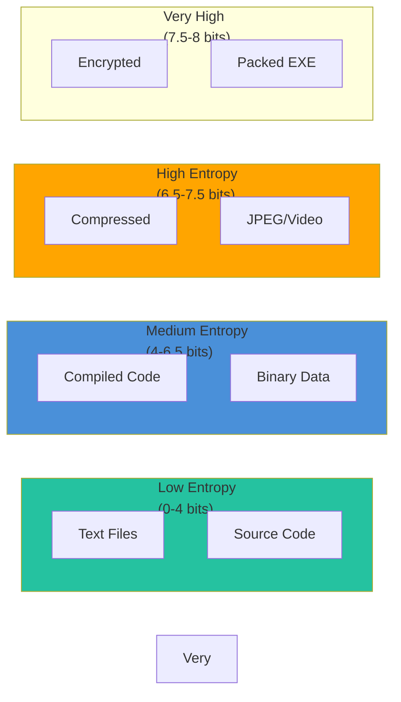
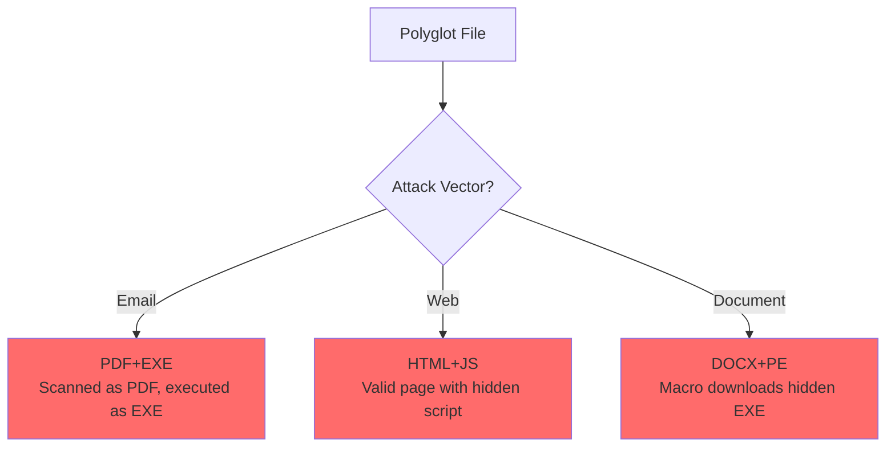
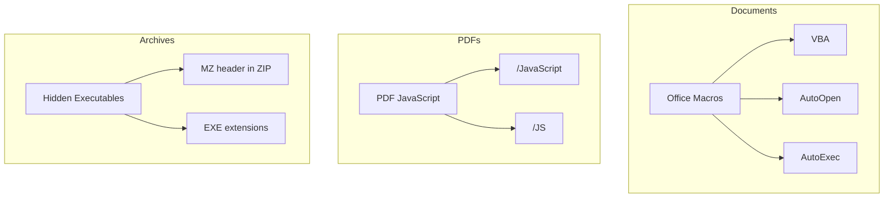
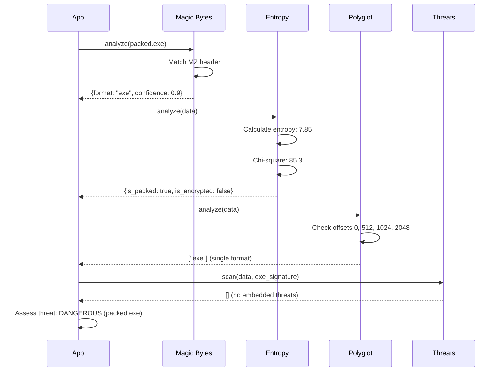

# Detection Pipeline

Detailed walkthrough of Batin's four-stage detection pipeline.

## Overview

Every file analysis passes through four stages:

```mermaid
flowchart LR
    subgraph Stage1["Stage 1"]
        A[Magic Bytes]
    end
    
    subgraph Stage2["Stage 2"]
        B[Entropy Analysis]
    end
    
    subgraph Stage3["Stage 3"]
        C[Polyglot Detection]
    end
    
    subgraph Stage4["Stage 4"]
        D[Threat Scanning]
    end
    
    A --> B --> C --> D --> E[Result]
    
    style Stage1 fill:#1a1a2e
    style Stage2 fill:#16213e
    style Stage3 fill:#0f3460
    style Stage4 fill:#25c2a0
```



Each stage can:

- **Contribute** to the final detection
- **Modify** confidence scores
- **Trigger** threat level changes
- **Short-circuit** for efficiency

---

## Stage 1: Magic Byte Signature Matching

### What Are Magic Bytes?

Magic bytes are fixed byte sequences at specific offsets that identify file formats:

| Format | Magic Bytes | Offset |
|--------|------------|--------|
| PNG | `89 50 4E 47 0D 0A 1A 0A` | 0 |
| PDF | `25 50 44 46` (%PDF) | 0 |
| ZIP | `50 4B 03 04` (PK..) | 0 |
| PE/EXE | `4D 5A` (MZ) | 0 |
| MP4 | `66 74 79 70` (ftyp) | 4 |

### Algorithm

```rust
fn match_signatures(&self, data: &[u8]) -> Vec<(usize, f64)> {
    let mut matches = Vec::new();
    
    for (idx, sig) in self.signatures.iter().enumerate() {
        // Check if data is long enough
        if data.len() < sig.offset + sig.magic.len() {
            continue;
        }
        
        // Compare magic bytes at offset
        let slice = &data[sig.offset..sig.offset + sig.magic.len()];
        if slice == sig.magic {
            // Check additional validation
            let additional_match = sig.additional_magic
                .map(|(offset, bytes)| {
                    data.len() >= offset + bytes.len() &&
                    &data[offset..offset + bytes.len()] == bytes
                })
                .unwrap_or(true);
            
            if additional_match {
                matches.push((idx, 0.9)); // 90% base confidence
            }
        }
    }
    
    matches
}
```

### Why This Approach?

**Pros:**

- ✅ Fast: O(n×m) where n=signatures, m=magic length
- ✅ Reliable: Magic bytes rarely change
- ✅ Low false positives: Specific byte patterns

**Cons:**

- ❌ Misses files without magic (plain text)
- ❌ Can be spoofed (prepend valid header)
- ❌ Some formats share prefixes

**Mitigation:** Other stages catch what magic bytes miss.

---

## Stage 2: Entropy Analysis

### Why Entropy?

Entropy measures randomness. Different file types have characteristic entropy:



### Shannon Entropy Formula

```
H(X) = -Σ p(x) × log₂(p(x))
```

Where:

- H(X) = entropy in bits per byte
- p(x) = probability of byte value x
- Range: 0.0 (all same byte) to 8.0 (uniform random)

### Single-Pass Implementation

```rust
pub fn calculate_entropy_stats(data: &[u8]) -> EntropyStats {
    // Build frequency distribution in single pass
    let mut frequency: [usize; 256] = [0; 256];
    for &byte in data {
        frequency[byte as usize] += 1;
    }
    
    let len = data.len() as f64;
    let mut entropy = 0.0;
    let mut chi_square = 0.0;
    let expected = len / 256.0;
    
    for &count in &frequency {
        if count > 0 {
            // Shannon entropy
            let p = count as f64 / len;
            entropy -= p * p.log2();
            
            // Chi-square statistic
            let diff = count as f64 - expected;
            chi_square += (diff * diff) / expected;
        }
    }
    
    EntropyStats {
        frequency,
        entropy,
        chi_square,
    }
}
```

### Why Single-Pass?

**Before (two passes):**

```rust
let entropy = calculate_shannon_entropy(&data);  // Pass 1
let chi = chi_square_test(&data);                // Pass 2
```

**After (one pass):**

```rust
let stats = calculate_entropy_stats(&data);      // Single pass
// stats.entropy and stats.chi_square available
```

**Benefit:** ~2x faster for large files (cache-friendly, less memory bandwidth).

---

## Stage 3: Polyglot Detection

### What is a Polyglot?

A file valid in multiple formats simultaneously:

```
┌──────────────────────────────────┐
│ %PDF-1.4        <- PDF header    │
│ ... PDF content ...               │
│ MZ              <- PE header     │
│ ... executable code ...           │
└──────────────────────────────────┘
```

This file:

- Opens in PDF readers as a document
- Executes in Windows as a program

### Detection Algorithm

```rust
pub fn detect_polyglot(data: &[u8], db: &SignatureDatabase) -> Result<Vec<String>> {
    let mut detected_formats = Vec::new();
    
    // Check multiple offsets
    let check_offsets = [0, 512, 1024, 2048];
    
    for offset in check_offsets {
        if offset >= data.len() {
            break;
        }
        
        let slice = &data[offset..];
        let matches = db.match_signatures(slice);
        
        for (sig_idx, _confidence) in matches {
            let sig = &db.signatures[sig_idx];
            let format = sig.extensions[0].clone();
            
            if !detected_formats.contains(&format) {
                detected_formats.push(format);
            }
        }
    }
    
    // Special case: PDF with embedded PE
    if data.starts_with(b"%PDF") {
        if let Some(pe_pos) = find_bytes(data, &[0x4D, 0x5A]) {
            if pe_pos > 100 {
                detected_formats.push("exe".to_string());
            }
        }
    }
    
    Ok(detected_formats)
}
```

### Why These Offsets?

| Offset | Rationale |
|--------|-----------|
| 0 | Primary format header |
| 512 | Old floppy sector size, boot sector |
| 1024 | Common secondary header location |
| 2048 | CD-ROM sector size, ISO headers |

### Common Polyglot Attacks



---

## Stage 4: Embedded Threat Scanning

### Threat Categories



### Detection Logic

```rust
pub fn scan_embedded_content(
    data: &[u8],
    signature: &FileSignature,
) -> Result<Vec<EmbeddedThreat>> {
    let mut threats = Vec::new();
    
    match signature.category {
        FileCategory::Document => {
            if signature.mime_type.contains("msword") {
                threats.extend(detect_macros(data));
            }
            if signature.mime_type == "application/pdf" {
                threats.extend(detect_pdf_javascript(data));
            }
        }
        FileCategory::Archive => {
            threats.extend(detect_executable_in_archive(data));
        }
        _ => {}
    }
    
    Ok(threats)
}
```

### Macro Detection Details

```rust
fn detect_macros(data: &[u8]) -> Vec<EmbeddedThreat> {
    let mut threats = Vec::new();
    
    // Auto-execute macros (CRITICAL severity)
    let auto_exec_markers = [
        b"AutoOpen",
        b"AutoExec", 
        b"Document_Open",
        b"Workbook_Open"
    ];
    
    for marker in &auto_exec_markers {
        if let Some(offset) = find_bytes(data, marker) {
            threats.push(EmbeddedThreat {
                threat_type: ThreatType::Macro,
                offset,
                severity: ThreatLevel::Critical,
                description: format!("Auto-execute macro: {}", 
                    String::from_utf8_lossy(marker)),
            });
        }
    }
    
    // Regular VBA macros (DANGEROUS severity)
    if threats.is_empty() {
        let macro_markers = [b"VBA", b"_VBA_PROJECT"];
        for marker in &macro_markers {
            if let Some(offset) = find_bytes(data, marker) {
                threats.push(EmbeddedThreat {
                    threat_type: ThreatType::Macro,
                    offset,
                    severity: ThreatLevel::Dangerous,
                    description: "Office macro detected".to_string(),
                });
                break;
            }
        }
    }
    
    threats
}
```

---

## Pipeline Flow Example

### Analyzing a Packed EXE



### Final Result

```json
{
  "extension": "exe",
  "mime_type": "application/x-dosexec",
  "confidence": 0.9,
  "entropy_profile": {
    "global_entropy": 7.85,
    "is_packed": true,
    "is_encrypted": false
  },
  "threat_level": "Dangerous",
  "detected_formats": ["exe"],
  "embedded_threats": []
}
```

---

## Performance Considerations

### Short-Circuit Optimization

```rust
// Skip expensive stages for speed (configurable)
if !config.enable_entropy {
    // Skip Stage 2
}

if !config.enable_polyglot {
    // Skip Stage 3
}

if !config.enable_embedded {
    // Skip Stage 4
}
```

### Lazy Evaluation

Stages only run when needed:

- Entropy: Only if `enable_entropy = true`
- Polyglot: Only if file matched a signature
- Threats: Only for applicable categories

---

:::tip Implementation Note
Each stage is designed to be:

- **Independent**: Can run in isolation
- **Fast**: Early stages are fastest
- **Additive**: Later stages add detail, not replace
- **Configurable**: Can be disabled for performance

This allows flexible trade-offs between accuracy and speed.
:::
