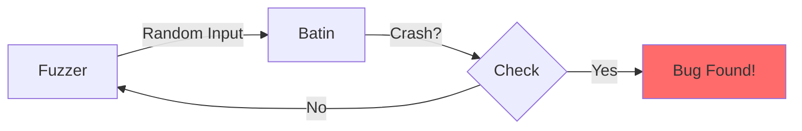

# Fuzz Testing

Ensuring Batin handles any input without panicking.

## Why Fuzz?

Fuzz testing finds bugs that humans miss:



**What fuzzing catches:**

- Buffer overflows
- Integer overflows
- Panics on edge cases
- Infinite loops
- Memory leaks

---

## Setup

### Install cargo-fuzz

```bash
# Requires nightly Rust
rustup install nightly

# Install cargo-fuzz
cargo install cargo-fuzz
```

### Project Structure

```
fuzz/
├── Cargo.toml          # Fuzz targets configuration
└── fuzz_targets/
    └── fuzz_detect.rs  # Main fuzz target
```

---

## Fuzz Target

```rust
// fuzz/fuzz_targets/fuzz_detect.rs
#![no_main]

use batin::{DetectionConfig, FileType};
use libfuzzer_sys::fuzz_target;

fuzz_target!(|data: &[u8]| {
    // The fuzzer generates random byte sequences
    // We want to ensure no panics regardless of input
    
    let config = DetectionConfig::default();
    
    // This should NEVER panic
    let _ = FileType::from_bytes(data, &config);
});
```

---

## Running the Fuzzer

### Basic Run

```bash
cargo +nightly fuzz run fuzz_detect
```

### Time-Limited Run

```bash
# Run for 5 minutes
cargo +nightly fuzz run fuzz_detect -- -max_total_time=300
```

### Corpus Mode

```bash
# Use existing corpus of test inputs
cargo +nightly fuzz run fuzz_detect -- corpus/
```

---

## Fuzz Targets

### Target 1: Basic Detection

```rust
fuzz_target!(|data: &[u8]| {
    let config = DetectionConfig::default();
    let _ = FileType::from_bytes(data, &config);
});
```

### Target 2: Entropy Analysis

```rust
fuzz_target!(|data: &[u8]| {
    let _ = batin::detection::calculate_shannon_entropy(data);
    let _ = batin::detection::chi_square_test(data);
    let _ = batin::detection::analyze_entropy(data, 7.2);
});
```

### Target 3: Polyglot Detection

```rust
fuzz_target!(|data: &[u8]| {
    let db = batin::detection::SignatureDatabase::default();
    let _ = batin::detection::detect_polyglot(data, &db);
});
```

### Target 4: Configuration Variations

```rust
#[derive(Debug, Arbitrary)]
struct FuzzConfig {
    max_read_bytes: u16,
    enable_entropy: bool,
    enable_polyglot: bool,
    enable_embedded: bool,
}

fuzz_target!(|input: (FuzzConfig, &[u8])| {
    let (fuzz_config, data) = input;
    
    let config = DetectionConfig {
        max_read_bytes: fuzz_config.max_read_bytes as usize,
        enable_entropy: fuzz_config.enable_entropy,
        enable_polyglot: fuzz_config.enable_polyglot,
        enable_embedded: fuzz_config.enable_embedded,
        ..Default::default()
    };
    
    let _ = FileType::from_bytes(data, &config);
});
```

---

## Interpreting Results

### Normal Output

```
#1234567 BINGO; ... corpus: 42/456Kb
```

- `#1234567` - Iterations completed
- `corpus: 42` - Unique inputs found
- No crashes = success!

### Crash Found

```
==12345== ERROR: libFuzzer: deadly signal
SUMMARY: libFuzzer: deadly signal
MS: 2 InsertByte-ChangeByte-; base unit: abc...
artifact_prefix='./fuzz/artifacts/fuzz_detect/'; Test unit written to ./fuzz/artifacts/fuzz_detect/crash-xyz
```

The crash input is saved for reproduction.

---

## Reproducing Crashes

### Run Specific Input

```bash
cargo +nightly fuzz run fuzz_detect -- fuzz/artifacts/fuzz_detect/crash-xyz
```

### Minimize Crash Input

```bash
cargo +nightly fuzz tmin fuzz_detect -- fuzz/artifacts/fuzz_detect/crash-xyz
```

This finds the smallest input that still triggers the crash.

---

## Continuous Fuzzing

### GitHub Actions Integration

```yaml
# .github/workflows/fuzz.yml
name: Fuzz Testing

on:
  schedule:
    - cron: '0 0 * * *'  # Daily at midnight

jobs:
  fuzz:
    runs-on: ubuntu-latest
    steps:
      - uses: actions/checkout@v4
      
      - name: Install nightly
        run: rustup install nightly
      
      - name: Install cargo-fuzz
        run: cargo install cargo-fuzz
      
      - name: Run fuzzer
        run: cargo +nightly fuzz run fuzz_detect -- -max_total_time=600
      
      - name: Upload crashes
        if: failure()
        uses: actions/upload-artifact@v4
        with:
          name: fuzz-crashes
          path: fuzz/artifacts/
```

---

## OSS-Fuzz Integration

Batin can be integrated with [OSS-Fuzz](https://google.github.io/oss-fuzz/) for continuous public fuzzing:

```dockerfile
# fuzz/oss-fuzz/Dockerfile
FROM gcr.io/oss-fuzz-base/base-builder-rust

RUN git clone https://github.com/ahmeddwalid/batin
WORKDIR batin
COPY build.sh $SRC/
```

---

## Coverage-Guided Fuzzing

### Generate Coverage Report

```bash
# Run with coverage
cargo +nightly fuzz coverage fuzz_detect

# View coverage
cargo cov -- show target/*/coverage/fuzz_detect --format=html
```

This shows which code paths the fuzzer has explored.

---

## Best Practices

### 1. Start Simple

```rust
// Start with basic input
fuzz_target!(|data: &[u8]| {
    let _ = some_function(data);
});
```

### 2. Add Complexity Gradually

```rust
// Then add structured input
#[derive(Arbitrary)]
struct Input {
    header: [u8; 8],
    body: Vec<u8>,
}

fuzz_target!(|input: Input| {
    // ...
});
```

### 3. Seed the Corpus

Add known valid files to `fuzz/corpus/fuzz_detect/`:

- Valid PDFs, PNGs, EXEs
- Edge cases
- Previous crash inputs

### 4. Run Regularly

- Daily CI runs
- Before releases
- After major changes

---

## Fixing Fuzz Bugs

### Example: Panic on Short Input

**Crash input:** `[0x89, 0x50]` (2 bytes)

**Root cause:**

```rust
// BAD: Assumes at least 8 bytes
let slice = &data[0..8];
```

**Fix:**

```rust
// GOOD: Check length first
if data.len() < 8 {
    return Err(DetectionError::Unsupported);
}
let slice = &data[0..8];
```

### Example: Integer Overflow

**Crash input:** Large file with specific structure

**Root cause:**

```rust
// BAD: Can overflow
let total = count * size;
```

**Fix:**

```rust
// GOOD: Checked arithmetic
let total = count.checked_mul(size)
    .ok_or(DetectionError::CorruptedStructure("overflow"))?;
```

---

:::warning Zero Panics Guarantee
Batin's `#![forbid(unsafe_code)]` and fuzz testing together ensure:

- No crashes on any input
- Safe handling of malformed files
- Attackers cannot cause DoS via crafted files

This is critical for a security tool processing untrusted content.
:::
