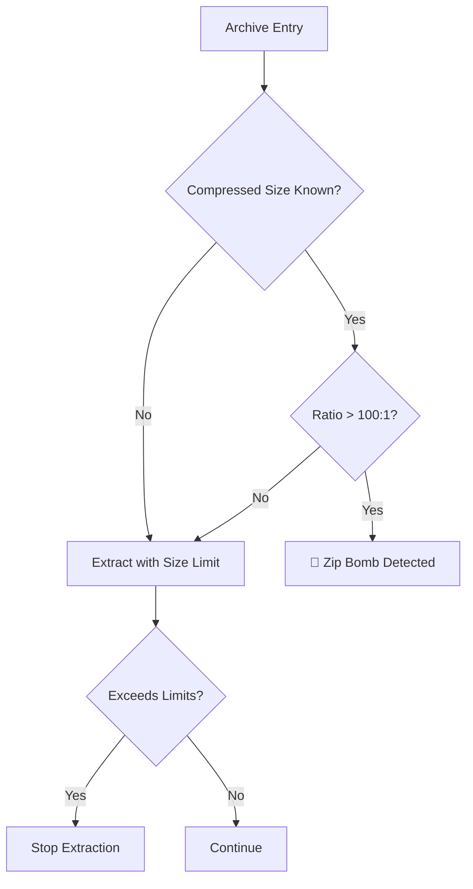

# Archive Module Deep Dive

Analysis of `src/io/archive.rs` for safe archive extraction and scanning.

## Purpose

Recursively scan files inside archives (ZIP, TAR) with **robust protections** against:

- Zip bombs (extreme compression)
- Memory exhaustion
- Path traversal attacks
- Excessive nesting

## Security Limits

```rust
/// Maximum size of a single extracted file
const MAX_EXTRACTED_FILE_SIZE: u64 = 50_000_000;  // 50MB

/// Maximum total extracted size
const MAX_TOTAL_EXTRACTED_SIZE: u64 = 100_000_000;  // 100MB

/// Maximum number of entries in an archive
const MAX_ARCHIVE_ENTRIES: usize = 10_000;

/// Suspicious compression ratio (zip bomb indicator)
const SUSPICIOUS_COMPRESSION_RATIO: u64 = 100;  // 100:1
```

## Zip Bomb Detection



## Core Scanning Function

```rust
pub async fn scan_archive(
    data: &[u8],
    config: &DetectionConfig,
) -> Result<Vec<ArchiveEntry>> {
    let cursor = std::io::Cursor::new(data);
    
    // Try ZIP format first
    if let Ok(results) = scan_zip(cursor.clone(), config).await {
        return Ok(results);
    }
    
    // Try TAR format
    // ...
    
    Err(DetectionError::Unsupported)
}
```

## ZIP Scanning with Limits

```rust
async fn scan_zip(
    reader: impl Read + Seek,
    config: &DetectionConfig,
) -> Result<Vec<ArchiveEntry>> {
    let mut archive = ZipArchive::new(reader)?;
    let mut results = Vec::new();
    let mut total_size: u64 = 0;
    
    // Entry count limit
    if archive.len() > MAX_ARCHIVE_ENTRIES {
        return Err(DetectionError::CorruptedStructure(
            "Too many archive entries".to_string()
        ));
    }
    
    for i in 0..archive.len() {
        let mut file = archive.by_index(i)?;
        
        // Skip directories
        if file.is_dir() { continue; }
        
        // Check compression ratio
        let compressed = file.compressed_size();
        let uncompressed = file.size();
        
        if compressed > 0 && uncompressed / compressed > SUSPICIOUS_COMPRESSION_RATIO {
            results.push(ArchiveEntry {
                path: file.name().to_string(),
                threat: Some(EmbeddedThreat {
                    threat_type: ThreatType::Unknown,
                    severity: ThreatLevel::Dangerous,
                    description: "Suspicious compression ratio (possible zip bomb)".to_string(),
                    offset: 0,
                }),
                ..Default::default()
            });
            continue;
        }
        
        // Size limits
        if uncompressed > MAX_EXTRACTED_FILE_SIZE {
            continue;  // Skip oversized files
        }
        
        total_size += uncompressed;
        if total_size > MAX_TOTAL_EXTRACTED_SIZE {
            break;  // Stop extraction
        }
        
        // Extract and scan
        let mut buffer = Vec::with_capacity(uncompressed as usize);
        file.read_to_end(&mut buffer)?;
        
        let detection = FileType::from_bytes(&buffer, config)?;
        results.push(ArchiveEntry {
            path: file.name().to_string(),
            detection: Some(detection),
            ..Default::default()
        });
    }
    
    Ok(results)
}
```

## ArchiveEntry Structure

```rust
#[derive(Debug, Clone, Serialize)]
pub struct ArchiveEntry {
    /// Path within archive
    pub path: String,
    
    /// Detection result for this file
    pub detection: Option<FileType>,
    
    /// Embedded threat if detected
    pub threat: Option<EmbeddedThreat>,
    
    /// Uncompressed size
    pub size: u64,
}
```

---

## Security Considerations

### Why These Limits?

| Limit | Attack Prevented |
|-------|-----------------|
| 50MB per file | Memory exhaustion |
| 100MB total | Server resource DoS |
| 10K entries | CPU exhaustion |
| 100:1 ratio | Zip bombs (42.zip) |

### Zip Bomb Example

The infamous `42.zip`:

- 42KB compressed
- 4.5PB uncompressed (4.5 petabytes!)
- Compression ratio: ~109,000,000,000:1

Batin would detect this as `ratio > 100:1` and flag as suspicious.
