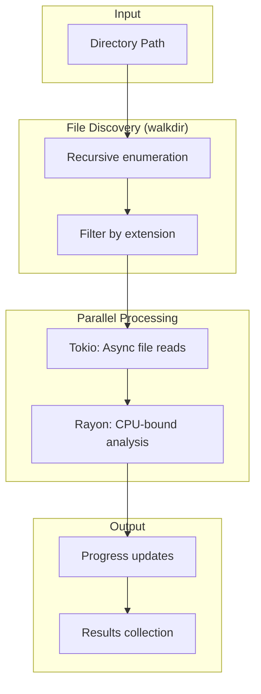

# Batch Module Deep Dive

Analysis of `src/io/batch.rs` for high-performance concurrent file processing.

## Purpose

Process large numbers of files efficiently using:

- **Tokio** for async I/O (non-blocking)
- **Rayon** for parallel CPU work
- **Progress reporting** for user feedback

## Architecture



## BatchProcessor

```rust
pub struct BatchProcessor {
    config: DetectionConfig,
}

impl BatchProcessor {
    pub fn new(config: DetectionConfig) -> Self {
        Self { config }
    }
    
    pub async fn process_directory(
        &self,
        path: &str,
        progress: Option<mpsc::UnboundedSender<BatchProgress>>,
    ) -> Result<Vec<(PathBuf, Result<FileType>)>> {
        // 1. Discover files
        let files: Vec<PathBuf> = walkdir::WalkDir::new(path)
            .into_iter()
            .filter_map(|e| e.ok())
            .filter(|e| e.file_type().is_file())
            .map(|e| e.path().to_path_buf())
            .collect();
        
        let total = files.len();
        let mut results = Vec::with_capacity(total);
        
        // 2. Process concurrently
        for (i, file_path) in files.iter().enumerate() {
            // Send progress update
            if let Some(ref tx) = progress {
                let _ = tx.send(BatchProgress {
                    total,
                    processed: i,
                    current_file: file_path.clone(),
                });
            }
            
            // Async file detection
            let result = FileType::from_file_path(&file_path, &self.config).await;
            results.push((file_path.clone(), result));
        }
        
        Ok(results)
    }
}
```

## Progress Reporting

```rust
#[derive(Debug, Clone)]
pub struct BatchProgress {
    /// Total files to process
    pub total: usize,
    
    /// Files processed so far
    pub processed: usize,
    
    /// Currently processing file
    pub current_file: PathBuf,
}
```

### Usage in CLI

```rust
let (tx, mut rx) = mpsc::unbounded_channel();

// Spawn progress display task
tokio::spawn(async move {
    while let Some(progress) = rx.recv().await {
        let percent = progress.processed * 100 / progress.total;
        eprintln!(
            "[{}/{}] {}% - {:?}", 
            progress.processed, 
            progress.total,
            percent,
            progress.current_file.file_name()
        );
    }
});

// Process with progress
processor.process_directory("/path", Some(tx)).await?;
```

## Why Tokio + Rayon?

| Workload | Best Tool | Reason |
|----------|-----------|--------|
| File I/O | Tokio | Non-blocking, high concurrency |
| Entropy calc | Rayon | CPU-bound, work-stealing |
| Signature match | Rayon | CPU-bound |

### Hybrid Approach

```rust
// Tokio for I/O
let data = tokio::fs::read(&path).await?;

// Rayon for CPU work (if needed for large batches)
let results: Vec<_> = files.par_iter()
    .map(|f| analyze_sync(f))
    .collect();
```

## Error Handling

Non-fatal errors don't stop the batch:

```rust
for file in files {
    let result = FileType::from_file_path(&file, &config).await;
    // result is Result<FileType>, not unwrapped
    results.push((file, result));
}
// Caller can filter Ok() vs Err()
```

---

## Performance Characteristics

| Files | Processing Time | Strategy |
|-------|-----------------|----------|
| 1-10 | Sequential fine | Async I/O |
| 10-1000 | Concurrent I/O | Tokio futures |
| 1000+ | Parallel + async | Rayon + Tokio |
