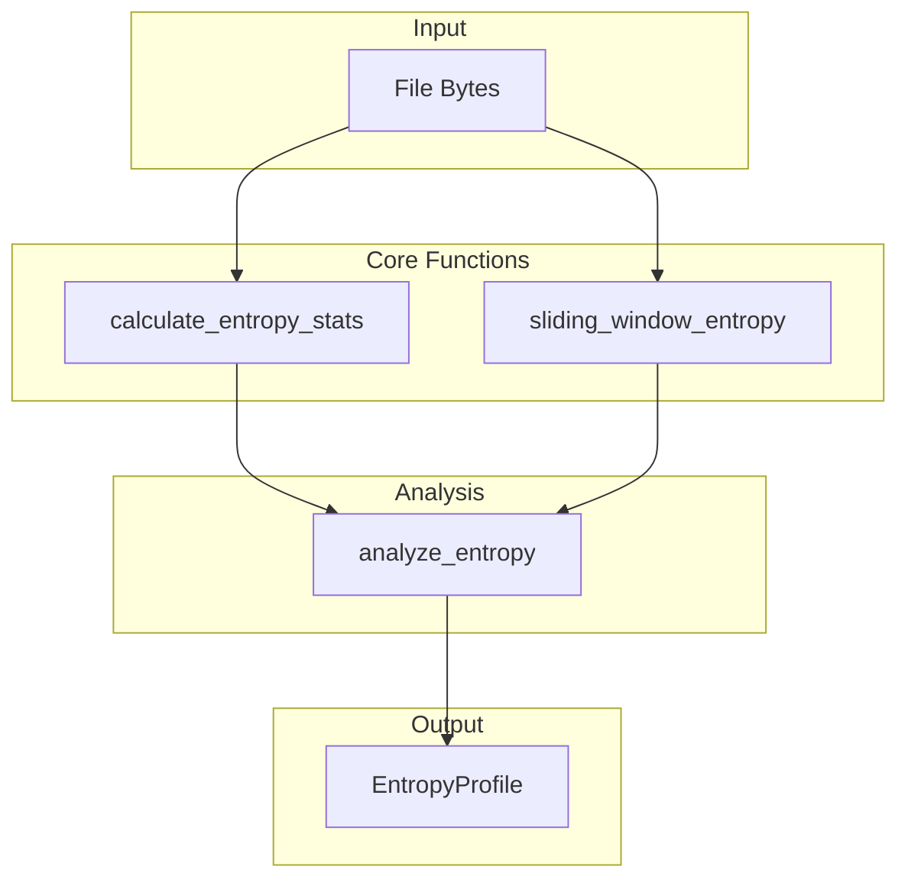
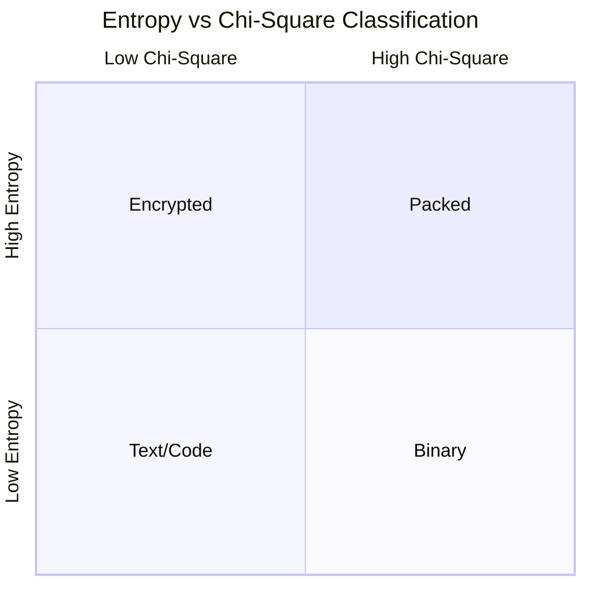

# Entropy Module Deep Dive

Comprehensive analysis of the `src/detection/entropy.rs` module.

## Purpose

The entropy module provides **information-theoretic analysis** of file content:

- Shannon entropy calculation
- Chi-square statistical test
- Packed/encrypted content detection
- Block-wise entropy visualization

## Architecture



## Key Data Structures

### EntropyStats

Internal structure for raw calculations:

```rust
pub struct EntropyStats {
    pub frequency: [usize; 256],  // Byte frequency distribution
    pub entropy: f64,             // Shannon entropy (0-8 bits)
    pub chi_square: f64,          // Chi-square statistic
}
```

### EntropyProfile

Public result structure:

```rust
#[derive(Debug, Clone, Serialize)]
pub struct EntropyProfile {
    pub global_entropy: f64,      // Overall file entropy
    pub block_entropies: Vec<f64>, // Per-block entropy
    pub chi_square: f64,          // Statistical uniformity
    pub is_packed: bool,          // Packed executable flag
    pub is_encrypted: bool,       // Encryption flag
}
```

---

## Core Algorithm: Single-Pass Calculation

### The Optimization

**Before (two passes):**

```rust
// Pass 1: Build frequency table
for &byte in data { frequency[byte] += 1; }

// Pass 2: Calculate entropy
for count in frequency { entropy -= p * log2(p); }

// Pass 3: Calculate chi-square  
for count in frequency { chi += (count - expected)² / expected; }
```

**After (single pass):**

```rust
pub fn calculate_entropy_stats(data: &[u8]) -> EntropyStats {
    if data.is_empty() {
        return EntropyStats::default();
    }
    
    // Single pass: build frequency
    let mut frequency: [usize; 256] = [0; 256];
    for &byte in data {
        frequency[byte as usize] += 1;
    }
    
    // Derive both metrics from frequency table
    let len = data.len() as f64;
    let mut entropy = 0.0;
    let mut chi_square = 0.0;
    let expected = len / 256.0;
    
    for &count in &frequency {
        if count > 0 {
            let p = count as f64 / len;
            entropy -= p * p.log2();  // Shannon formula
            
            let diff = count as f64 - expected;
            chi_square += (diff * diff) / expected;  // Chi-square
        }
    }
    
    EntropyStats { frequency, entropy, chi_square }
}
```

### Why This Matters

| Approach | Memory Accesses | Cache Behavior |
|----------|----------------|----------------|
| Two-pass | 2n | Poor (re-read data) |
| Single-pass | n + 256 | Excellent (sequential) |

For a 1MB file: **50% fewer memory operations**.

---

## Shannon Entropy Theory

### Formula

```
H(X) = -Σ p(xᵢ) × log₂(p(xᵢ))
```

### Implementation

```rust
pub fn calculate_shannon_entropy(data: &[u8]) -> f64 {
    if data.is_empty() { return 0.0; }
    
    let mut frequency = [0usize; 256];
    for &byte in data {
        frequency[byte as usize] += 1;
    }
    
    let len = data.len() as f64;
    frequency.iter()
        .filter(|&&c| c > 0)
        .map(|&c| {
            let p = c as f64 / len;
            -p * p.log2()
        })
        .sum()
}
```

### Entropy Interpretation

| Range | Content Type | Example |
|-------|--------------|---------|
| 0.0 | Uniform bytes | `AAAAAAA` |
| 1.0-3.0 | Highly repetitive | Run-length encoded |
| 3.0-5.0 | Natural language | English text |
| 5.0-6.5 | Compiled code | Normal executables |
| 6.5-7.5 | Compressed | ZIP, JPEG |
| 7.5-8.0 | Random/Encrypted | AES, packed EXE |

---

## Chi-Square Test

### Purpose

Chi-square measures how much the byte distribution deviates from uniform (random).

### Formula

```
χ² = Σ (Oᵢ - Eᵢ)² / Eᵢ
```

Where:

- Oᵢ = observed count of byte i
- Eᵢ = expected count = n/256

### Implementation

```rust
pub fn chi_square_test(data: &[u8]) -> f64 {
    if data.is_empty() { return 0.0; }
    
    let mut frequency = [0usize; 256];
    for &byte in data {
        frequency[byte as usize] += 1;
    }
    
    let expected = data.len() as f64 / 256.0;
    frequency.iter()
        .map(|&count| {
            let diff = count as f64 - expected;
            (diff * diff) / expected
        })
        .sum()
}
```

### Interpretation

| Chi-Square | Meaning | Implication |
|------------|---------|-------------|
| < 50 | Very uniform | Likely encrypted |
| 50-150 | Somewhat uniform | Compressed/packed |
| 150-500 | Normal variation | Binary data |
| > 500 | Very non-uniform | Text, structured |

---

## Packed vs Encrypted Detection



### Detection Logic

```rust
pub fn analyze_entropy(
    data: &[u8], 
    packed_threshold: f64
) -> Result<EntropyProfile> {
    let stats = calculate_entropy_stats(data);
    
    Ok(EntropyProfile {
        global_entropy: stats.entropy,
        chi_square: stats.chi_square,
        is_packed: stats.entropy > packed_threshold 
                   && stats.chi_square < 100.0,
        is_encrypted: stats.entropy > 7.8 
                      && stats.chi_square < 50.0,
        ...
    })
}
```

### Why Both Metrics?

**Packed files** (UPX, Themida):

- High entropy (compressed)
- Moderate chi-square (not perfectly random)

**Encrypted files** (AES, ransomware):

- Very high entropy (~8.0)
- Very low chi-square (uniform distribution)

---

## Sliding Window Entropy

### Use Case

Global entropy can hide localized anomalies:

```
[Normal text .... [HIDDEN ENCRYPTED BLOB] .... Normal text]
Global: 5.5 (looks normal)
Local:  7.9 (suspicious!)
```

### Implementation

```rust
pub fn sliding_window_entropy(
    data: &[u8], 
    window_size: usize
) -> Vec<f64> {
    if data.len() < window_size {
        return vec![calculate_shannon_entropy(data)];
    }
    
    (0..=(data.len() - window_size))
        .map(|i| calculate_shannon_entropy(&data[i..i + window_size]))
        .collect()
}
```

### Visualization

```
Offset:    0      256    512    768    1024
Entropy:  4.5    4.7    7.9    7.8    4.6
                        ^^^^^^^^^^^
                    Hidden encrypted section!
```

---

## Performance Characteristics

### Time Complexity

| Function | Complexity |
|----------|------------|
| `calculate_entropy_stats` | O(n) |
| `calculate_shannon_entropy` | O(n) |
| `chi_square_test` | O(n) |
| `sliding_window_entropy` | O(n × w) |
| `analyze_entropy` | O(n) |

### Space Complexity

| Component | Space |
|-----------|-------|
| Frequency array | 256 bytes (constant) |
| Block entropies | 8 × (n/w) bytes |

---

## Testing

```rust
#[cfg(test)]
mod tests {
    use super::*;

    #[test]
    fn test_uniform_entropy() {
        let data = vec![0xAA; 1000];
        let entropy = calculate_shannon_entropy(&data);
        assert_eq!(entropy, 0.0);  // All same = zero entropy
    }

    #[test]
    fn test_maximum_entropy() {
        // All 256 values equally distributed
        let data: Vec<u8> = (0..=255).collect();
        let entropy = calculate_shannon_entropy(&data);
        assert!((entropy - 8.0).abs() < 0.01);  // Near maximum
    }

    #[test]
    fn test_packed_detection() {
        let profile = analyze_entropy(&high_entropy_data, 7.2)?;
        assert!(profile.is_packed);
    }
}
```

---

:::tip Performance Tips

1. **Skip small files**: Entropy is meaningless for < 256 bytes
2. **Use `calculate_entropy_stats`**: For both metrics at once
3. **Configure thresholds**: Adjust for your false positive tolerance
4. **Cache results**: Entropy calculation is deterministic

:::
