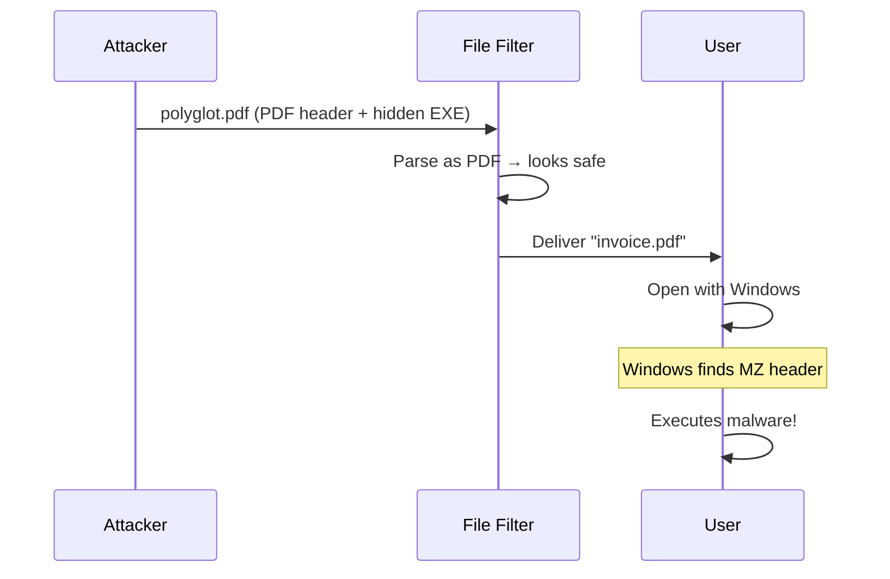

# Polyglot Module Deep Dive

Comprehensive analysis of the `src/detection/polyglot.rs` module.

## Purpose

Detect files that are **simultaneously valid in multiple formats**, a common attack vector for bypassing security filters.

## The Threat Model



## Core Algorithm

```rust
pub fn detect_polyglot(data: &[u8], db: &SignatureDatabase) -> Result<Vec<String>> {
    let mut detected_formats = Vec::new();
    
    // Check multiple offsets for signatures
    let check_offsets = [0, 512, 1024, 2048];
    
    for offset in check_offsets {
        if offset >= data.len() {
            break;
        }
        
        let slice = &data[offset..];
        let matches = db.match_signatures(slice);
        
        for (sig_idx, _confidence) in matches {
            let sig = &db.signatures[sig_idx];
            let format = sig.extensions[0].clone();
            
            if !detected_formats.contains(&format) {
                detected_formats.push(format);
            }
        }
    }
    
    // Special case: PDF with embedded PE
    if data.starts_with(b"%PDF") {
        if let Some(pe_pos) = find_bytes(data, &[0x4D, 0x5A]) {
            if pe_pos > 100 {
                detected_formats.push("exe".to_string());
            }
        }
    }
    
    Ok(detected_formats)
}
```

## Why These Offsets?

| Offset | Rationale |
|--------|-----------|
| 0 | Primary format header |
| 512 | Floppy sector size (legacy) |
| 1024 | Common padding boundary |
| 2048 | CD-ROM sector (ISO 9660) |

## Special Case: PDF+EXE

This attack is so common it gets explicit handling:

```rust
if data.starts_with(b"%PDF") {
    if let Some(pe_pos) = find_bytes(data, &[0x4D, 0x5A]) {
        if pe_pos > 100 {  // Not near start
            detected_formats.push("exe".to_string());
        }
    }
}
```

**Why `pe_pos > 100`?**

- Legitimate PDFs might have "MZ" as text
- PE headers need DOS stub space (100+ bytes)
- Reduces false positives

---

## Detection Response

```rust
// In threat assessment
if detected_formats.len() > 1 {
    return ThreatLevel::Dangerous;  // Always dangerous
}
```

---

## Testing

```rust
#[test]
fn test_polyglot_detection() {
    let mut polyglot = b"%PDF-1.4\n".to_vec();
    polyglot.extend(vec![0u8; 200]);
    polyglot.extend(&[0x4D, 0x5A]);  // MZ header
    
    let db = SignatureDatabase::default();
    let formats = detect_polyglot(&polyglot, &db).unwrap();
    
    assert!(formats.len() > 1);
    assert!(formats.contains(&"pdf".to_string()));
    assert!(formats.contains(&"exe".to_string()));
}
```
