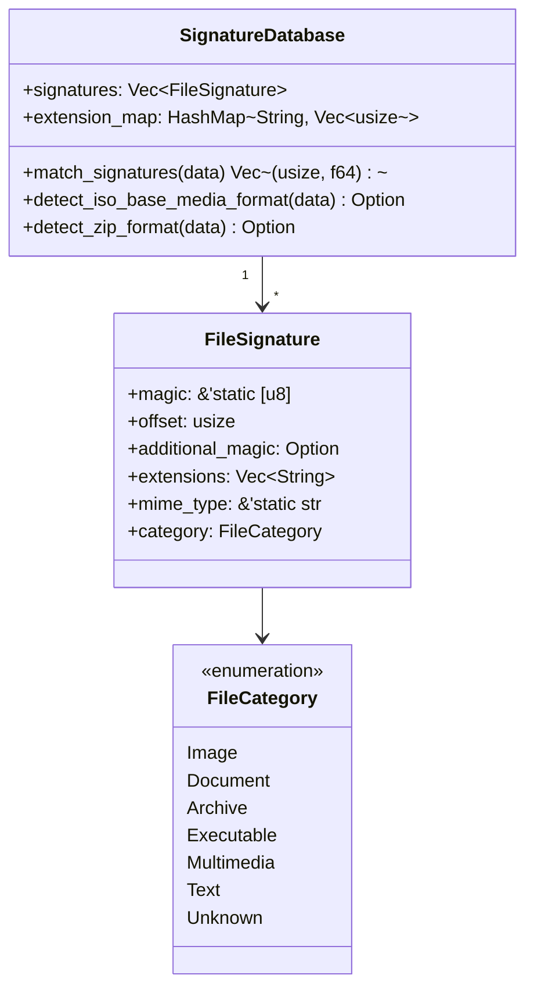

# Signatures Module Deep Dive

Comprehensive analysis of the `src/detection/signatures.rs` module.

## Purpose

The signatures module is the **foundation of file type detection**. It maintains a database of ~60+ file format signatures and provides efficient matching algorithms.

## Architecture



## Key Design Decisions

### 1. Global Lazy-Initialized Database

```rust
pub static SIGNATURE_DB: LazyLock<RwLock<SignatureDatabase>> = 
    LazyLock::new(|| RwLock::new(SignatureDatabase::default()));
```

**Why this design?**

| Alternative | Problem |
|-------------|---------|
| Pass-by-parameter | Caller must manage lifecycle |
| `lazy_static!` macro | Older, less ergonomic |
| `OnceCell` | Requires explicit initialization call |

`LazyLock` (stable as of Rust 1.80) provides:

- Thread-safe initialization
- Zero runtime cost after first access
- No macro magic
- `RwLock` allows concurrent reads

### 2. Static Magic Bytes

```rust
pub struct FileSignature {
    pub magic: &'static [u8],  // Static reference!
    ...
}
```

**Why `&'static [u8]` instead of `Vec<u8>`?**

- **Zero allocation**: Magic bytes live in binary's data segment
- **Zero copy**: No heap allocation needed
- **Compile-time verification**: Rust checks slices at compile time

### 3. Extension Map for Fast Lookup

```rust
pub extension_map: HashMap<String, Vec<usize>>
```

When validating claimed extensions, instead of searching all signatures O(n), we have O(1) lookup.

---

## Signature Definition Examples

### Simple Signature (PNG)

```rust
FileSignature {
    magic: &[0x89, 0x50, 0x4E, 0x47, 0x0D, 0x0A, 0x1A, 0x0A],
    offset: 0,
    additional_magic: None,
    extensions: vec!["png".to_string()],
    mime_type: "image/png",
    category: FileCategory::Image,
}
```

### Offset Signature (MP4)

```rust
FileSignature {
    magic: &[0x66, 0x74, 0x79, 0x70],  // "ftyp"
    offset: 4,  // Magic is at offset 4, not 0!
    additional_magic: None,
    extensions: vec!["mp4".to_string()],
    mime_type: "video/mp4",
    category: FileCategory::Multimedia,
}
```

### Two-Stage Signature (WebP)

```rust
FileSignature {
    magic: &[0x52, 0x49, 0x46, 0x46],  // "RIFF"
    offset: 0,
    additional_magic: Some((8, b"WEBP")),  // Also check offset 8
    extensions: vec!["webp".to_string()],
    mime_type: "image/webp",
    category: FileCategory::Image,
}
```

---

## Matching Algorithm

### Core Match Function

```rust
pub fn match_signatures(&self, data: &[u8]) -> Vec<(usize, f64)> {
    let mut matches = Vec::new();
    
    for (idx, sig) in self.signatures.iter().enumerate() {
        // 1. Length check
        let required = sig.offset + sig.magic.len();
        if data.len() < required {
            continue;
        }
        
        // 2. Primary magic comparison
        let slice = &data[sig.offset..sig.offset + sig.magic.len()];
        if slice != sig.magic {
            continue;
        }
        
        // 3. Secondary magic (if defined)
        if let Some((add_offset, add_bytes)) = sig.additional_magic {
            if data.len() < add_offset + add_bytes.len() {
                continue;
            }
            if &data[add_offset..add_offset + add_bytes.len()] != add_bytes {
                continue;
            }
        }
        
        // 4. Match found with 90% base confidence
        matches.push((idx, 0.9));
    }
    
    matches
}
```

### Complexity Analysis

| Operation | Time | Space |
|-----------|------|-------|
| Full scan | O(n × m) | O(k) |
| Extension lookup | O(1) | O(1) |

Where: n = signatures (~60), m = avg magic length (~6), k = matches

---

## Format Disambiguation

### ISO Base Media Format

MP4, MOV, M4A, HEIC, AVIF all share `ftyp` signature. We disambiguate by parsing the brand field:

```rust
fn detect_iso_base_media_format(&self, data: &[u8]) -> Option<...> {
    if data.len() < 12 { return None; }
    
    let brand = &data[8..12];
    match brand {
        b"isom" | b"mp41" | b"mp42" => Some(("mp4", ...)),
        b"qt  " => Some(("mov", ...)),
        b"M4A " | b"M4B " => Some(("m4a", ...)),
        b"heic" | b"mif1" => Some(("heic", ...)),
        b"avif" => Some(("avif", ...)),
        _ => None,
    }
}
```

### ZIP-Based Formats

DOCX, XLSX, JAR, EPUB all use ZIP container. We check internal paths:

```rust
fn detect_zip_format(&self, data: &[u8]) -> Option<&'static str> {
    if find_bytes(data, b"[Content_Types].xml").is_some() {
        // Office Open XML
        if find_bytes(data, b"word/").is_some() { return Some("docx"); }
        if find_bytes(data, b"xl/").is_some() { return Some("xlsx"); }
        if find_bytes(data, b"ppt/").is_some() { return Some("pptx"); }
    }
    if find_bytes(data, b"META-INF/MANIFEST.MF").is_some() {
        return Some("jar");
    }
    if find_bytes(data, b"mimetype").is_some() {
        return Some("epub");
    }
    None
}
```

---

## Testing

```rust
#[cfg(test)]
mod tests {
    use super::*;

    #[test]
    fn test_png_detection() {
        let png = [0x89, 0x50, 0x4E, 0x47, 0x0D, 0x0A, 0x1A, 0x0A];
        let db = SignatureDatabase::default();
        let matches = db.match_signatures(&png);
        
        assert!(!matches.is_empty());
        assert_eq!(db.signatures[matches[0].0].extensions[0], "png");
    }

    #[test]  
    fn test_empty_data() {
        let db = SignatureDatabase::default();
        let matches = db.match_signatures(&[]);
        // Should not panic, may return empty
    }
}
```

---

## Adding New Signatures

### Step-by-Step Guide

1. **Research** the format specification
2. **Identify** magic bytes and offset
3. **Add** to `build_signatures()`:

```rust
// In SignatureDatabase::build_signatures()
vec![
    // ... existing signatures ...
    
    FileSignature {
        magic: &[0x00, 0x00, 0x01, 0x00],
        offset: 0,
        additional_magic: None,
        extensions: vec!["ico".to_string()],
        mime_type: "image/x-icon",
        category: FileCategory::Image,
    },
]
```

4. **Add tests**
5. **Update documentation**

---

## Performance Optimizations

### 1. Early Exit

Comparison stops at first non-matching byte:

```rust
// slice != sig.magic uses byte-by-byte comparison
// that short-circuits on first mismatch
```

### 2. Most Common First

Signatures are ordered roughly by frequency of use, so common formats match early.

### 3. Length Pre-check

```rust
if data.len() < required { continue; }
```

Skips signatures that can't possibly match before comparing bytes.

---

:::tip Implementation Notes

1. **Thread Safety**: Database is `RwLock`-protected for concurrent reads
2. **Memory**: ~10KB for all signatures (static data)
3. **Extensibility**: Easy to add new formats via `build_signatures()`
4. **Testing**: Each signature should have corresponding test cases

:::
