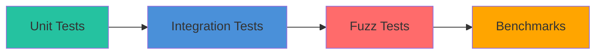

# Testing

Comprehensive testing guide for Batin.

## Test Types



---

## Running Tests

### All Tests

```bash
cargo test --all-features
```

### Specific Modules

```bash
# Detection tests only
cargo test detection::

# Entropy tests only
cargo test entropy::

# Integration tests only
cargo test --test integration_tests
```

### With Output

```bash
cargo test -- --nocapture
```

---

## Unit Tests

Located alongside source code in `mod tests` blocks.

### Example: Signature Matching

```rust
#[cfg(test)]
mod tests {
    use super::*;

    #[test]
    fn test_png_detection() {
        let png_magic = [0x89, 0x50, 0x4E, 0x47, 0x0D, 0x0A, 0x1A, 0x0A];
        let db = SignatureDatabase::default();
        let matches = db.match_signatures(&png_magic);
        
        assert!(!matches.is_empty(), "Should detect PNG");
        assert_eq!(db.signatures[matches[0].0].extensions[0], "png");
    }
    
    #[test]
    fn test_no_match_random_bytes() {
        let random = [0xFF, 0xFE, 0x00, 0x01];
        let db = SignatureDatabase::default();
        let matches = db.match_signatures(&random);
        
        // May still match something, but with low confidence
        // The key is no panic
    }
}
```

### Example: Entropy Calculation

```rust
#[test]
fn test_entropy_text() {
    let text = b"Hello, World!";
    let entropy = calculate_shannon_entropy(text);
    
    // Text has low-medium entropy
    assert!(entropy > 2.0 && entropy < 5.0);
}

#[test]
fn test_entropy_random() {
    // Near-maximum entropy
    let random: Vec<u8> = (0..=255).collect();
    let entropy = calculate_shannon_entropy(&random);
    
    assert!(entropy > 7.9, "Random data should have ~8 bits/byte");
}

#[test]
fn test_entropy_uniform() {
    // All same byte = zero entropy
    let uniform = vec![0xAA; 1000];
    let entropy = calculate_shannon_entropy(&uniform);
    
    assert_eq!(entropy, 0.0, "Uniform data has zero entropy");
}
```

---

## Integration Tests

Located in `tests/` directory.

### Example: Full Detection Flow

```rust
// tests/integration_tests.rs
use batin::{FileType, DetectionConfig};

#[tokio::test]
async fn test_detect_pdf() {
    let pdf_data = b"%PDF-1.4\n%test\n%%EOF";
    let config = DetectionConfig::default();
    
    let result = FileType::from_bytes(pdf_data, &config).unwrap();
    
    assert_eq!(result.extension, "pdf");
    assert_eq!(result.mime_type, "application/pdf");
}

#[tokio::test]
async fn test_detect_polyglot() {
    // PDF with embedded MZ header
    let mut polyglot = b"%PDF-1.4\n".to_vec();
    polyglot.extend(vec![0u8; 200]);
    polyglot.extend(&[0x4D, 0x5A]); // MZ header
    
    let config = DetectionConfig {
        enable_polyglot: true,
        ..Default::default()
    };
    
    let result = FileType::from_bytes(&polyglot, &config).unwrap();
    
    assert!(
        result.detected_formats.len() > 1,
        "Should detect polyglot"
    );
}
```

---

## Test Data

### In-Memory Test Data

```rust
// Create minimal valid headers
let png_header = [0x89, 0x50, 0x4E, 0x47, 0x0D, 0x0A, 0x1A, 0x0A];
let pdf_header = b"%PDF-1.4\n";
let exe_header = [0x4D, 0x5A, 0x90, 0x00];
```

### File-Based Test Data

```rust
// Using include_bytes! for compile-time embedding
let test_png = include_bytes!("../test_files/sample.png");

// Or runtime loading
let test_pdf = std::fs::read("test_files/sample.pdf")?;
```

### Generating Test Data

```rust
// High entropy (random) data
fn generate_random_data(size: usize) -> Vec<u8> {
    (0..size).map(|i| (i * 17 + 31) as u8).collect()
}

// Low entropy (repetitive) data
fn generate_low_entropy(size: usize) -> Vec<u8> {
    vec![0x41; size]  // All 'A'
}
```

---

## Testing Edge Cases

### Empty Data

```rust
#[test]
fn test_empty_data() {
    let db = SignatureDatabase::default();
    let matches = db.match_signatures(&[]);
    // Should not panic, may return empty or unknown
}

#[test]
fn test_empty_entropy() {
    let entropy = calculate_shannon_entropy(&[]);
    assert_eq!(entropy, 0.0);
}
```

### Truncated Data

```rust
#[test]
fn test_truncated_png() {
    // PNG header but no complete chunks
    let truncated = [0x89, 0x50, 0x4E, 0x47];
    let config = DetectionConfig::default();
    
    // Should still detect as PNG (based on magic)
    let result = FileType::from_bytes(&truncated, &config).unwrap();
    assert_eq!(result.extension, "png");
}
```

### Large Data

```rust
#[test]
fn test_large_file() {
    // 10MB of data
    let large = vec![0u8; 10_000_000];
    let config = DetectionConfig {
        max_read_bytes: 3072,  // Only reads first 3KB
        ..Default::default()
    };
    
    // Should not OOM
    let result = FileType::from_bytes(&large, &config);
    assert!(result.is_ok());
}
```

---

## Performance Testing

### Benchmarks

Located in `benches/`:

```rust
// benches/detection.rs
use criterion::{black_box, criterion_group, criterion_main, Criterion};
use batin::{FileType, DetectionConfig};

fn bench_detection(c: &mut Criterion) {
    let data = include_bytes!("../test_files/sample.pdf");
    let config = DetectionConfig::default();
    
    c.bench_function("detect_pdf", |b| {
        b.iter(|| FileType::from_bytes(black_box(data), &config))
    });
}

fn bench_entropy(c: &mut Criterion) {
    let data: Vec<u8> = (0..10000).map(|i| i as u8).collect();
    
    c.bench_function("entropy_10k", |b| {
        b.iter(|| batin::detection::calculate_shannon_entropy(black_box(&data)))
    });
}

criterion_group!(benches, bench_detection, bench_entropy);
criterion_main!(benches);
```

### Running Benchmarks

```bash
cargo bench
```

---

## Test Configuration

### Cargo.toml

```toml
[dev-dependencies]
tokio = { version = "1", features = ["rt-multi-thread", "macros"] }
tempfile = "3.8"
```

### Running with Features

```bash
# Test with all features
cargo test --all-features

# Test core only
cargo test --no-default-features

# Test specific features
cargo test --features "hashing,archive"
```

---

## Debugging Tests

### Print Debug Output

```rust
#[test]
fn test_with_debug() {
    let result = something();
    dbg!(&result);  // Prints to stderr
    assert!(result.is_ok());
}
```

### Run Single Test with Output

```bash
cargo test test_name -- --nocapture
```

### Run Tests in Sequence

```bash
cargo test -- --test-threads=1
```

---

## Coverage

### Using cargo-tarpaulin

```bash
# Install
cargo install cargo-tarpaulin

# Run coverage
cargo tarpaulin --all-features --out Html
```

### Using llvm-cov

```bash
# Install
rustup component add llvm-tools-preview
cargo install cargo-llvm-cov

# Run coverage
cargo llvm-cov --all-features --html
```

---

:::tip Testing Best Practices

1. **Test the happy path** - normal expected behavior
2. **Test edge cases** - empty, huge, truncated
3. **Test error conditions** - invalid input handling
4. **Use descriptive test names** - `test_detect_png_with_truncated_header`
5. **Keep tests fast** - avoid unnecessary I/O
6. **Fuzz for unknown unknowns** - see next section
:::
