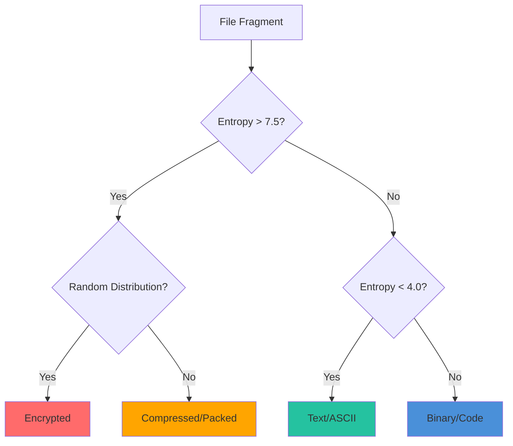

# Digital Forensics with Batin

Guide for using Batin in forensic investigations.

## Evidence Collection

### Best Practices

1. **Always use `--hash`** for chain of custody
2. **Save JSON output** for court-admissible reports
3. **Document the scan environment** (Batin version, system info)
4. **Use read-only mounts** to preserve evidence integrity

### Standard Evidence Scan

```bash
# Full scan with hashes
batin scan /evidence/disk-mount -r --json --hash \
  --output case-$(date +%Y%m%d)-scan.json

# Include metadata
echo "{
  \"case_id\": \"2024-001\",
  \"investigator\": \"$(whoami)\",
  \"timestamp\": \"$(date -Iseconds)\",
  \"batin_version\": \"$(batin --version)\",
  \"scan_results\": $(cat case-*-scan.json)
}" > evidence-report.json
```

---

## File Fragment Classification

### When to Use Fragment Analysis

- **Disk carving** - Recovering deleted files without filesystem metadata
- **Memory forensics** - Analyzing RAM dumps for file signatures
- **Damaged media** - Partial file recovery from corrupted drives

### Using the Forensics Module

```rust
use batin::forensics::classify_fragment;

fn analyze_disk_sector(sector_data: &[u8]) {
    match classify_fragment(sector_data) {
        Ok(classification) => {
            println!("Likely type: {}", classification.likely_type);
            println!("Confidence: {:.1}%", classification.confidence * 100.0);
            println!("Entropy: {:.2} bits/byte", classification.entropy);
            
            match classification.likely_type.as_str() {
                "text" => println!("→ ASCII/UTF-8 text content"),
                "native_code" => println!("→ Compiled executable code"),
                "compressed" => println!("→ Compressed/archive data"),
                "encrypted" => println!("→ Encrypted content"),
                "high_entropy" => println!("→ Random/compressed/encrypted"),
                _ => println!("→ Unknown content type"),
            }
        }
        Err(e) => eprintln!("Classification failed: {}", e),
    }
}
```

### Entropy-Based Classification



---

## Extension Spoofing Detection

### Why Check Extension Mismatch?

Attackers and users may:

- Rename `.exe` to `.pdf` to bypass filters
- Hide data in fake image files
- Disguise malware as documents

### Detection Method

```rust
use batin::{FileType, DetectionConfig};

async fn check_extension_mismatch(path: &str) -> Result<(), Box<dyn std::error::Error>> {
    let declared_ext = std::path::Path::new(path)
        .extension()
        .and_then(|e| e.to_str())
        .unwrap_or("");
    
    let config = DetectionConfig::default();
    let result = FileType::from_file_path(path, &config).await?;
    
    if !result.validate_extension(declared_ext) {
        println!("⚠️ MISMATCH DETECTED!");
        println!("  Claimed: .{}", declared_ext);
        println!("  Actual:  .{}", result.extension);
        println!("  MIME:    {}", result.mime_type);
    }
    
    Ok(())
}
```

### Batch Detection Script

```bash
#!/bin/bash
# find-mismatches.sh

batin scan /evidence -r --json | jq -r '
  .[] | 
  select(.file_type.extension as $ext | 
    (.path | split("/")[-1] | split(".")[-1]) != $ext) |
  "\(.path)\t(claims: \(.path | split("/")[-1] | split(".")[-1]), actual: \(.file_type.extension))"
' | column -t -s $'\t'
```

---

## Timeline Reconstruction

### Event Logging

```bash
# Monitor and log with timestamps
batin watch /evidence/timeline-dir 2>&1 | \
  while IFS= read -r line; do
    echo "[$(date -Iseconds)] $line"
  done | tee -a timeline.log
```

### Correlating with File Metadata

```python
import subprocess
import json
import os
from datetime import datetime

def build_timeline(directory):
    # Get Batin scan results
    result = subprocess.run(
        ["batin", "scan", directory, "-r", "--json"],
        capture_output=True, text=True
    )
    files = json.loads(result.stdout)
    
    timeline = []
    for f in files:
        path = f["path"]
        file_type = f["file_type"]
        
        # Get file timestamps
        stat = os.stat(path)
        
        timeline.append({
            "path": path,
            "type": file_type["extension"],
            "threat": file_type["threat_level"],
            "created": datetime.fromtimestamp(stat.st_ctime).isoformat(),
            "modified": datetime.fromtimestamp(stat.st_mtime).isoformat(),
            "accessed": datetime.fromtimestamp(stat.st_atime).isoformat(),
        })
    
    # Sort by modification time
    timeline.sort(key=lambda x: x["modified"])
    return timeline
```

---

## Hidden Data Detection

### Steganography Indicators

High entropy in media files may indicate hidden data:

```bash
# Find images with suspiciously high entropy
batin scan /evidence -r --json | jq '
  .[] | 
  select(.file_type.extension | test("jpg|png|gif|bmp")) |
  select(.file_type.entropy_profile.global_entropy > 7.5) |
  {path, entropy: .file_type.entropy_profile.global_entropy}
'
```

### Alternate Data Streams (NTFS)

```bash
# On Windows NTFS, scan all streams
# Note: Requires mounting with stream support
batin scan /evidence/ntfs-mount -r --json
```

---

## Report Generation

### Forensic Report Template

```bash
#!/bin/bash
# generate-report.sh

EVIDENCE_DIR="$1"
CASE_ID="$2"
OUTPUT="forensic-report-${CASE_ID}.html"

cat << EOF > "$OUTPUT"
<!DOCTYPE html>
<html>
<head>
    <title>Forensic Report - Case $CASE_ID</title>
    <style>
        body { font-family: sans-serif; margin: 2em; }
        .threat-Safe { color: green; }
        .threat-Suspicious { color: orange; }
        .threat-Dangerous { color: red; font-weight: bold; }
        .threat-Critical { color: red; font-weight: bold; background: yellow; }
        table { border-collapse: collapse; width: 100%; }
        th, td { border: 1px solid #ddd; padding: 8px; text-align: left; }
        th { background: #333; color: white; }
    </style>
</head>
<body>
    <h1>Forensic Analysis Report</h1>
    <p><strong>Case ID:</strong> $CASE_ID</p>
    <p><strong>Date:</strong> $(date)</p>
    <p><strong>Investigator:</strong> $(whoami)</p>
    <p><strong>Tool:</strong> Batin $(batin --version)</p>
    
    <h2>Scan Results</h2>
    <table>
        <tr>
            <th>File</th>
            <th>Type</th>
            <th>Threat</th>
            <th>Entropy</th>
            <th>SHA-256</th>
        </tr>
EOF

batin scan "$EVIDENCE_DIR" -r --json --hash | jq -r '
  .[] | "<tr>
    <td>\(.path)</td>
    <td>\(.file_type.extension)</td>
    <td class=\"threat-\(.file_type.threat_level)\">\(.file_type.threat_level)</td>
    <td>\(.file_type.entropy_profile.global_entropy // "N/A")</td>
    <td style=\"font-family:monospace;font-size:0.8em\">\(.file_type.hashes.sha256 // "N/A")</td>
  </tr>"
' >> "$OUTPUT"

cat << EOF >> "$OUTPUT"
    </table>
</body>
</html>
EOF

echo "Report generated: $OUTPUT"
```

---

## Chain of Custody

### Hash Verification

```bash
# Initial scan with hashes
batin scan /evidence -r --json --hash --output initial-scan.json

# Later verification
batin scan /evidence -r --json --hash --output verification-scan.json

# Compare hashes
diff <(jq -r '.[].file_type.hashes.sha256' initial-scan.json | sort) \
     <(jq -r '.[].file_type.hashes.sha256' verification-scan.json | sort)
```

---

:::warning Legal Considerations

- Document all tools and methods used
- Maintain chain of custody records
- Use write blockers when imaging drives
- Follow your jurisdiction's digital evidence guidelines
:::
