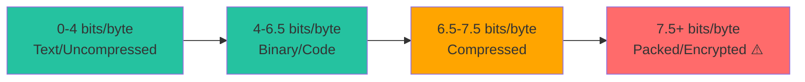

# Malware Analysis with Batin

A deep dive into using Batin for malware triage and analysis.

## Why Batin for Malware Analysis?

Traditional file type detection fails against modern malware that uses:

| Technique | Traditional Tools | Batin |
|-----------|------------------|-------|
| Extension spoofing | ❌ Fooled | ✅ Detects mismatch |
| Packing/Encryption | ❌ No detection | ✅ Entropy analysis |
| Polyglot files | ❌ Shows single type | ✅ Multi-format detection |
| Embedded threats | ❌ Not scanned | ✅ Deep content scanning |

## Packed Executable Detection

### What is Packing?

Malware authors "pack" executables to:

- Evade signature-based detection
- Reduce file size
- Make reverse engineering harder

Packed files have **high entropy** (>7.0 bits/byte) because the compressed/encrypted data appears random.

### Detection with Batin

```bash
batin scan malware.exe --json | jq '.[] | {
  file: .path,
  entropy: .file_type.entropy_profile.global_entropy,
  is_packed: .file_type.entropy_profile.is_packed,
  threat: .file_type.threat_level
}'
```

**Output:**

```json
{
  "file": "malware.exe",
  "entropy": 7.85,
  "is_packed": true,
  "threat": "Dangerous"
}
```

### Entropy Interpretation



### Batch Analysis Script

```bash
#!/bin/bash
# find-packed.sh

echo "Scanning for packed executables..."

batin scan /malware-samples -r --json | \
  jq -r '.[] | select(.file_type.entropy_profile.is_packed == true) | 
    "\(.path)\t\(.file_type.entropy_profile.global_entropy | tostring | .[0:4]) bits/byte"' | \
  column -t -s $'\t'
```

---

## Polyglot Detection

### What are Polyglots?

A polyglot file is valid in multiple formats simultaneously. Attackers use this to:

1. **Bypass email filters** - File scanned as PDF, executed as EXE
2. **Confuse analysts** - What is the "real" type?
3. **Evade AV** - Signatures for one format don't match the other

### Common Attack: PDF+EXE

```
+------------------------+
|  %PDF-1.4 (PDF header) |  <- Email scanner sees PDF
|  [PDF content padding] |
|  MZ (PE header)        |  <- Windows sees executable
|  [PE code]             |
+------------------------+
```

### Detection with Batin

```bash
batin scan suspicious.pdf --json | jq '.[] | {
  detected_formats: .file_type.detected_formats,
  is_polyglot: (.file_type.detected_formats | length > 1),
  threat: .file_type.threat_level
}'
```

**Output:**

```json
{
  "detected_formats": ["pdf", "exe"],
  "is_polyglot": true,
  "threat": "Dangerous"
}
```

### Finding All Polyglots

```bash
batin scan /samples -r --json | \
  jq '.[] | select(.file_type.detected_formats | length > 1) | {
    path,
    formats: .file_type.detected_formats
  }'
```

---

## Macro Detection

### Office Macro Threats

VBA macros in Office documents can:

- Download and execute malware
- Steal credentials
- Encrypt files (ransomware)

**Especially dangerous**: Auto-execute macros that run when documents open.

### Detection with Batin

```bash
batin scan invoice.docx --json | jq '.[] | {
  has_macros: (.file_type.embedded_threats | map(.threat_type) | contains(["Macro"])),
  threats: .file_type.embedded_threats
}'
```

**Output for infected document:**

```json
{
  "has_macros": true,
  "threats": [
    {
      "threat_type": "Macro",
      "offset": 12345,
      "severity": "Critical",
      "description": "Auto-execute macro detected: AutoOpen"
    }
  ]
}
```

### Severity Levels

| Detected Pattern | Severity | Meaning |
|-----------------|----------|---------|
| `VBA`, `_VBA_PROJECT` | Dangerous | Macros present |
| `AutoOpen`, `AutoExec` | **Critical** | Auto-execute macros |
| `Document_Open`, `Workbook_Open` | **Critical** | Auto-execute macros |

---

## PDF JavaScript Detection

### PDF Exploits

Malicious PDFs often contain JavaScript that:

- Exploits PDF reader vulnerabilities
- Downloads malware
- Extracts sensitive data

### Detection

```bash
batin scan document.pdf --json | \
  jq '.[] | select(.file_type.embedded_threats | any(.threat_type == "JavaScript"))'
```

### Indicators

Batin looks for these PDF JavaScript tags:

- `/JavaScript`
- `/JS`

---

## Triage Workflow

### Step 1: Initial Scan

```bash
batin scan /incoming -r --json --hash --output triage-$(date +%Y%m%d).json
```

### Step 2: Categorize by Threat

```bash
# Critical (immediate action)
jq '.[] | select(.file_type.threat_level == "Critical")' triage-*.json

# Dangerous (priority analysis)
jq '.[] | select(.file_type.threat_level == "Dangerous")' triage-*.json

# Suspicious (investigate when possible)
jq '.[] | select(.file_type.threat_level == "Suspicious")' triage-*.json
```

### Step 3: Extract IOCs

```bash
# Get hashes for threat intelligence
jq -r '.[] | select(.file_type.threat_level != "Safe") | 
  .file_type.hashes.sha256' triage-*.json | sort -u > iocs.txt
```

### Step 4: Priority Matrix

```mermaid
quadrantChart
    title Malware Triage Priority
    x-axis Low Entropy --> High Entropy
    y-axis Single Format --> Polyglot
    quadrant-1 CRITICAL: Packed Polyglot
    quadrant-2 HIGH: Polyglot
    quadrant-3 MEDIUM: Standard Executable
    quadrant-4 HIGH: Packed Executable
```

---

## Integration with Other Tools

### With YARA

```bash
# Scan with Batin first, then YARA on matches
batin scan /samples -r --json --min-threat suspicious | \
  jq -r '.[].path' | \
  xargs -I {} yara rules.yar {}
```

### With VirusTotal

```python
import subprocess
import json
import requests

def check_vt(sha256):
    url = f"https://www.virustotal.com/api/v3/files/{sha256}"
    headers = {"x-apikey": "YOUR_API_KEY"}
    response = requests.get(url, headers=headers)
    return response.json()

# Get hashes from Batin
result = subprocess.run(
    ["batin", "scan", "/samples", "-r", "--json", "--hash"],
    capture_output=True, text=True
)

for file in json.loads(result.stdout):
    if file["file_type"]["threat_level"] != "Safe":
        sha256 = file["file_type"]["hashes"]["sha256"]
        vt_result = check_vt(sha256)
        print(f"{file['path']}: VT detections = {vt_result['data']['attributes']['last_analysis_stats']['malicious']}")
```

---

:::warning Sandbox Recommendation
Always analyze malware samples in an isolated environment (VM, sandbox). Batin only performs static analysis - it won't protect you from opening malicious files!
:::
