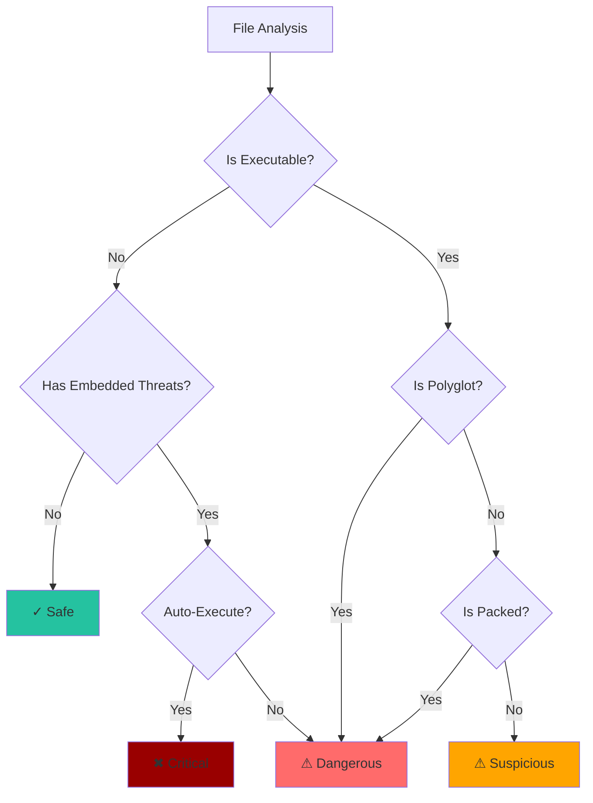

# Threat Levels

Understanding how Batin assesses file risk.

## Overview

Batin assigns one of four threat levels to each file based on multiple factors:



## Threat Level Definitions

### ✓ Safe

**No threats detected**

Files marked Safe are:

- Not executable
- No suspicious entropy patterns
- No embedded threats
- Single format (not polyglot)

**Examples:**

- Regular images (PNG, JPEG)
- Plain text files
- Audio/video files
- Clean documents

### ⚠ Suspicious

**Potentially risky - investigate**

Files marked Suspicious are:

- Executable files (EXE, DLL, ELF, Mach-O)
- Scripts (JavaScript, PowerShell, Shell)
- Files with elevated entropy
- Files with extension mismatches

**Examples:**

- Any `.exe` or `.dll` file
- PDF with JavaScript (non-auto-execute)
- Files with entropy > 6.0

### ⚠ Dangerous

**High risk - treat with caution**

Files marked Dangerous have:

- Packed/encrypted content (entropy > 7.2)
- Polyglot format (valid as multiple types)
- Embedded executables in documents/archives
- Known dangerous patterns

**Examples:**

- UPX-packed executables
- PDF + EXE polyglot
- Word document with macros
- ZIP containing EXE

### ✖ Critical

**Immediate threat - high confidence malicious**

Files marked Critical have:

- Auto-execute macros (`AutoOpen`, `AutoExec`)
- Document macros that run on open
- Workbook macros (`Workbook_Open`)
- Multiple danger indicators combined

**Examples:**

- Office document with `AutoOpen` macro
- Excel with `Workbook_Open` VBA

---

## Assessment Factors

### 1. File Category

| Category | Base Risk |
|----------|-----------|
| Executable | Suspicious |
| Document | Safe |
| Archive | Safe |
| Image/Media | Safe |
| Text | Safe |

### 2. Entropy Analysis

| Entropy Range | Interpretation | Risk Adjustment |
|--------------|----------------|-----------------|
| 0 - 4.0 | Plain text | None |
| 4.0 - 6.5 | Binary data | None |
| 6.5 - 7.2 | Compressed | Slight increase |
| 7.2 - 7.8 | Packed | → Dangerous |
| 7.8 - 8.0 | Encrypted | → Dangerous |

### 3. Polyglot Detection

If multiple valid formats detected:

- 2+ formats → Dangerous
- Especially: PDF+EXE, DOC+EXE combinations

### 4. Embedded Threats

| Threat Type | Severity |
|------------|----------|
| VBA macro | Dangerous |
| AutoOpen/AutoExec macro | **Critical** |
| PDF JavaScript | Suspicious |
| Executable in archive | Dangerous |

---

## Custom Threat Rules

Extend threat assessment in your application:

```rust
use batin::{FileType, DetectionConfig, ThreatLevel};

fn custom_threat_assessment(result: &FileType) -> ThreatLevel {
    // Start with Batin's assessment
    let mut level = result.threat_level.clone();
    
    // Custom rule: Block all Office files with any macros
    if result.embedded_threats.iter().any(|t| 
        matches!(t.threat_type, batin::detection::ThreatType::Macro)
    ) {
        level = ThreatLevel::Critical;
    }
    
    // Custom rule: Flag all PE executables as Dangerous
    if result.extension == "exe" || result.extension == "dll" {
        level = ThreatLevel::Dangerous;
    }
    
    // Custom rule: Allow only approved file types
    let allowed_types = ["pdf", "png", "jpg", "docx", "xlsx"];
    if !allowed_types.contains(&result.extension.as_str()) {
        level = ThreatLevel::Suspicious;
    }
    
    level
}
```

---

## Filtering by Threat Level

### CLI

```bash
# Show only suspicious and above
batin scan /uploads -r --min-threat suspicious

# Show only dangerous and critical
batin scan /samples -r --min-threat dangerous

# Show only critical
batin scan /documents -r --min-threat critical
```

### JSON Processing

```bash
# Filter Safe files
batin scan /dir -r --json | jq '.[] | select(.file_type.threat_level != "Safe")'

# Count by threat level
batin scan /dir -r --json | jq 'group_by(.file_type.threat_level) | 
  map({level: .[0].file_type.threat_level, count: length})'
```

### Library

```rust
use batin::{FileType, DetectionConfig, ThreatLevel};

async fn filter_threats(paths: Vec<&str>) -> Vec<FileType> {
    let config = DetectionConfig::default();
    let mut threats = Vec::new();
    
    for path in paths {
        if let Ok(result) = FileType::from_file_path(path, &config).await {
            if !matches!(result.threat_level, ThreatLevel::Safe) {
                threats.push(result);
            }
        }
    }
    
    threats
}
```

---

## Threat Level Comparison

```rust
fn threat_level_value(level: &ThreatLevel) -> u8 {
    match level {
        ThreatLevel::Safe => 0,
        ThreatLevel::Suspicious => 1,
        ThreatLevel::Dangerous => 2,
        ThreatLevel::Critical => 3,
    }
}

fn is_at_least_suspicious(level: &ThreatLevel) -> bool {
    threat_level_value(level) >= 1
}

fn is_at_least_dangerous(level: &ThreatLevel) -> bool {
    threat_level_value(level) >= 2
}
```

---

## Best Practices

### For Security Teams

| Threat Level | Recommended Action |
|--------------|-------------------|
| Safe | Allow |
| Suspicious | Monitor/Log |
| Dangerous | Block or Quarantine |
| Critical | Block + Alert immediately |

### For Web Applications

```rust
async fn validate_upload(data: &[u8]) -> Result<(), &'static str> {
    let config = DetectionConfig::default();
    let result = FileType::from_bytes(data, &config)?;
    
    match result.threat_level {
        ThreatLevel::Safe => Ok(()),
        ThreatLevel::Suspicious => {
            log::warn!("Suspicious file uploaded: {}", result.extension);
            Ok(()) // Allow but log
        }
        ThreatLevel::Dangerous | ThreatLevel::Critical => {
            log::error!("Blocked dangerous upload: {:?}", result.threat_level);
            Err("File rejected for security reasons")
        }
    }
}
```

---

:::note False Positives
Some legitimate files may be flagged:

- Installers and self-extracting archives (packed)
- Password-protected Office documents (encrypted look)
- Polyglot art projects (intentional multi-format)

Configure thresholds or add exceptions as needed for your environment.
:::
