# نظرة عامة على الهندسة

نظرة عميقة على الهندسة الداخلية لباطن، وقرارات التصميم، وسبب وجود كل مكون.

## الهندسة عالية المستوى

```mermaid
flowchart TB
    subgraph المدخلات["طبقة المدخلات"]
        A[مسار الملف] --> B[I/O غير متزامن]
        C[شريحة البايتات] --> D[معالجة مباشرة]
    end
    
    subgraph الكشف["محرك الكشف"]
        B --> E[مطابقة التوقيع]
        D --> E
        E --> F[تحليل الإنتروبيا]
        F --> G[كشف متعددي الصيغ]
        G --> H[فحص التهديدات المضمنة]
    end
    
    subgraph التقييم["تقييم التهديدات"]
        H --> I[تسجيل المخاطر]
        I --> J[مستوى التهديد]
    end
    
    subgraph المخرجات["طبقة المخرجات"]
        J --> K[نتيجة FileType]
        K --> L[JSON/CSV/جدول]
    end
    
    style المدخلات fill:#1a1a2e
    style الكشف fill:#16213e
    style التقييم fill:#0f3460
    style المخرجات fill:#25c2a0
```



## مبادئ التصميم الأساسية

### 1. صفر كود غير آمن

```rust
#![forbid(unsafe_code)]
```

**لماذا؟** أدوات الأمان يجب أن تكون آمنة بنفسها. أخطاء فساد الذاكرة في محلل الملفات يمكن استغلالها بملفات خبيثة مصممة.

### 2. الدفاع في العمق

باطن لا يثق أبداً بطريقة كشف واحدة:

- البايتات السحرية
- التحقق من الامتداد
- التحقق من البنية
- فحص الإنتروبيا
- فحص المحتوى

### 3. استخدام الموارد المحدود

كل عملية محدودة الموارد:

| المورد | الحد | التكوين |
|--------|------|---------|
| الذاكرة | `max_read_bytes` | 3KB افتراضياً |
| الوقت | `timeout_ms` | 5 ثوانٍ افتراضياً |
| إدخالات الأرشيف | `MAX_ARCHIVE_ENTRIES` | 10,000 |
| حجم الأرشيف | `MAX_TOTAL_EXTRACTED_SIZE` | 100MB |

### 4. ضمان عدم التوقف

مختبر ضد أي إدخال لضمان عدم التوقف:

```rust
// جميع واجهات البرمجة العامة تعيد Result<T, DetectionError>
pub fn from_bytes(data: &[u8], config: &DetectionConfig) -> Result<Self>
```

---

## تنظيم الوحدات

```
src/
├── lib.rs              # الأنواع الأساسية، واجهة البرمجة الرئيسية
├── main.rs             # نقطة دخول CLI
├── utils.rs            # أدوات البايت
│
├── detection/          # كشف الملفات
│   ├── signatures.rs   # قاعدة بيانات البايتات السحرية
│   ├── entropy.rs      # إنتروبيا شانون
│   ├── polyglot.rs     # كشف الصيغ المتعددة
│   └── embedded.rs     # التهديدات المضمنة
│
├── analysis/           # التحليل العميق
│   ├── validation.rs   # التحقق من البنية
│   ├── forensics.rs    # تصنيف الأجزاء
│   └── binary.rs       # تحليل PE/ELF
│
├── io/                 # عمليات I/O
│   ├── batch.rs        # المعالجة المتوازية
│   ├── archive.rs      # فحص الأرشيف
│   └── hasher.rs       # هاش الملفات
│
└── cli/                # واجهة سطر الأوامر
    ├── scanner.rs      # أمر الفحص
    ├── watcher.rs      # أمر المراقبة
    └── console.rs      # تنسيق الواجهة
```

---

## سلامة الخيوط

### قاعدة بيانات التوقيعات

```rust
pub static SIGNATURE_DB: LazyLock<RwLock<SignatureDatabase>> = 
    LazyLock::new(|| RwLock::new(SignatureDatabase::default()));
```

**لماذا `LazyLock<RwLock<...>>`?**

1. **`LazyLock`**: التهيئة مرة واحدة، عند أول وصول
2. **`RwLock`**: قراء متعددون، كاتب واحد
3. **آمن**: لا حاجة للتزامن اليدوي

---

:::tip للمساهمين
فهم الهندسة يساعدك على:

- معرفة أين تضيف ميزات جديدة
- الحفاظ على أنماط تصميم متسقة
- كتابة كود فعال وآمن
- فهم لماذا اتُخذت القرارات

راجع [دليل المساهمة](./contributing) للبدء في المساهمة!
:::
