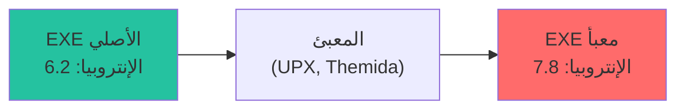

# تحليل الإنتروبيا

كيف يستخدم باطن نظرية المعلومات لكشف الملفات المضغوطة والمشفرة والمشبوهة.

## ما هي الإنتروبيا؟

**الإنتروبيا** تقيس العشوائية أو "محتوى المعلومات" للبيانات. في الأمن السيبراني، تكشف خصائص الملفات غير المرئية لكشف التوقيعات.

### معادلة إنتروبيا شانون

```
H(X) = -Σ p(xᵢ) × log₂(p(xᵢ))
```

حيث:

- **H(X)** = الإنتروبيا بالبت لكل بايت (0.0 إلى 8.0)
- **p(xᵢ)** = احتمال حدوث قيمة البايت i
- **log₂** = اللوغاريتم بالأساس 2

### الفهم البديهي

| الإنتروبيا | المعنى | مثال |
|---------|---------|---------|
| 0.0 | كل البايتات متطابقة | `AAAAAAAAAA` |
| ~4.5 | نص إنجليزي | كود المصدر، المستندات |
| ~6.0 | كود مترجم | ملفات تنفيذية عادية |
| ~7.5 | بيانات مضغوطة | ZIP، JPEG، MP3 |
| ~8.0 | عشوائي تماماً | مشفر، مضغوط |

---

## لماذا الإنتروبيا مهمة للأمان

### الملفات التنفيذية المضغوطة

البرمجيات الخبيثة غالباً تكون "معبأة" لـ:

- تجنب كشف التوقيعات
- تقليل حجم الملف
- إخفاء الكود

التعبئة تضغط الملف التنفيذي، مما يؤدي إلى **إنتروبيا عالية**.



### المحتوى المشفر

فيروسات الفدية والحمولات المشفرة والمستندات المشفرة لها:

- إنتروبيا عالية جداً (>7.8)
- توزيع بايتات شبه منتظم

### الضغط مقابل التشفير

كلاهما له إنتروبيا عالية، لكن:

| الخاصية | مضغوط | مشفر |
|---------|---------|---------|
| الإنتروبيا | 7.0-7.8 | 7.8-8.0 |
| كاي مربع | أعلى | منخفض جداً |
| له رؤوس | نعم (ZIP, GZIP) | غالباً لا |

اختبار كاي مربع يميز بينهما: البيانات المشفرة لها توزيع منتظم تقريباً مثالي.

---

## التنفيذ

### خوارزمية المرور الواحد

```rust
pub fn calculate_entropy_stats(data: &[u8]) -> EntropyStats {
    if data.is_empty() {
        return EntropyStats::default();
    }
    
    // الخطوة 1: بناء جدول التردد في مرور واحد
    let mut frequency: [usize; 256] = [0; 256];
    for &byte in data {
        frequency[byte as usize] += 1;
    }
    
    let len = data.len() as f64;
    let mut entropy = 0.0;
    let mut chi_square = 0.0;
    let expected = len / 256.0;  // العدد المتوقع للمنتظم
    
    // الخطوة 2: حساب كلا المقياسين من جدول التردد
    for &count in &frequency {
        if count > 0 {
            // إنتروبيا شانون
            let p = count as f64 / len;
            entropy -= p * p.log2();
            
            // إحصائية كاي مربع
            let diff = count as f64 - expected;
            chi_square += (diff * diff) / expected;
        }
    }
    
    EntropyStats { frequency, entropy, chi_square }
}
```

---

## اختبار كاي مربع

### الغرض

كاي مربع يقيس مقدار انحراف التوزيع المرصود عن المتوقع (المنتظم).

### المعادلة

```
χ² = Σ (Oᵢ - Eᵢ)² / Eᵢ
```

حيث:

- **Oᵢ** = العدد المرصود للبايت i
- **Eᵢ** = العدد المتوقع (data.len() / 256)

### التفسير

| كاي مربع | التفسير |
|----------|---------|
| < 50 | منتظم جداً (مشفر) |
| 50-150 | منتظم إلى حد ما (معبأ/مضغوط) |
| 150-500 | تباين عادي (ثنائي) |
| > 500 | غير منتظم (نص، بيانات منظمة) |

---

## إنتروبيا النافذة المنزلقة

### الغرض

الإنتروبيا العامة تفقد الشذوذات المحلية:

```
[بيانات عادية ......... كتلة مشفرة مخفية .... بيانات عادية]
                        ^^^^^^^^^^^^^^^^^^^
         الإنتروبيا العامة: 5.5 (تبدو عادية)
         الإنتروبيا المحلية: 7.9 (مشبوهة!)
```

### التنفيذ

```rust
pub fn sliding_window_entropy(data: &[u8], window_size: usize) -> Vec<f64> {
    if data.len() < window_size {
        return vec![calculate_shannon_entropy(data)];
    }
    
    let mut entropies = Vec::with_capacity(data.len() - window_size + 1);
    
    for i in 0..=(data.len() - window_size) {
        let window = &data[i..i + window_size];
        entropies.push(calculate_shannon_entropy(window));
    }
    
    entropies
}
```

---

## أمثلة واقعية

### ملف تنفيذي عادي

```
الملف: notepad.exe
الإنتروبيا: 6.12 بت/بايت
كاي مربع: 342.5
معبأ: لا
مشفر: لا
→ مستوى التهديد: مشبوه (exe عادي)
```

### برمجية خبيثة معبأة بـ UPX

```
الملف: malware_packed.exe
الإنتروبيا: 7.89 بت/بايت
كاي مربع: 78.2
معبأ: نعم
مشفر: لا
→ مستوى التهديد: خطير
```

### حمولة مشفرة

```
الملف: encrypted_data.bin
الإنتروبيا: 7.99 بت/بايت
كاي مربع: 23.1
معبأ: لا
مشفر: نعم
→ مستوى التهديد: خطير
```

---

:::tip الرؤية الأساسية
الإنتروبيا هي "الرأي الثاني" بعد البايتات السحرية. ملف يدعي أنه PDF بإنتروبيا 7.9 يكون مؤكداً تقريباً **ليس** PDF عادي - على الأرجح مشفر أو معبأ أو خبيث.

مع كاي مربع، يستطيع باطن التمييز بين:

- الضغط العادي (ZIP، JPEG)
- التعبئة المشبوهة (UPX، Themida)
- التشفير المحتمل (فيروسات الفدية، الحمولات المشفرة)
:::
