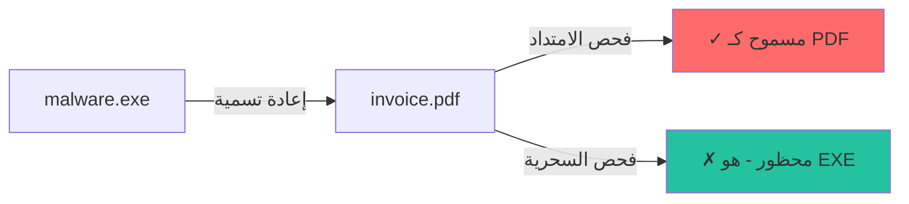

# كشف البايتات السحرية

تعمق في كيفية تحديد باطن لأنواع الملفات باستخدام توقيعات البايتات السحرية.

## ما هي البايتات السحرية؟

البايتات السحرية (تُسمى أيضاً "توقيعات الملفات" أو "الأرقام السحرية") هي تسلسلات بايت ثابتة في مواقع محددة تحدد صيغ الملفات بشكل فريد.

### لماذا البايتات السحرية؟

1. **الامتدادات تكذب**: `malware.exe` → `invoice.pdf` - سهل إعادة التسمية
2. **المحتوى لا يكذب**: البايتات الفعلية تكشف الصيغة الحقيقية
3. **سريع**: قراءة البايتات الأولى فقط، وليس الملف بأكمله
4. **موثوق**: الصيغ نادراً ما تغير توقيعاتها

---

## هيكل التوقيع

```rust
pub struct FileSignature {
    /// البايتات السحرية الأساسية للمطابقة
    pub magic: &'static [u8],
    
    /// الموقع من بداية الملف حيث تظهر السحرية
    pub offset: usize,
    
    /// فحص ثانوي اختياري للتمييز
    pub additional_magic: Option<(usize, &'static [u8])>,
    
    /// امتدادات الملفات الممكنة
    pub extensions: Vec<String>,
    
    /// نوع MIME
    pub mime_type: &'static str,
    
    /// الفئة لتقييم التهديدات
    pub category: FileCategory,
}
```

---

## أمثلة التوقيعات

### صورة PNG

```rust
FileSignature {
    magic: &[0x89, 0x50, 0x4E, 0x47, 0x0D, 0x0A, 0x1A, 0x0A],
    offset: 0,
    additional_magic: None,
    extensions: vec!["png".to_string()],
    mime_type: "image/png",
    category: FileCategory::Image,
}
```

**شرح البايتات:**

- `0x89` - بت عالي مضبوط (ليس ASCII)
- `0x50 0x4E 0x47` - "PNG" بترميز ASCII
- `0x0D 0x0A` - نهاية سطر DOS (\\r\\n)
- `0x1A` - نهاية ملف DOS
- `0x0A` - نهاية سطر Unix (\\n)

### ملف تنفيذي PE (EXE/DLL)

```rust
FileSignature {
    magic: &[0x4D, 0x5A],  // "MZ"
    offset: 0,
    extensions: vec!["exe".to_string(), "dll".to_string()],
    mime_type: "application/x-dosexec",
    category: FileCategory::Executable,
}
```

### فيديو MP4

```rust
FileSignature {
    magic: &[0x66, 0x74, 0x79, 0x70],  // "ftyp"
    offset: 4,  // ملاحظة: ليس في الموقع 0!
    extensions: vec!["mp4".to_string()],
    mime_type: "video/mp4",
    category: FileCategory::Multimedia,
}
```

**لماذا الموقع 4؟** ملفات MP4 تبدأ بحقل الحجم (4 بايت)، ثم نوع ذرة "ftyp".

---

## خوارزمية المطابقة

```rust
pub fn match_signatures(&self, data: &[u8]) -> Vec<(usize, f64)> {
    let mut matches = Vec::new();
    
    for (idx, sig) in self.signatures.iter().enumerate() {
        // 1. التحقق من طول البيانات
        let required_len = sig.offset + sig.magic.len();
        if data.len() < required_len {
            continue;
        }
        
        // 2. استخراج الشريحة في الموقع
        let slice = &data[sig.offset..sig.offset + sig.magic.len()];
        
        // 3. مقارنة البايتات السحرية
        if slice != sig.magic {
            continue;
        }
        
        // 4. فحص additional_magic إذا وجد
        if let Some((add_offset, add_bytes)) = sig.additional_magic {
            if data.len() < add_offset + add_bytes.len() {
                continue;
            }
            if &data[add_offset..add_offset + add_bytes.len()] != add_bytes {
                continue;
            }
        }
        
        // 5. تم العثور على تطابق!
        matches.push((idx, 0.9));  // 90% ثقة أساسية
    }
    
    matches
}
```

---

## تقنيات التمييز

### المشكلة: البادئات المشتركة

العديد من الصيغ تشترك في نفس البايتات السحرية:

| السحرية | الصيغ الممكنة |
|-------|--------------------|
| `PK..` | ZIP، DOCX، XLSX، JAR، EPUB، APK |
| `ftyp` | MP4، MOV، M4A، M4V، HEIC، AVIF |
| `RIFF` | WAV، AVI، WebP |

### الحل 1: السحرية الإضافية

```rust
// WEBP: RIFF في 0، WEBP في 8
FileSignature {
    magic: &[0x52, 0x49, 0x46, 0x46],  // "RIFF"
    offset: 0,
    additional_magic: Some((8, b"WEBP")),
    extensions: vec!["webp".to_string()],
    ...
}
```

### الحل 2: فحص المحتوى

للصيغ المبنية على ZIP، نفحص المسارات الداخلية:

```rust
fn detect_zip_format(&self, data: &[u8]) -> Option<&'static str> {
    if find_bytes(data, b"[Content_Types].xml").is_some() {
        // Office Open XML
        if find_bytes(data, b"word/").is_some() { return Some("docx"); }
        if find_bytes(data, b"xl/").is_some() { return Some("xlsx"); }
        if find_bytes(data, b"ppt/").is_some() { return Some("pptx"); }
    }
    if find_bytes(data, b"META-INF/MANIFEST.MF").is_some() {
        return Some("jar");
    }
    None
}
```

---

## لماذا لا نستخدم امتداد الملف؟



**فشل فحص الامتداد:**

1. المستخدم يعيد تسمية الملف (عرضياً أو بقصد)
2. السيرفر لا يضبط الامتداد
3. الملف مستخرج من أرشيف
4. تحليل الذاكرة - لا يوجد اسم ملف

---

:::tip النقطة الأساسية
البايتات السحرية هي أساس كشف نوع الملف، لكنها ليست معصومة. باطن يستخدمها كالمرحلة 1، ثم يتحقق بالإنتروبيا وكشف متعددي الصيغ وفحص التهديدات للأمان الشامل.
:::
