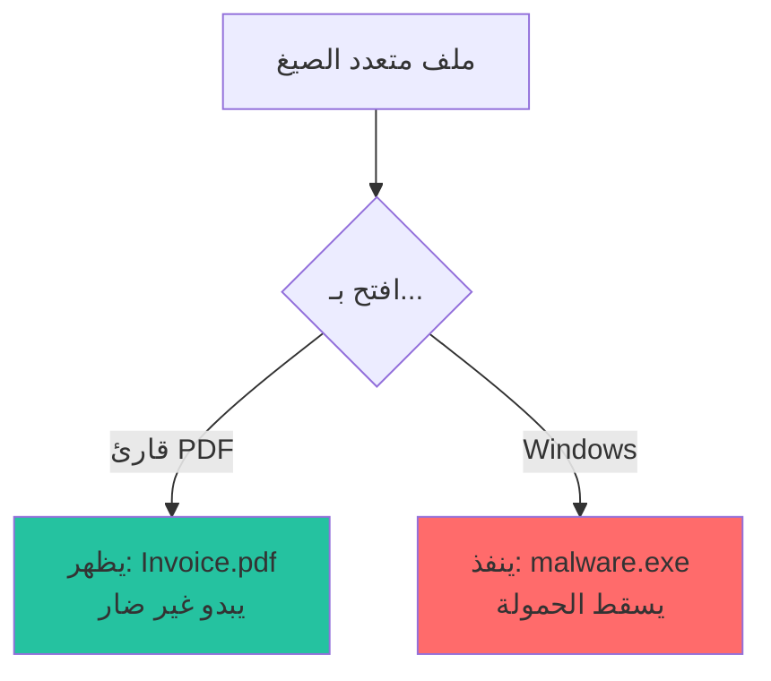
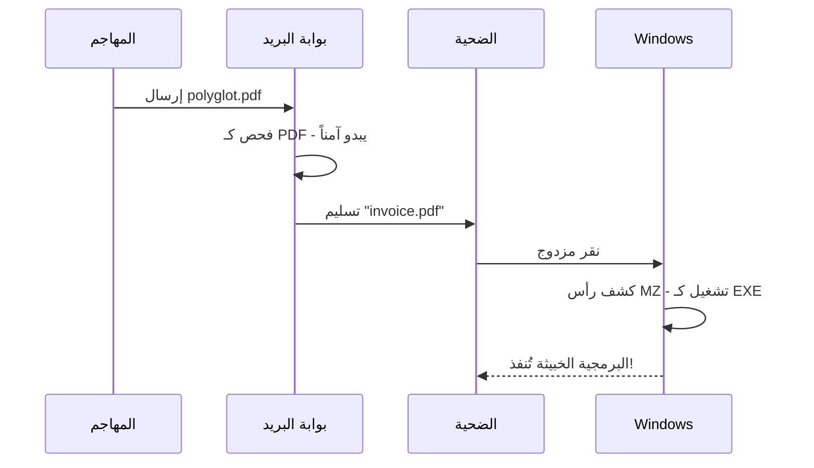

# كشف متعددي الصيغ

كيف يحدد باطن الملفات الصالحة في صيغ متعددة في نفس الوقت.

## ما هو ملف متعدد الصيغ؟

**متعدد الصيغ** (من اليونانية "كثير الألسنة") هو ملف:

1. **صالح** عند تفسيره كصيغة A
2. **صالح أيضاً** عند تفسيره كصيغة B
3. قد **يتصرف بشكل مختلف** في كل سياق



---

## لماذا متعددو الصيغ خطيرون

### سيناريو الهجوم: تجاوز البريد الإلكتروني



### لماذا هذا يعمل

1. **ماسحات البريد** تفحص البداية - ترى `%PDF`
2. **Windows** يفحص **المحتوى الفعلي** - يجد رأس `MZ` بالداخل
3. أدوات مختلفة، تفسيرات مختلفة

---

## التوليفات الشائعة لمتعددي الصيغ

| الأساسي | الثانوي | ناقل الهجوم |
|---------|---------|--------------|
| PDF | EXE | البريد الإلكتروني، تحميلات الويب |
| PNG | HTML | XSS الويب، استضافة الصور |
| GIF | JavaScript | XSS المبني على الصور |
| ZIP | JAR | استغلال Java |

### PDF + EXE (الأكثر شيوعاً)

```
+----------------------------------+
| %PDF-1.4                         | <- رأس PDF
| ...كائنات PDF...                 |
| MZ                               | <- رأس PE (مضمن)
| ...كود تنفيذي...                 |
| %%EOF                            | <- ذيل PDF
+----------------------------------+
```

قارئات PDF تتوقف عند `%%EOF`.
Windows يجد `MZ` وينفذ.

---

## خوارزمية الكشف

```rust
pub fn detect_polyglot(data: &[u8], db: &SignatureDatabase) -> Result<Vec<String>> {
    let mut detected_formats = Vec::new();
    
    // فحص مواقع متعددة للتوقيعات
    let check_offsets = [0, 512, 1024, 2048];
    
    for offset in check_offsets {
        if offset >= data.len() {
            break;
        }
        
        let slice = &data[offset..];
        let matches = db.match_signatures(slice);
        
        for (sig_idx, _confidence) in matches {
            let sig = &db.signatures[sig_idx];
            let format = sig.extensions[0].clone();
            
            if !detected_formats.contains(&format) {
                detected_formats.push(format);
            }
        }
    }
    
    // حالة خاصة: PDF مع PE مضمن
    if data.starts_with(b"%PDF") {
        if let Some(pe_pos) = find_bytes(data, &[0x4D, 0x5A]) {
            if pe_pos > 100 {  // ليس في البداية (مضمن)
                detected_formats.push("exe".to_string());
            }
        }
    }
    
    Ok(detected_formats)
}
```

---

## تأثير مستوى التهديد

```rust
fn assess_threat(...) -> ThreatLevel {
    // متعدد الصيغ = دائماً خطير
    if detected_formats.len() > 1 {
        return ThreatLevel::Dangerous;
    }
    
    // ... فحوصات أخرى ...
}
```

**المبرر:**

- الملفات الشرعية **ليست أبداً** متعددة الصيغ
- أي ملف متعدد الصيغ يجب فحصه
- أفضل أن نحذر زيادة من أن نفقد هجوماً

---

## استراتيجيات الدفاع

### 1. رفض متعددي الصيغ

```rust
async fn validate_upload(data: &[u8]) -> Result<(), &'static str> {
    let config = DetectionConfig::default();
    let result = FileType::from_bytes(data, &config)?;
    
    if result.detected_formats.len() > 1 {
        log::error!("رُفض متعدد الصيغ: {:?}", result.detected_formats);
        return Err("ملفات متعددة الصيغ غير مسموحة");
    }
    
    Ok(())
}
```

### 2. فرض نوع المحتوى

```rust
fn validate_claimed_type(data: &[u8], claimed: &str) -> bool {
    let config = DetectionConfig::default();
    let result = FileType::from_bytes(data, &config).ok()?;
    
    // رفض إذا متعدد الصيغ
    if result.detected_formats.len() > 1 {
        return false;
    }
    
    // رفض إذا النوع المكتشف لا يتطابق مع المدعى
    result.extension == claimed
}
```

---

:::warning ملاحظة أمنية
ملفات متعددي الصيغ **مشبوهة بطبيعتها**. بينما توجد بعض الحالات الشرعية، أي ملف يُكتشف كصيغ متعددة يجب:

1. تسجيله
2. عزله أو حظره
3. مراجعته يدوياً قبل السماح

في حالة الشك، ارفض.
:::
