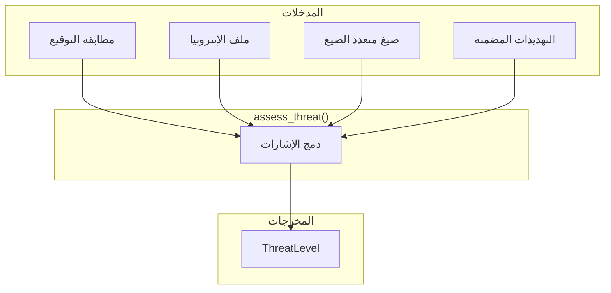
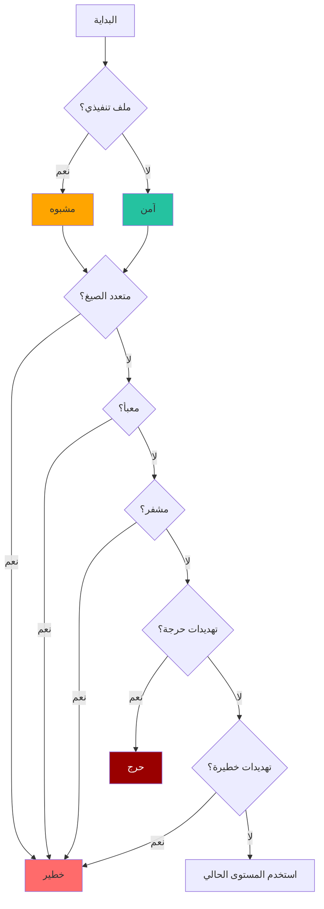

# تقييم التهديدات

كيف يجمع باطن كل إشارات الكشف لتقييم خطورة الملفات.

## نظرة عامة

بعد اكتمال مراحل الكشف الأربعة، يجمع باطن النتائج في مستوى `ThreatLevel` واحد:



---

## تعداد مستوى التهديد

```rust
#[derive(Debug, Clone, Copy, PartialEq, Eq, PartialOrd, Ord, Serialize)]
pub enum ThreatLevel {
    Safe,       // 0 - لا مؤشرات خطر
    Suspicious, // 1 - مخاوف بسيطة
    Dangerous,  // 2 - مؤشرات خطر عالية
    Critical,   // 3 - تهديد فوري
}
```

### الترتيب

مستويات التهديد مرتبة، مما يمكن المقارنات:

```rust
assert!(ThreatLevel::Safe < ThreatLevel::Suspicious);
assert!(ThreatLevel::Dangerous < ThreatLevel::Critical);

// الحصول على أعلى مستوى تهديد
let levels = [ThreatLevel::Safe, ThreatLevel::Dangerous];
let max = levels.iter().max().unwrap(); // Dangerous
```

---

## خوارزمية التقييم

```rust
fn assess_threat(
    signature: &FileSignature,
    entropy_profile: &Option<EntropyProfile>,
    detected_formats: &[String],
) -> ThreatLevel {
    // البدء بالافتراضي المبني على الفئة
    let mut level = match signature.category {
        FileCategory::Executable => ThreatLevel::Suspicious,
        _ => ThreatLevel::Safe,
    };
    
    // كشف متعدد الصيغ → خطير
    if detected_formats.len() > 1 {
        level = level.max(ThreatLevel::Dangerous);
    }
    
    // تحليل الإنتروبيا
    if let Some(entropy) = entropy_profile {
        // معبأ → خطير
        if entropy.is_packed {
            level = level.max(ThreatLevel::Dangerous);
        }
        // مشفر → خطير
        if entropy.is_encrypted {
            level = level.max(ThreatLevel::Dangerous);
        }
    }
    
    level
}
```

---

## قواعد التقييم

### القاعدة 1: الافتراضي المبني على الفئة

| فئة الملف | المستوى الافتراضي | المبرر |
|-----------|-------------------|--------|
| تنفيذي | مشبوه | يمكنه تشغيل كود |
| مستند | آمن | عموماً غير ضار |
| صورة | آمن | للعرض فقط |
| أرشيف | آمن | حاوية، افحص المحتويات |
| وسائط متعددة | آمن | غير قابل للتنفيذ |

### القاعدة 2: تصعيد متعدد الصيغ

```rust
if detected_formats.len() > 1 {
    level = level.max(ThreatLevel::Dangerous);
}
```

**لماذا؟** متعددو الصيغ ليسوا شرعيين أبداً في المحتوى المرفوع.

### القاعدة 3: تصعيد الإنتروبيا

```rust
if entropy.is_packed || entropy.is_encrypted {
    level = level.max(ThreatLevel::Dangerous);
}
```

**لماذا؟** التعبئة/التشفير تشير لمحاولات تهرب.

---

## شجرة القرار



---

## تسجيل المخاطر (موسع)

للتقييم الأكثر تفصيلاً، حول إلى نتيجة رقمية:

```rust
fn calculate_risk_score(result: &FileType) -> f64 {
    let mut score = 0.0;
    
    // النتيجة الأساسية حسب الفئة
    match result.threat_level {
        ThreatLevel::Safe => score += 0.0,
        ThreatLevel::Suspicious => score += 25.0,
        ThreatLevel::Dangerous => score += 50.0,
        ThreatLevel::Critical => score += 100.0,
    }
    
    // إضافة نقاط للمؤشرات المقلقة
    if let Some(profile) = &result.entropy_profile {
        if profile.global_entropy > 7.0 {
            score += (profile.global_entropy - 7.0) * 20.0;
        }
        if profile.is_packed { score += 15.0; }
        if profile.is_encrypted { score += 20.0; }
    }
    
    // متعدد الصيغ يضيف خطراً كبيراً
    if result.detected_formats.len() > 1 {
        score += 30.0;
    }
    
    // سقف عند 100
    score.min(100.0)
}
```

### تفسير النتيجة

| نطاق النتيجة | المعنى |
|-------------|--------|
| 0-10 | آمن، لا مخاوف |
| 11-30 | خطر منخفض، تسجيل فقط |
| 31-50 | خطر متوسط، مراجعة |
| 51-75 | خطر عالي، عزل |
| 76-100 | حرج، حظر فوري |

---

:::tip فلسفة التصميم
تقييم التهديدات **محافظ بالتصميم**—أفضل التحذير الزائد من فقدان تهديد حقيقي.

يمكن إضافة الملفات الشرعية للقائمة البيضاء عبر:

- دوال تقييم مخصصة
- قوائم امتدادات مسموحة
- قواعد خاصة بالبيئة

لكن الافتراضي يجب أن يميل دائماً لجانب الأمان.
:::
