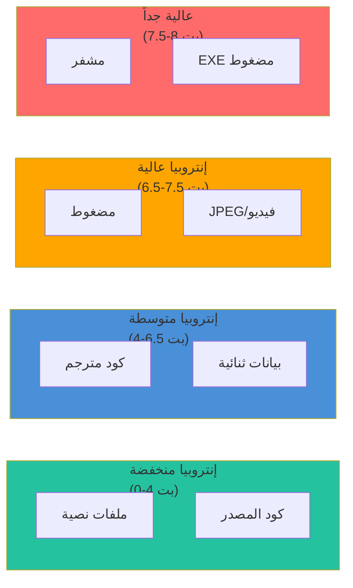
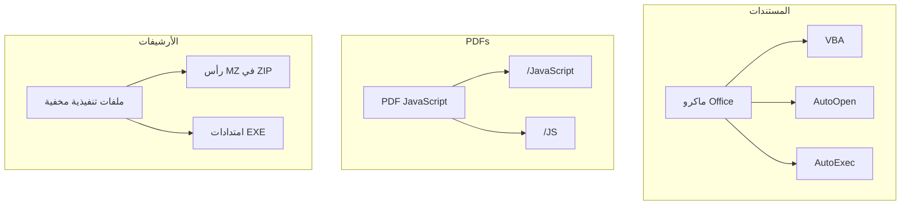

# خط الكشف

شرح مفصل لخط الكشف الرباعي المراحل في باطن.

## نظرة عامة

كل تحليل ملف يمر عبر أربع مراحل:

```mermaid
flowchart LR
    subgraph Stage1["المرحلة 1"]
        A[البايتات السحرية]
    end
    
    subgraph Stage2["المرحلة 2"]
        B[تحليل الإنتروبيا]
    end
    
    subgraph Stage3["المرحلة 3"]
        C[كشف متعددي الصيغ]
    end
    
    subgraph Stage4["المرحلة 4"]
        D[فحص التهديدات]
    end
    
    A --> B --> C --> D --> E[النتيجة]
    
    style Stage1 fill:#1a1a2e
    style Stage2 fill:#16213e
    style Stage3 fill:#0f3460
    style Stage4 fill:#25c2a0
```



كل مرحلة يمكنها:

- **المساهمة** في الكشف النهائي
- **تعديل** درجات الثقة
- **تفعيل** تغييرات مستوى التهديد
- **التجاوز** للكفاءة

---

## المرحلة 1: مطابقة توقيعات البايتات السحرية

### ما هي البايتات السحرية؟

البايتات السحرية هي تسلسلات بايت ثابتة في مواقع محددة تحدد صيغ الملفات:

| الصيغة | البايتات السحرية | الموقع |
|--------|------------|--------|
| PNG | `89 50 4E 47 0D 0A 1A 0A` | 0 |
| PDF | `25 50 44 46` (%PDF) | 0 |
| ZIP | `50 4B 03 04` (PK..) | 0 |
| PE/EXE | `4D 5A` (MZ) | 0 |
| MP4 | `66 74 79 70` (ftyp) | 4 |

### الخوارزمية

```rust
fn match_signatures(&self, data: &[u8]) -> Vec<(usize, f64)> {
    let mut matches = Vec::new();
    
    for (idx, sig) in self.signatures.iter().enumerate() {
        // التحقق من طول البيانات
        if data.len() < sig.offset + sig.magic.len() {
            continue;
        }
        
        // مقارنة البايتات السحرية في الموقع
        let slice = &data[sig.offset..sig.offset + sig.magic.len()];
        if slice == sig.magic {
            // التحقق من التحقق الإضافي
            let additional_match = sig.additional_magic
                .map(|(offset, bytes)| {
                    data.len() >= offset + bytes.len() &&
                    &data[offset..offset + bytes.len()] == bytes
                })
                .unwrap_or(true);
            
            if additional_match {
                matches.push((idx, 0.9)); // 90% ثقة أساسية
            }
        }
    }
    
    matches
}
```

### لماذا هذا النهج؟

**المميزات:**

- ✅ سريع: O(n×m) حيث n=التوقيعات، m=طول السحر
- ✅ موثوق: البايتات السحرية نادراً ما تتغير
- ✅ إيجابيات خاطئة منخفضة: أنماط بايت محددة

**العيوب:**

- ❌ يفقد الملفات بدون سحر (نص عادي)
- ❌ يمكن تزويره (إضافة رأس صالح)
- ❌ بعض الصيغ تشترك في البادئات

**التخفيف:** المراحل الأخرى تلتقط ما تفقده البايتات السحرية.

---

## المرحلة 2: تحليل الإنتروبيا

### لماذا الإنتروبيا؟

الإنتروبيا تقيس العشوائية. أنواع الملفات المختلفة لها إنتروبيا مميزة:



### معادلة إنتروبيا شانون

```
H(X) = -Σ p(x) × log₂(p(x))
```

حيث:

- H(X) = الإنتروبيا بالبت لكل بايت
- p(x) = احتمال قيمة البايت x
- النطاق: 0.0 (كل نفس البايت) إلى 8.0 (عشوائي منتظم)

### تنفيذ المرور الواحد

```rust
pub fn calculate_entropy_stats(data: &[u8]) -> EntropyStats {
    // بناء توزيع التردد في مرور واحد
    let mut frequency: [usize; 256] = [0; 256];
    for &byte in data {
        frequency[byte as usize] += 1;
    }
    
    let len = data.len() as f64;
    let mut entropy = 0.0;
    let mut chi_square = 0.0;
    let expected = len / 256.0;
    
    for &count in &frequency {
        if count > 0 {
            // إنتروبيا شانون
            let p = count as f64 / len;
            entropy -= p * p.log2();
            
            // إحصائية كاي مربع
            let diff = count as f64 - expected;
            chi_square += (diff * diff) / expected;
        }
    }
    
    EntropyStats {
        frequency,
        entropy,
        chi_square,
    }
}
```

---

## المرحلة 3: كشف متعددي الصيغ

### ما هو متعدد الصيغ؟

ملف صالح في صيغ متعددة في نفس الوقت:

```
┌──────────────────────────────────┐
│ %PDF-1.4        <- رأس PDF      │
│ ... محتوى PDF ...                │
│ MZ              <- رأس PE       │
│ ... كود تنفيذي ...               │
└──────────────────────────────────┘
```

هذا الملف:

- يفتح في قارئات PDF كمستند
- يُنفذ في Windows كبرنامج

### خوارزمية الكشف

```rust
pub fn detect_polyglot(data: &[u8], db: &SignatureDatabase) -> Result<Vec<String>> {
    let mut detected_formats = Vec::new();
    
    // فحص مواقع متعددة
    let check_offsets = [0, 512, 1024, 2048];
    
    for offset in check_offsets {
        if offset >= data.len() {
            break;
        }
        
        let slice = &data[offset..];
        let matches = db.match_signatures(slice);
        
        for (sig_idx, _confidence) in matches {
            let sig = &db.signatures[sig_idx];
            let format = sig.extensions[0].clone();
            
            if !detected_formats.contains(&format) {
                detected_formats.push(format);
            }
        }
    }
    
    // حالة خاصة: PDF مع PE مضمن
    if data.starts_with(b"%PDF") {
        if let Some(pe_pos) = find_bytes(data, &[0x4D, 0x5A]) {
            if pe_pos > 100 {
                detected_formats.push("exe".to_string());
            }
        }
    }
    
    Ok(detected_formats)
}
```

---

## المرحلة 4: فحص التهديدات المضمنة

### فئات التهديدات



### منطق الكشف

```rust
pub fn scan_embedded_content(
    data: &[u8],
    signature: &FileSignature,
) -> Result<Vec<EmbeddedThreat>> {
    let mut threats = Vec::new();
    
    match signature.category {
        FileCategory::Document => {
            if signature.mime_type.contains("msword") {
                threats.extend(detect_macros(data));
            }
            if signature.mime_type == "application/pdf" {
                threats.extend(detect_pdf_javascript(data));
            }
        }
        FileCategory::Archive => {
            threats.extend(detect_executable_in_archive(data));
        }
        _ => {}
    }
    
    Ok(threats)
}
```

---

## اعتبارات الأداء

### تحسين التجاوز

```rust
// تخطي المراحل المكلفة للسرعة (قابل للتكوين)
if !config.enable_entropy {
    // تخطي المرحلة 2
}

if !config.enable_polyglot {
    // تخطي المرحلة 3
}

if !config.enable_embedded {
    // تخطي المرحلة 4
}
```

### التقييم الكسول

المراحل تعمل فقط عند الحاجة:

- الإنتروبيا: فقط إذا `enable_entropy = true`
- متعدد الصيغ: فقط إذا تطابق الملف مع توقيع
- التهديدات: فقط للفئات المطبقة

---

:::tip ملاحظة تنفيذية
كل مرحلة مصممة لتكون:

- **مستقلة**: يمكن تشغيلها بشكل منفصل
- **سريعة**: المراحل المبكرة هي الأسرع
- **إضافية**: المراحل اللاحقة تضيف تفاصيل، لا تستبدل
- **قابلة للتكوين**: يمكن تعطيلها للأداء

هذا يسمح بمقايضات مرنة بين الدقة والسرعة.
:::
