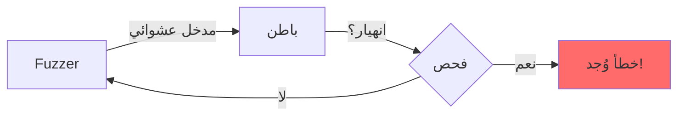

# اختبار Fuzz

ضمان تعامل باطن مع أي مدخل دون انهيار.

## لماذا Fuzz؟

اختبار Fuzz يجد أخطاء يفقدها البشر:



**ما يلتقطه Fuzzing:**

- تجاوز المخزن المؤقت
- تجاوز الأعداد الصحيحة
- الانهيار في الحالات الحدية
- الحلقات اللانهائية
- تسرب الذاكرة

---

## الإعداد

### تثبيت cargo-fuzz

```bash
# يتطلب Rust nightly
rustup install nightly

# تثبيت cargo-fuzz
cargo install cargo-fuzz
```

### هيكل المشروع

```
fuzz/
├── Cargo.toml          # تكوين أهداف Fuzz
└── fuzz_targets/
    └── fuzz_detect.rs  # هدف Fuzz الرئيسي
```

---

## هدف Fuzz

```rust
// fuzz/fuzz_targets/fuzz_detect.rs
#![no_main]

use batin::{DetectionConfig, FileType};
use libfuzzer_sys::fuzz_target;

fuzz_target!(|data: &[u8]| {
    // يولد الـ fuzzer تسلسلات بايت عشوائية
    // نريد التأكد من عدم حدوث انهيار بغض النظر عن المدخل
    
    let config = DetectionConfig::default();
    
    // هذا يجب ألا ينهار أبداً
    let _ = FileType::from_bytes(data, &config);
});
```

---

## تشغيل الـ Fuzzer

### تشغيل أساسي

```bash
cargo +nightly fuzz run fuzz_detect
```

### تشغيل محدود الوقت

```bash
# تشغيل لمدة 5 دقائق
cargo +nightly fuzz run fuzz_detect -- -max_total_time=300
```

---

## أهداف Fuzz

### الهدف 1: الكشف الأساسي

```rust
fuzz_target!(|data: &[u8]| {
    let config = DetectionConfig::default();
    let _ = FileType::from_bytes(data, &config);
});
```

### الهدف 2: تحليل الإنتروبيا

```rust
fuzz_target!(|data: &[u8]| {
    let _ = batin::detection::calculate_shannon_entropy(data);
    let _ = batin::detection::chi_square_test(data);
});
```

### الهدف 3: كشف متعددي الصيغ

```rust
fuzz_target!(|data: &[u8]| {
    let db = batin::detection::SignatureDatabase::default();
    let _ = batin::detection::detect_polyglot(data, &db);
});
```

---

## تفسير النتائج

### الإخراج العادي

```
#1234567 BINGO; ... corpus: 42/456Kb
```

- `#1234567` - التكرارات المكتملة
- `corpus: 42` - المدخلات الفريدة الموجودة
- لا انهيارات = نجاح!

### انهيار وُجد

```
==12345== ERROR: libFuzzer: deadly signal
artifact_prefix='./fuzz/artifacts/fuzz_detect/'; Test unit written to ./fuzz/artifacts/fuzz_detect/crash-xyz
```

يتم حفظ مدخل الانهيار لإعادة الإنتاج.

---

## إعادة إنتاج الانهيارات

### تشغيل مدخل محدد

```bash
cargo +nightly fuzz run fuzz_detect -- fuzz/artifacts/fuzz_detect/crash-xyz
```

### تصغير مدخل الانهيار

```bash
cargo +nightly fuzz tmin fuzz_detect -- fuzz/artifacts/fuzz_detect/crash-xyz
```

هذا يجد أصغر مدخل يثير الانهيار.

---

## إصلاح أخطاء Fuzz

### مثال: انهيار على مدخل قصير

**مدخل الانهيار:** `[0x89, 0x50]` (2 بايت)

**السبب الجذري:**

```rust
// سيء: يفترض 8 بايت على الأقل
let slice = &data[0..8];
```

**الإصلاح:**

```rust
// جيد: تحقق من الطول أولاً
if data.len() < 8 {
    return Err(DetectionError::Unsupported);
}
let slice = &data[0..8];
```

---

:::warning ضمان صفر انهيارات
`#![forbid(unsafe_code)]` لباطن واختبار Fuzz معاً يضمنان:

- لا انهيارات على أي مدخل
- معالجة آمنة للملفات المشوهة
- المهاجمون لا يستطيعون التسبب في DoS عبر ملفات مصممة

هذا حرج لأداة أمان تعالج محتوى غير موثوق.
:::
