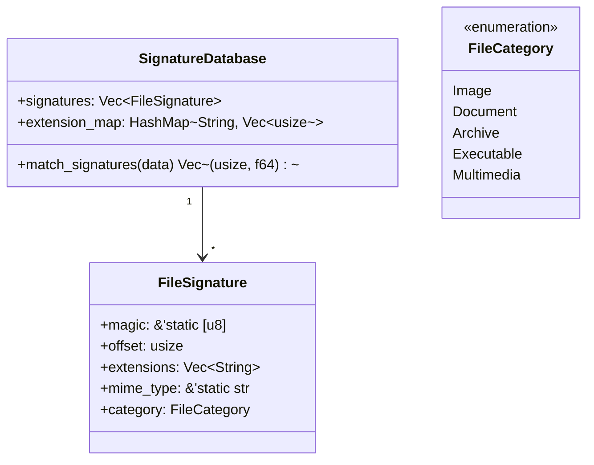

# تعمق في وحدة التوقيعات

تحليل شامل لوحدة `src/detection/signatures.rs`.

## الغرض

وحدة التوقيعات هي **أساس كشف نوع الملف**. تحتفظ بقاعدة بيانات لأكثر من 60 توقيع صيغة ملفات وتوفر خوارزميات مطابقة فعالة.

## البنية



## قرارات التصميم الرئيسية

### 1. قاعدة بيانات عامة بتهيئة كسولة

```rust
pub static SIGNATURE_DB: LazyLock<RwLock<SignatureDatabase>> = 
    LazyLock::new(|| RwLock::new(SignatureDatabase::default()));
```

### 2. بايتات سحرية ثابتة

```rust
pub struct FileSignature {
    pub magic: &'static [u8],  // مرجع ثابت!
    ...
}
```

**لماذا `&'static [u8]` بدلاً من `Vec<u8>`؟**

- **صفر تخصيص**: البايتات السحرية في قسم بيانات الثنائي
- **صفر نسخ**: لا حاجة لتخصيص heap
- **تحقق وقت الترجمة**: Rust يفحص الشرائح وقت الترجمة

---

## أمثلة تعريف التوقيعات

### توقيع بسيط (PNG)

```rust
FileSignature {
    magic: &[0x89, 0x50, 0x4E, 0x47, 0x0D, 0x0A, 0x1A, 0x0A],
    offset: 0,
    extensions: vec!["png".to_string()],
    mime_type: "image/png",
    category: FileCategory::Image,
}
```

### توقيع بموقع (MP4)

```rust
FileSignature {
    magic: &[0x66, 0x74, 0x79, 0x70],  // "ftyp"
    offset: 4,  // السحرية في الموقع 4، وليس 0!
    extensions: vec!["mp4".to_string()],
    mime_type: "video/mp4",
    category: FileCategory::Multimedia,
}
```

---

## خوارزمية المطابقة

```rust
pub fn match_signatures(&self, data: &[u8]) -> Vec<(usize, f64)> {
    let mut matches = Vec::new();
    
    for (idx, sig) in self.signatures.iter().enumerate() {
        // 1. التحقق من الطول
        if data.len() < sig.offset + sig.magic.len() {
            continue;
        }
        
        // 2. مقارنة السحرية الأساسية
        let slice = &data[sig.offset..sig.offset + sig.magic.len()];
        if slice == sig.magic {
            matches.push((idx, 0.9)); // 90% ثقة أساسية
        }
    }
    
    matches
}
```

---

:::tip ملاحظات التنفيذ

1. **أمان الخيوط**: قاعدة البيانات محمية بـ `RwLock` للقراءات المتزامنة
2. **الذاكرة**: ~10KB لجميع التوقيعات (بيانات ثابتة)
3. **القابلية للتوسعة**: سهل إضافة صيغ جديدة عبر `build_signatures()`

:::
