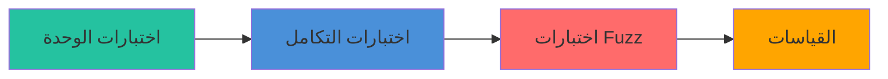

# الاختبار

دليل شامل للاختبار في باطن.

## أنواع الاختبارات



---

## تشغيل الاختبارات

### جميع الاختبارات

```bash
cargo test --all-features
```

### وحدات محددة

```bash
# اختبارات الكشف فقط
cargo test detection::

# اختبارات الإنتروبيا فقط
cargo test entropy::

# اختبارات التكامل فقط
cargo test --test integration_tests
```

### مع الإخراج

```bash
cargo test -- --nocapture
```

---

## اختبارات الوحدة

موجودة بجانب الكود المصدري في كتل `mod tests`.

### مثال: مطابقة التوقيعات

```rust
#[cfg(test)]
mod tests {
    use super::*;

    #[test]
    fn test_png_detection() {
        let png_magic = [0x89, 0x50, 0x4E, 0x47, 0x0D, 0x0A, 0x1A, 0x0A];
        let db = SignatureDatabase::default();
        let matches = db.match_signatures(&png_magic);
        
        assert!(!matches.is_empty(), "يجب أن يكتشف PNG");
        assert_eq!(db.signatures[matches[0].0].extensions[0], "png");
    }
}
```

### مثال: حساب الإنتروبيا

```rust
#[test]
fn test_entropy_text() {
    let text = b"Hello, World!";
    let entropy = calculate_shannon_entropy(text);
    
    // النص له إنتروبيا منخفضة-متوسطة
    assert!(entropy > 2.0 && entropy < 5.0);
}

#[test]
fn test_entropy_random() {
    // إنتروبيا قريبة من الحد الأقصى
    let random: Vec<u8> = (0..=255).collect();
    let entropy = calculate_shannon_entropy(&random);
    
    assert!(entropy > 7.9, "البيانات العشوائية يجب أن تكون ~8 بت/بايت");
}
```

---

## اختبارات التكامل

موجودة في مجلد `tests/`.

### مثال: تدفق الكشف الكامل

```rust
// tests/integration_tests.rs
use batin::{FileType, DetectionConfig};

#[tokio::test]
async fn test_detect_pdf() {
    let pdf_data = b"%PDF-1.4\n%test\n%%EOF";
    let config = DetectionConfig::default();
    
    let result = FileType::from_bytes(pdf_data, &config).unwrap();
    
    assert_eq!(result.extension, "pdf");
    assert_eq!(result.mime_type, "application/pdf");
}
```

---

## اختبار الحالات الحدية

### بيانات فارغة

```rust
#[test]
fn test_empty_data() {
    let db = SignatureDatabase::default();
    let matches = db.match_signatures(&[]);
    // يجب ألا ينهار
}

#[test]
fn test_empty_entropy() {
    let entropy = calculate_shannon_entropy(&[]);
    assert_eq!(entropy, 0.0);
}
```

### بيانات مقطوعة

```rust
#[test]
fn test_truncated_png() {
    // رأس PNG لكن بدون chunks كاملة
    let truncated = [0x89, 0x50, 0x4E, 0x47];
    let config = DetectionConfig::default();
    
    // يجب أن يكتشف كـ PNG (بناءً على السحر)
    let result = FileType::from_bytes(&truncated, &config).unwrap();
    assert_eq!(result.extension, "png");
}
```

---

## اختبار الأداء

### القياسات

موجودة في `benches/`:

```rust
use criterion::{black_box, criterion_group, criterion_main, Criterion};
use batin::{FileType, DetectionConfig};

fn bench_detection(c: &mut Criterion) {
    let data = include_bytes!("../test_files/sample.pdf");
    let config = DetectionConfig::default();
    
    c.bench_function("detect_pdf", |b| {
        b.iter(|| FileType::from_bytes(black_box(data), &config))
    });
}
```

### تشغيل القياسات

```bash
cargo bench
```

---

## التغطية

### باستخدام cargo-tarpaulin

```bash
# التثبيت
cargo install cargo-tarpaulin

# تشغيل التغطية
cargo tarpaulin --all-features --out Html
```

---

:::tip أفضل ممارسات الاختبار

1. **اختبر المسار السعيد** - السلوك المتوقع العادي
2. **اختبر الحالات الحدية** - فارغ، ضخم، مقطوع
3. **اختبر حالات الخطأ** - معالجة الإدخال غير الصالح
4. **استخدم أسماء اختبار وصفية** - `test_detect_png_with_truncated_header`
5. **اجعل الاختبارات سريعة** - تجنب I/O غير الضروري
:::
