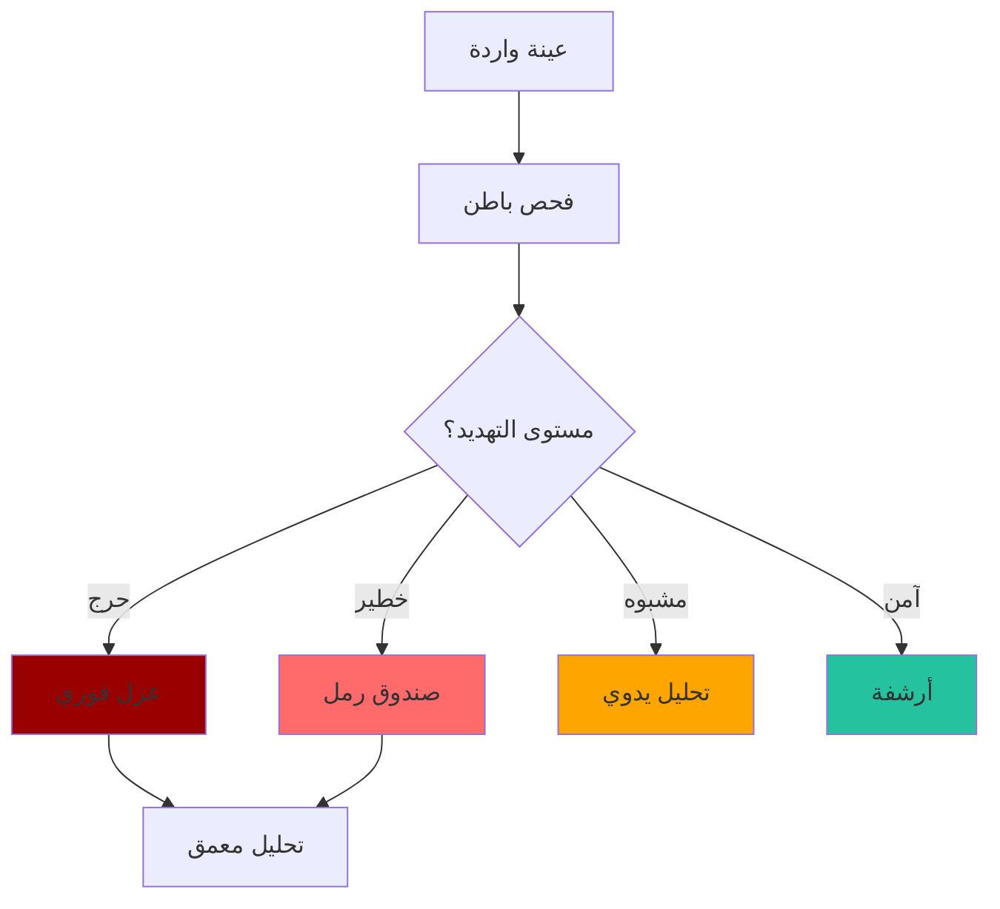

# تحليل البرمجيات الخبيثة

دليل متعمق لاستخدام باطن في سير عمل تحليل البرمجيات الخبيثة.

## سير عمل الفرز



## كشف الملفات التنفيذية المضغوطة

### ما هو الضغط (Packing)؟

الضغط (Packing) عملية ضغط/تشفير ملف تنفيذي تُفك عند التشغيل.

**لماذا تستخدم البرمجيات الخبيثة الضغط:**

- تجنب كشف التوقيعات
- تقليل حجم الملف
- إخفاء الكود

### الكشف باستخدام باطن

```bash
# إيجاد الملفات التنفيذية المضغوطة
batin scan /samples -r --json | \
  jq '.[] | select(.file_type.entropy_profile.is_packed == true) | .path'
```

### مؤشرات الإنتروبيا

| نطاق الإنتروبيا | التفسير |
|---------------|---------|
| 5.0 - 6.5 | تنفيذي عادي (غير مضغوط) |
| 6.5 - 7.2 | ضغط خفيف أو تحسين |
| 7.2 - 7.5 | على الأرجح مضغوط |
| 7.5 - 8.0 | بالتأكيد مضغوط أو مشفر |

---

## كشف متعددي الصيغ (Polyglot)

### الهجمات الشائعة

| التركيبة | الهجوم |
|----------|--------|
| PDF + EXE | يبدو كمستند، ينفذ كتنفيذي |
| DOC + EXE | مستند Office مع تنفيذي مضمن |
| JPG + ZIP | إخفاء البيانات في صور |

### الكشف

```bash
# إيجاد الملفات متعددة الصيغ
batin scan /suspicious -r --json | \
  jq '.[] | select(.file_type.detected_formats | length > 1) | 
      {path: .path, formats: .file_type.detected_formats}'
```

---

## كشف الماكرو

### تصنيف الخطورة

| الماكرو | المستوى | السبب |
|---------|---------|-------|
| AutoOpen | **حرج** | ينفذ تلقائياً عند الفتح |
| AutoExec | **حرج** | ينفذ عند بدء التطبيق |
| Document_Open | **حرج** | حدث فتح المستند |
| Workbook_Open | **حرج** | حدث فتح مصنف Excel |
| VBA عادي | خطير | يتطلب إجراء المستخدم |

### الفحص

```bash
# إيجاد المستندات مع ماكروات التنفيذ التلقائي
batin scan /documents -r --json | \
  jq '.[] | select(.file_type.embedded_threats | 
      any(.severity == "Critical" and .threat_type == "Macro"))'
```

---

## سكربت أتمتة الفرز

```bash
#!/bin/bash
# malware-triage.sh

INPUT_DIR="$1"
OUTPUT_DIR="$2"

mkdir -p "$OUTPUT_DIR"/{critical,dangerous,suspicious,safe}

batin scan "$INPUT_DIR" -r --json | jq -c '.[]' | while read -r result; do
    path=$(echo "$result" | jq -r '.path')
    threat=$(echo "$result" | jq -r '.file_type.threat_level')
    filename=$(basename "$path")
    
    case "$threat" in
        Critical)
            cp "$path" "$OUTPUT_DIR/critical/$filename"
            echo "[!] حرج: $filename"
            ;;
        Dangerous)
            cp "$path" "$OUTPUT_DIR/dangerous/$filename"
            echo "[!] خطير: $filename"
            ;;
        Suspicious)
            cp "$path" "$OUTPUT_DIR/suspicious/$filename"
            echo "[?] مشبوه: $filename"
            ;;
        Safe)
            cp "$path" "$OUTPUT_DIR/safe/$filename"
            ;;
    esac
done

echo "=== الملخص ==="
echo "حرج: $(ls -1 "$OUTPUT_DIR/critical" | wc -l)"
echo "خطير: $(ls -1 "$OUTPUT_DIR/dangerous" | wc -l)"
echo "مشبوه: $(ls -1 "$OUTPUT_DIR/suspicious" | wc -l)"
echo "آمن: $(ls -1 "$OUTPUT_DIR/safe" | wc -l)"
```

---

:::warning تحذير أمان
عند تحليل البرمجيات الخبيثة:

- استخدم دائماً بيئة معزولة (VM/sandbox)
- لا تنفذ العينات خارج بيئة التحليل
- احتفظ بنسخ احتياطية من العينات
- وثق سلسلة الحراسة
:::
