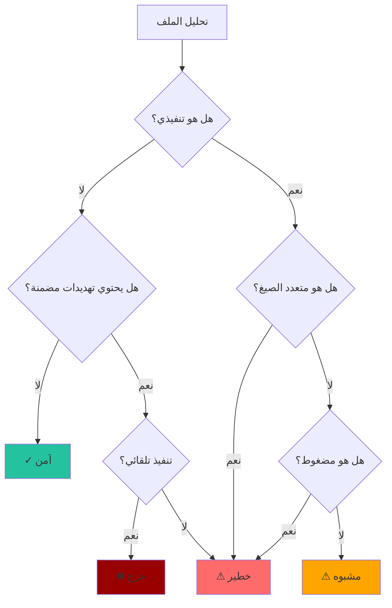

# مستويات التهديد

فهم كيفية تقييم باطن لمخاطر الملفات.

## نظرة عامة

يعين باطن أحد مستويات التهديد الأربعة لكل ملف بناءً على عوامل متعددة:



## تعريفات مستويات التهديد

### ✓ آمن

**لم يتم اكتشاف تهديدات**

الملفات المميزة بأنها آمنة:

- ليست تنفيذية
- لا توجد أنماط إنتروبيا مشبوهة
- لا توجد تهديدات مضمنة
- صيغة واحدة (ليست متعددة الصيغ)

**أمثلة:**

- الصور العادية (PNG، JPEG)
- ملفات النص العادي
- ملفات الصوت/الفيديو
- المستندات النظيفة

### ⚠ مشبوه

**قد يكون خطيراً - يتطلب التحقيق**

الملفات المميزة بأنها مشبوهة:

- ملفات تنفيذية (EXE، DLL، ELF، Mach-O)
- السكربتات (JavaScript، PowerShell، Shell)
- ملفات ذات إنتروبيا مرتفعة
- ملفات ذات عدم تطابق في الامتداد

### ⚠ خطير

**مخاطر عالية - تعامل بحذر**

الملفات المميزة بأنها خطيرة تحتوي على:

- محتوى مضغوط/مشفر (إنتروبيا > 7.2)
- صيغة متعددة (صالحة كأنواع متعددة)
- ملفات تنفيذية مضمنة في المستندات/الأرشيفات
- أنماط خطيرة معروفة

### ✖ حرج

**تهديد فوري - ثقة عالية بأنه ضار**

الملفات المميزة بأنها حرجة تحتوي على:

- ماكرو تنفيذ تلقائي (`AutoOpen`، `AutoExec`)
- ماكرو مستند يعمل عند الفتح
- ماكرو مصنف (`Workbook_Open`)
- مؤشرات خطر متعددة مجتمعة

---

## عوامل التقييم

### 1. فئة الملف

| الفئة | المخاطر الأساسية |
|-------|-----------------|
| تنفيذي | مشبوه |
| مستند | آمن |
| أرشيف | آمن |
| صورة/وسائط | آمن |
| نص | آمن |

### 2. تحليل الإنتروبيا

| نطاق الإنتروبيا | التفسير | تعديل المخاطر |
|---------------|---------|--------------|
| 0 - 4.0 | نص عادي | لا شيء |
| 4.0 - 6.5 | بيانات ثنائية | لا شيء |
| 6.5 - 7.2 | مضغوط | زيادة طفيفة |
| 7.2 - 7.8 | مضغوط (packed) | → خطير |
| 7.8 - 8.0 | مشفر | → خطير |

### 3. كشف متعددي الصيغ

إذا تم اكتشاف صيغ صالحة متعددة:

- صيغتان أو أكثر → خطير
- خاصة: تركيبات PDF+EXE، DOC+EXE

### 4. التهديدات المضمنة

| نوع التهديد | الشدة |
|------------|-------|
| ماكرو VBA | خطير |
| ماكرو AutoOpen/AutoExec | **حرج** |
| PDF JavaScript | مشبوه |
| تنفيذي في أرشيف | خطير |

---

## التصفية حسب مستوى التهديد

### CLI

```bash
# عرض المشبوه وما فوق
batin scan /uploads -r --min-threat suspicious

# عرض الخطير والحرج فقط
batin scan /samples -r --min-threat dangerous

# عرض الحرج فقط
batin scan /documents -r --min-threat critical
```

### معالجة JSON

```bash
# تصفية الملفات الآمنة
batin scan /dir -r --json | jq '.[] | select(.file_type.threat_level != "Safe")'

# العد حسب مستوى التهديد
batin scan /dir -r --json | jq 'group_by(.file_type.threat_level) | 
  map({level: .[0].file_type.threat_level, count: length})'
```

---

## أفضل الممارسات

### لفرق الأمن

| مستوى التهديد | الإجراء الموصى به |
|--------------|------------------|
| آمن | السماح |
| مشبوه | المراقبة/التسجيل |
| خطير | الحجر أو العزل |
| حرج | الحظر + التنبيه فوراً |

---

:::note الإيجابيات الكاذبة
بعض الملفات الشرعية قد يتم تمييزها:

- المثبتات والأرشيفات ذاتية الاستخراج (مضغوطة)
- مستندات Office المحمية بكلمة مرور (تبدو مشفرة)
- مشاريع الفن متعدد الصيغ (متعدد الصيغ مقصود)

قم بتكوين العتبات أو إضافة استثناءات حسب الحاجة لبيئتك.
:::
